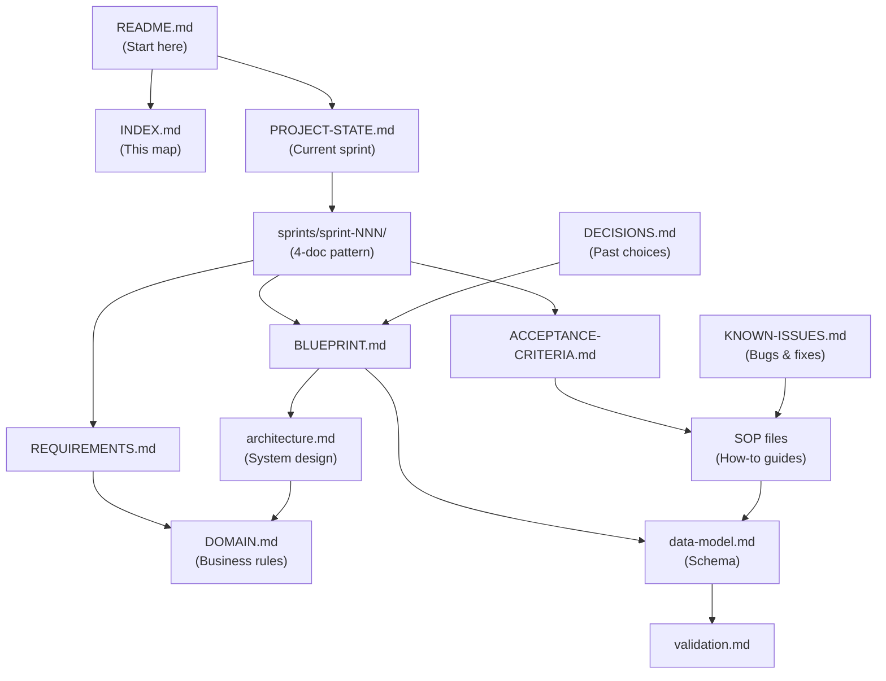

# MyOMR Project Index

A detailed map of what's where and when to use each document.

## Quick Finder (by Task)

| I need to... | Go to | Purpose |
|---|---|---|
| Understand the project | [`README.md`](./README.md) | 30-second orientation |
| Know the current status | [`planning/PROJECT-STATE.md`](./planning/PROJECT-STATE.md) | Current sprint, blockers, next actions |
| Learn the business rules | [`planning/DOMAIN.md`](./planning/DOMAIN.md) | Job enums, localities, terminology |
| Understand the system | [`docs/architecture.md`](./docs/architecture.md) | Module relationships, data flow |
| Check the database schema | [`docs/data-model.md`](./docs/data-model.md) | Tables, fields, relationships |
| Prove something works | [`docs/validation.md`](./docs/validation.md) | Testing rules, quality gates |
| Understand integrations | [`docs/api-integrations.md`](./docs/api-integrations.md) | External APIs (Search Console, GA4, etc.) |
| Know who accesses what | [`docs/permissions.md`](./docs/permissions.md) | Admin roles, access control |
| See all past decisions | [`planning/DECISIONS.md`](./planning/DECISIONS.md) | Why we chose X over Y |
| Understand the risks | [`planning/RISKS.md`](./planning/RISKS.md) | Known traps, fragile assumptions |
| Find an open question | [`planning/QUESTIONS.md`](./planning/QUESTIONS.md) | Issues awaiting stakeholder input |
| Reference a PDF/export | [`planning/FILE-INVENTORY.md`](./planning/FILE-INVENTORY.md) | PDFs, exports, screenshots, sources |
| Find meeting notes | [`planning/meetings/`](./planning/meetings/) | Meeting records by date |
| Get my task | [`planning/sprints/sprint-NNN/HANDOFF-PROMPT.md`](./planning/sprints/) | Detailed builder instructions |
| Know what to build | [`planning/sprints/sprint-NNN/REQUIREMENTS.md`](./planning/sprints/) | What + why + success metric |
| Learn how to build it | [`planning/sprints/sprint-NNN/BLUEPRINT.md`](./planning/sprints/) | Architecture, flow, edge cases |
| Know when I'm done | [`planning/sprints/sprint-NNN/ACCEPTANCE-CRITERIA.md`](./planning/sprints/) | Checklist of done |
| See what was built + issues found | [`planning/sprints/sprint-NNN/WORKLOG.md`](./planning/sprints/) | Work log for each sprint |
| Find historical work | [`planning/WORKLOG-ARCHIVE.md`](./planning/WORKLOG-ARCHIVE.md) | Index of all past worklogs |
| Learn about a gotcha | [`KNOWN-ISSUES.md`](./KNOWN-ISSUES.md) | Persistent bugs, their fixes |
| Understand decisions | [`LEARNINGS.md`](./LEARNINGS.md) | Why things were done this way |
| See what shipped | [`RECENT-UPDATES.md`](./RECENT-UPDATES.md) | Recent feature completion |
| Find a template | [`sop/DEV-TOOLS-TEMPLATES.md`](./sop/DEV-TOOLS-TEMPLATES.md) | All template scripts indexed |
| Publish a job | [`sop/JOB-INSERT-AND-SEO-SOP.md`](./sop/JOB-INSERT-AND-SEO-SOP.md) | Job insert checklist |
| Publish an event | [`sop/EVENT-INSERT-AND-FEATURED-SOP.md`](./sop/EVENT-INSERT-AND-FEATURED-SOP.md) | Event insert checklist |
| Publish news | [`sop/NEWS-ARTICLE-PUBLISHING-SOP.md`](./sop/NEWS-ARTICLE-PUBLISHING-SOP.md) | News publishing workflow |
| QA a news article | [`sop/NEWS-ARTICLE-HTML-QA-SOP.md`](./sop/NEWS-ARTICLE-HTML-QA-SOP.md) | HTML validation before live |
| Publish anything to live | [`sop/LIVE-PUBLISH-CHECKLIST-SOP.md`](./sop/LIVE-PUBLISH-CHECKLIST-SOP.md) | Master checklist (jobs/events/news/etc.) |
| Handle dual posts | [`sop/DUAL-POST-CLASSIFIED-RENT-LEASE-SOP.md`](./sop/DUAL-POST-CLASSIFIED-RENT-LEASE-SOP.md) | Cross-module consistency |
| Roll out email campaigns | [`sop/EMAIL-LANDING-PAGE-ROLLOUT-SOP.md`](./sop/EMAIL-LANDING-PAGE-ROLLOUT-SOP.md) | Email landing pages |
| Import external SQL | [`sop/EXTERNAL-SQL-IMPORT-SOP.md`](./sop/EXTERNAL-SQL-IMPORT-SOP.md) | Data migration safety |
| Check ad compliance | [`sop/ADSENSE-COMPLIANCE-SOP.md`](./sop/ADSENSE-COMPLIANCE-SOP.md) | Ad placement audit |
| Set up the project | [`SETUP.md`](./SETUP.md) | Developer onboarding (<1 hour) |
| Understand team standards | [`CONVENTIONS.md`](./CONVENTIONS.md) | File naming, format, structure |
| Read all SOPs | [`sop/README.md`](./sop/README.md) | SOP index, grouped by category |
| Follow team AI rules | [`rules/cursor-ai-rules.md`](./rules/cursor-ai-rules.md) | MyOMR dev guidelines |
| Set up GA4 | [`rules/ga4-google-cloud.mdc`](./rules/ga4-google-cloud.mdc) | Service account, property ID |
| Use ad slots | [`rules/ad-banner-component.mdc`](./rules/ad-banner-component.mdc) | Ad registry + `omr_ad_slot()` |
| Learn the project | [`skills/myomr-project/SKILL.md`](./skills/myomr-project/SKILL.md) | Bootstrap, canonicals, sitelinks |
| Use slug URLs | [`skills/slug-urls-detail-pages/SKILL.md`](./skills/slug-urls-detail-pages/SKILL.md) | /module/id/slug pattern |

---

## By Layer

### Hub & Navigation
- **`README.md`** — Entry point (this is your start)
- **`INDEX.md`** — This file (detailed map)
- **`CONVENTIONS.md`** — Team standards

### Durable Project Memory

#### `.cursor/planning/` — Sprint System + Project State
- **`PROJECT-STATE.md`** — Current sprint, status, blockers, next actions
- **`DECISIONS.md`** — All documented decisions with rationale
- **`DOMAIN.md`** — MyOMR business rules, terminology, workflows
- **`RISKS.md`** — Known traps, fragile assumptions, mitigations
- **`QUESTIONS.md`** — Open questions awaiting stakeholder input
- **`FILE-INVENTORY.md`** — PDFs, exports, reference docs
- **`meetings/`** — Meeting notes by date
- **`sprints/`** — Sprint folders, each with REQUIREMENTS/BLUEPRINT/ACCEPTANCE/HANDOFF

#### `.cursor/docs/` — Technical Foundation
- **`architecture.md`** — System map + module relationships
- **`data-model.md`** — MySQL schema, entities, relationships
- **`validation.md`** — Quality gates, testing rules
- **`api-integrations.md`** — External APIs (GA4, Search Console, etc.)
- **`permissions.md`** — Admin roles, access control

#### Root Memory Files
- **`LEARNINGS.md`** — Lessons learned, gotchas, anti-patterns
- **`RECENT-UPDATES.md`** — Shipped features, important changes
- **`KNOWN-ISSUES.md`** — Persistent bugs + their fixes

### Operations & Team Standards

#### `.cursor/sop/` — Operational Runbooks
- **`README.md`** — SOP index, grouped by category
- **Content SOPs:**
  - `NEWS-ARTICLE-PUBLISHING-SOP.md` — End-to-end news publish
  - `NEWS-ARTICLE-HTML-QA-SOP.md` — HTML validation before live
  - `JOB-INSERT-AND-SEO-SOP.md` — Job publishing + SEO
  - `EVENT-INSERT-AND-FEATURED-SOP.md` — Event publishing
  - `DUAL-POST-CLASSIFIED-RENT-LEASE-SOP.md` — Cross-module
  - `EMAIL-LANDING-PAGE-ROLLOUT-SOP.md` — Email campaigns
- **Data SOPs:**
  - `EXTERNAL-SQL-IMPORT-SOP.md` — Safe data migrations
  - `LIVE-PUBLISH-CHECKLIST-SOP.md` — Master checklist (all entities)
- **Monetization SOPs:**
  - `ADSENSE-COMPLIANCE-SOP.md` — Ad slot audit
- **Infrastructure SOPs:**
  - `SEO-CANONICAL-SITEMAP-SOP.md` — Canonical URLs, sitemaps
  - `SEARCH-CONSOLE-API-OPERATIONS-SOP.md` — GSC API ops
  - `CPANEL-DEPLOYMENT-SOP.md` — Git deployment
  - `REMOTE-DB-MIGRATION-SOP.md` — Remote MySQL setup
- **Template Index:**
  - `DEV-TOOLS-TEMPLATES.md` — All template scripts by entity type
  - (Plus 16+ existing SOPs)

#### `.cursor/rules/` — Team Rules
- **`rules.json`** — Machine-readable rules summary
- **`cursor-ai-rules.md`** — MyOMR-specific AI guidelines
- **`ga4-google-cloud.mdc`** — GA4 service account setup
- **`ad-banner-component.mdc`** — Ad slot registry

#### `.cursor/skills/` — Reusable Team Patterns
- **`myomr-project/SKILL.md`** — Project overview + bootstrap
- **`slug-urls-detail-pages/SKILL.md`** — /module/id/slug URL pattern
- (Plus generic UI skills for design tasks)

#### `.cursor/secrets/` — Local Only (Gitignored)
- **`README.md`** — GA4 setup guide
- **`google-analytics.json`** — Service account key (NOT in git)

#### Onboarding
- **`SETUP.md`** — Developer onboarding in <1 hour

---

## By Task Type

### I'm Publishing Content (News/Jobs/Events/etc.)

1. Read [`planning/PROJECT-STATE.md`](./planning/PROJECT-STATE.md) — What sprint are we in?
2. Read relevant SOP:
   - News? → [`sop/NEWS-ARTICLE-PUBLISHING-SOP.md`](./sop/NEWS-ARTICLE-PUBLISHING-SOP.md)
   - Job? → [`sop/JOB-INSERT-AND-SEO-SOP.md`](./sop/JOB-INSERT-AND-SEO-SOP.md)
   - Event? → [`sop/EVENT-INSERT-AND-FEATURED-SOP.md`](./sop/EVENT-INSERT-AND-FEATURED-SOP.md)
3. Find template → [`sop/DEV-TOOLS-TEMPLATES.md`](./sop/DEV-TOOLS-TEMPLATES.md)
4. Check schema → [`docs/data-model.md`](./docs/data-model.md)
5. Validate → Relevant SOP checklist + [`docs/validation.md`](./docs/validation.md)

### I'm Building a Feature

1. Read [`planning/PROJECT-STATE.md`](./planning/PROJECT-STATE.md) — Current sprint
2. Go to [`planning/sprints/sprint-NNN/`](./planning/sprints/) and read:
   - `REQUIREMENTS.md` — What to build
   - `BLUEPRINT.md` — How to build it
   - `ACCEPTANCE-CRITERIA.md` — When you're done
   - `HANDOFF-PROMPT.md` — Detailed instructions
3. Check [`docs/architecture.md`](./docs/architecture.md) — System design
4. Check [`docs/data-model.md`](./docs/data-model.md) — Schema
5. Reference relevant SOP for checklist
6. Create `IMPLEMENTATION-SUMMARY.md` in sprint folder

### I'm Onboarding to the Project

1. Read [`SETUP.md`](./SETUP.md) — 1 hour setup
2. Read [`README.md`](./README.md) — 10 min orientation
3. Read [`planning/DOMAIN.md`](./planning/DOMAIN.md) — Business rules
4. Read [`docs/architecture.md`](./docs/architecture.md) — System design
5. Read [`CONVENTIONS.md`](./CONVENTIONS.md) — Team standards

### I'm Reviewing Someone's Work

1. Read relevant sprint folder → `REQUIREMENTS.md` + `BLUEPRINT.md`
2. Read `ACCEPTANCE-CRITERIA.md` — What done looks like
3. Check `IMPLEMENTATION-SUMMARY.md` — What they built
4. Verify against checklist (SOP + acceptance criteria)
5. Update sprint `STATUS.md` (approved/needs-changes/complete)

### I'm Debugging an Issue

1. Check [`KNOWN-ISSUES.md`](./KNOWN-ISSUES.md) — Is it a known gotcha?
2. Check [`planning/RISKS.md`](./planning/RISKS.md) — Was this a known risk?
3. Check relevant SOP — Does it have a validation step?
4. Check [`docs/validation.md`](./docs/validation.md) — Quality gate?
5. Update [`planning/DECISIONS.md`](./planning/DECISIONS.md) or [`KNOWN-ISSUES.md`](./KNOWN-ISSUES.md) with fix

---

## By File Type

### Markdown Files (Text, Human-Readable)
All `.md` files are human-readable documentation.

| File | Format | Purpose |
|------|--------|---------|
| `README.md` | Markdown | Quick start (30 sec) |
| `INDEX.md` | Markdown | This map |
| `CONVENTIONS.md` | Markdown | Team standards |
| `planning/PROJECT-STATE.md` | Markdown | Current status |
| `planning/DECISIONS.md` | Markdown | Decision log |
| `planning/DOMAIN.md` | Markdown | Business rules |
| `planning/RISKS.md` | Markdown | Risk register |
| `docs/*.md` | Markdown | Technical docs |
| `sop/*.md` | Markdown | How-to guides |
| `LEARNINGS.md` | Markdown | Lessons learned |
| `RECENT-UPDATES.md` | Markdown | Changelog |
| `KNOWN-ISSUES.md` | Markdown | Bug registry |
| `SETUP.md` | Markdown | Onboarding |

### Config Files
| File | Format | Purpose |
|------|--------|---------|
| `rules/rules.json` | JSON | Machine-readable rules |

### Cursor Rules (MDC Format)
| File | Format | Purpose |
|------|--------|---------|
| `rules/cursor-ai-rules.mdc` | MDC | Cursor AI guidelines (autoapplied) |
| `rules/ga4-google-cloud.mdc` | MDC | GA4 setup (autoapplied) |
| `rules/ad-banner-component.mdc` | MDC | Ad registry (glob-scoped) |

### Sprint Folders (5-Document Pattern)
Each sprint gets a folder:
```
sprints/sprint-NNN-{name}/
├── REQUIREMENTS.md       (What + why)
├── BLUEPRINT.md          (How)
├── ACCEPTANCE-CRITERIA.md (Done = ?)
├── HANDOFF-PROMPT.md     (Builder instructions)
├── WORKLOG.md            (Issues found + fixes applied)
└── STATUS.md             (In progress → complete)
```

**WORKLOG.md added in May 2026** — See `WORKLOG-SYSTEM.md` for details.

---

## Relationships & Dependencies



---

## Search Tips

**Searching `.cursor/` for a concept?**

| Concept | Search in | Files |
|---|---|---|
| "How do I publish a job?" | `sop/` | `JOB-INSERT-AND-SEO-SOP.md` |
| "What's the job schema?" | `docs/` | `data-model.md` |
| "Why did we choose slug URLs?" | `planning/` | `DECISIONS.md` |
| "What's the homepage flow?" | `docs/` | `architecture.md` |
| "What are the job enums?" | `planning/` | `DOMAIN.md` |
| "What's a known bug?" | Root | `KNOWN-ISSUES.md` |
| "What template do I use?" | `sop/` | `DEV-TOOLS-TEMPLATES.md` |
| "Who can access admin?" | `docs/` | `permissions.md` |
| "What's the risk?" | `planning/` | `RISKS.md` |
| "What did we recently ship?" | Root | `RECENT-UPDATES.md` |

---

## Version Control

**All files in `.cursor/` are git-tracked** except:
- `.cursor/secrets/` (local only, gitignored)
- `.cursor/plans/` (ephemeral, gitignored)

**Team synchronization:**
- Pull `.cursor/` from repo → all SOPs, rules, sprint templates, project memory in sync
- Push changes to `.cursor/` regularly → keep team aligned

---

## Last Updated

2026-05-19

See [`RECENT-UPDATES.md`](./RECENT-UPDATES.md) for changelog.
