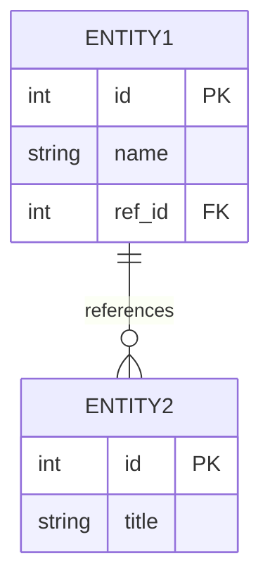
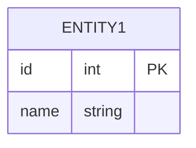

# Mermaid and Chrome Extension Troubleshooting

**Purpose:** Fix common Mermaid diagram rendering issues in Markdown viewers and Chrome extensions.  
**Applies to:** MD files with Mermaid code blocks, Markdown viewers, and Chrome extensions that render Mermaid.

---

## 1. Common Issues and Fixes

### Issue A: "No diagram type detected matching given configuration"

**Symptom:** Error message where the "text" looks like CSS, SVG, or rendered HTML instead of Mermaid source.

**Cause:** The Markdown viewer or extension is passing the wrong content to Mermaid (e.g. rendered output instead of raw code block text).

**Fixes:**

1. **Content script:** Ensure you extract the raw text from inside the fenced code block, not the rendered DOM. Match ` ```mermaid ` blocks and pass only the content between the fences.
2. **Fallback rendering:** Only run Mermaid when the content looks like Mermaid source (e.g. starts with `flowchart`, `graph`, `sequenceDiagram`, `gantt`). Skip if it looks like CSS/SVG/HTML.
3. **Example check:**
   ```javascript
   const isMermaidSource = /^(flowchart|graph|sequenceDiagram|gantt|journey|pie|erDiagram)\s/m.test(content.trim());
   if (!isMermaidSource) return; // do not render
   ```

---

### Issue B: "Denying load of URL. Resources must be listed in web_accessible_resources"

**Symptom:** Chrome extension blocks loading of Mermaid script or loader.

**Cause:** The Mermaid library URL (or loader script) is not declared in `web_accessible_resources` in `manifest.json`.

**Fixes:**

1. Add the Mermaid CDN (or your hosted script) to `web_accessible_resources`:
   ```json
   "web_accessible_resources": [
     { "resources": ["scripts/mermaid-loader.js"], "matches": ["<all_urls>"] }
   ]
   ```
2. If loading Mermaid from a CDN, ensure the CDN domain is allowed or use a local copy bundled with the extension.
3. Avoid loading Mermaid via a `<script src="...?query=string">` — some extensions strip or alter query strings.

---

### Issue C: erDiagram "Parse error … Expecting 'ATTRIBUTE_WORD', got 'ATTRIBUTE_KEY'"

**Symptom:** Parse error around line 19 or entity attribute definitions.

**Cause:** Invalid attribute syntax in `erDiagram`. Mermaid expects `type name` or `type name PK` or `type name FK`, not `name type` or other formats.

**Correct format:**


**Wrong (causes parse error):**


**Fix:** Use `type name` for every attribute. Use `type name PK` or `type name FK` where needed. Avoid reserved words as first token.

**Recommendation:** Prefer `flowchart` or tables over `erDiagram` when possible; they are more stable across viewers.

---

### Issue D: "Mermaid run() error: Object" with no useful message

**Symptom:** `mermaid.run()` throws an error object with no readable message in console.

**Fixes:**

1. **Log full error:**
   ```javascript
   mermaid.run({ suppressErrors: true }).catch(err => {
     console.error('Mermaid error:', err?.message, err?.stack);
   });
   ```
2. **Use suppressErrors:** Pass `suppressErrors: true` so one failing diagram does not break others:
   ```javascript
   await mermaid.run({ suppressErrors: true, nodes: nodes });
   ```
3. **Check mermaid version:** Older versions have less helpful errors. Consider upgrading.

---

## 2. Chrome Extension–Specific Fixes

### Loader URL and Query String

**Problem:** Using a loader script with a query string (e.g. `mermaid.min.js?v=10`) can cause "No diagram type detected" if the extension alters or blocks it.

**Fix:**

1. **No query string on loader URL:** Use a stable URL without `?` parameters, e.g. `https://cdn.jsdelivr.net/npm/mermaid@10/dist/mermaid.min.js`
2. **Pass Mermaid URL via global:** Set the URL once, use it for all diagrams:
   ```html
   <script>
     window.__MDV_MERMAID_URL = 'https://cdn.jsdelivr.net/npm/mermaid@10/dist/mermaid.min.js';
   </script>
   ```
   Then in your content script, read `window.__MDV_MERMAID_URL` and load from that URL.

### Content Script and Page-Context Loader

If the extension injects a loader script into the page:

1. **Loader `src`:** Do not add query parameters. Use the URL from `window.__MDV_MERMAID_URL` or a constant.
2. **Injection order:** Inject the script that sets `window.__MDV_MERMAID_URL` before the loader script.

---

## 3. Files to Change (Chrome Extension)

If you maintain a Chrome extension for Markdown/Mermaid viewing:

| File | Change |
|------|--------|
| `manifest.json` | Add Mermaid script (or loader) to `web_accessible_resources` |
| Content script (e.g. `content.js`) | Extract raw code block text; verify it looks like Mermaid before calling `mermaid.run()` |
| Page-context loader | Use `window.__MDV_MERMAID_URL` for script `src`; avoid query strings |
| Inline script in HTML | Set `window.__MDV_MERMAID_URL` before loader runs |
| Mermaid run call | Use `mermaid.run({ suppressErrors: true })` and log `err.message` and `err.stack` |

**After changes:** Reload the extension (chrome://extensions → Reload) and refresh the Markdown page.

---

## 3b. Markdown Viewer Extension — Specific Patch Guide

If you see **CSP violation** + **Mermaid URL not provided** + **web_accessible_resources** when viewing local MD files:

→ See **`docs/MARKDOWN-VIEWER-MERMAID-FIX.md`** for step-by-step fixes:

1. Set `window.__MDV_MERMAID_URL` before the loader runs
2. Move inline script to external file (or add CSP hash)
3. Add Mermaid scripts to `web_accessible_resources` with `file:///*` in `matches`
4. Reload extension and refresh the page

---

## 4. Files to Change (MyOMR Markdown Content)

For Markdown files in this project (e.g. `docs/workflows-pipelines/*.md`):

| Change | Reason |
|--------|--------|
| Avoid `erDiagram` | Parse errors in some viewers |
| Use `flowchart` and `sequenceDiagram` | Better compatibility |
| Keep node labels simple | Avoid CSS-like or SVG-like strings that trigger "No diagram type detected" |
| Use tables for entity-style data | Safer than `erDiagram` |

**Example:** `docs/workflows-pipelines/NEWS-WORKFLOW-END-TO-END-PROCESS-MAP.md` uses only `flowchart` and `sequenceDiagram` and avoids `erDiagram`.

---

## 5. Quick Checklist

- [ ] Mermaid blocks contain only Mermaid syntax, not CSS/SVG/HTML
- [ ] `erDiagram` uses `type name` and `type name PK/FK` for attributes
- [ ] Loader URL has no query string
- [ ] `web_accessible_resources` includes Mermaid script
- [ ] `mermaid.run({ suppressErrors: true })` used with error logging
- [ ] Extension reloaded and page refreshed after changes
