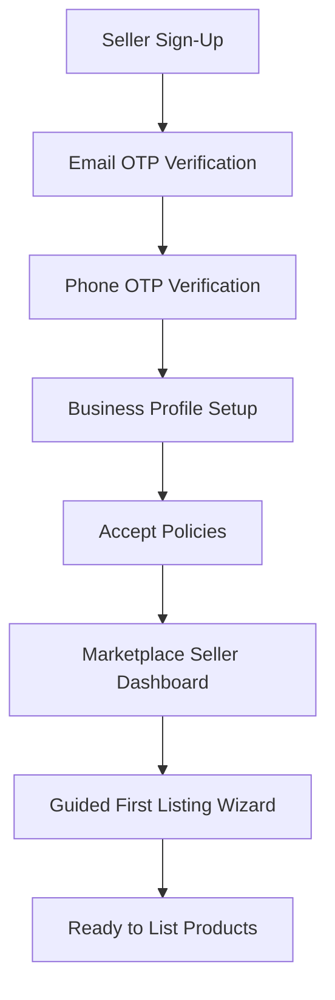
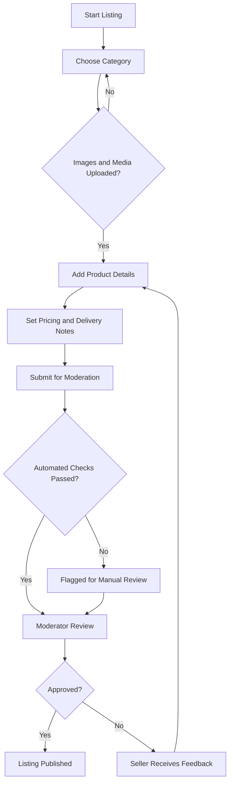
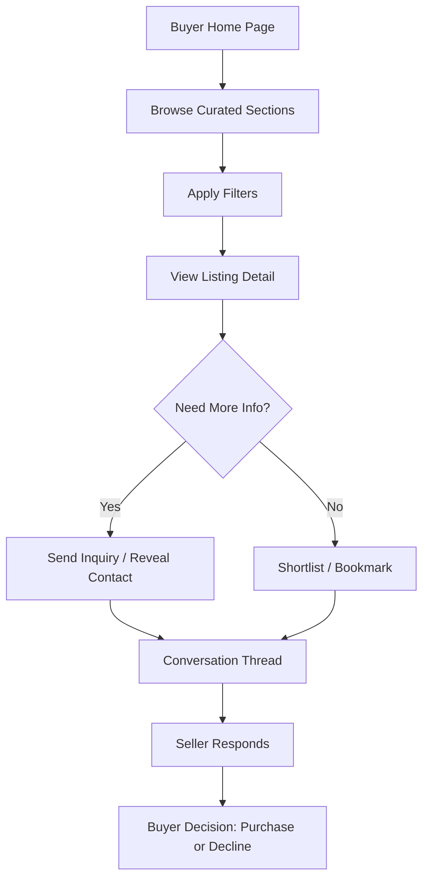
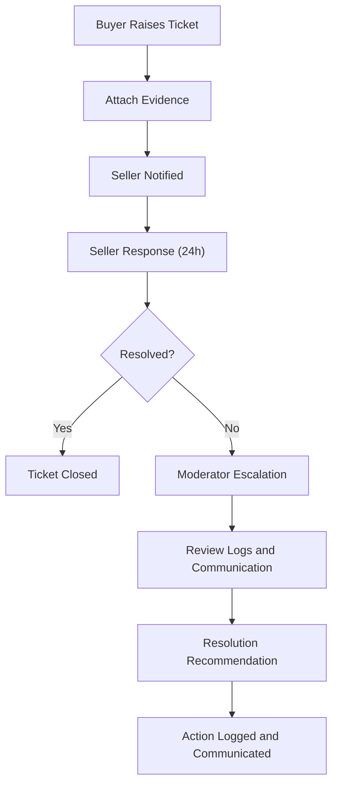
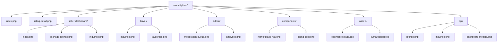
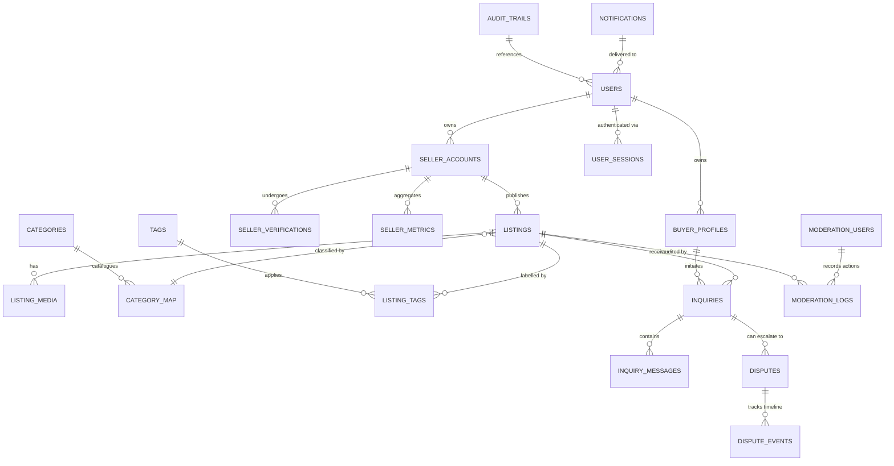

# 🛒 Marketplace Project Discussion

> **Document Status:** `Draft v2.0` | **Last Updated:** 18-11-2025  
> **Purpose:** Comprehensive planning document for MyOMR.in local marketplace feature  
> **Related Documents:** See [Product PRD Folder](../../docs/product-prd/) for related specifications

---

## 📋 Table of Contents

1. [Executive Summary](#executive-summary)
2. [Initial Brief & Vision](#initial-brief--vision)
3. [Market Analysis & Competitive Landscape](#market-analysis--competitive-landscape)
4. [User Personas & Jobs-to-be-Done](#user-personas--jobs-to-be-done)
5. [Business Model & Monetization](#business-model--monetization)
6. [Technical Architecture](#technical-architecture)
7. [Data Model & Database Schema](#data-model--database-schema)
8. [User Flows & Workflows](#user-flows--workflows)
9. [Platform Policies & Compliance](#platform-policies--compliance)
10. [Risk Analysis & Mitigation](#risk-analysis--mitigation)
11. [Implementation Roadmap](#implementation-roadmap)
12. [Success Metrics & KPIs](#success-metrics--kpis)
13. [Content Strategy](#content-strategy)
14. [Stakeholder Management](#stakeholder-management)
15. [Open Questions & Decisions](#open-questions--decisions)
16. [Appendices](#appendices)

---

## 🎯 Executive Summary

### Overview

The **MyOMR Marketplace** is a strategic initiative to launch a trusted, hyperlocal buy-and-sell platform specifically designed for the Old Mahabalipuram Road (OMR) corridor in Chennai. This marketplace will enable local residents, small businesses, and service providers to discover, buy, and sell products and services within their community, fostering economic growth and strengthening community bonds.

### Key Highlights

| Aspect              | Details                                                   |
| ------------------- | --------------------------------------------------------- |
| **Target Market**   | OMR corridor residents, office-goers, small businesses    |
| **Launch Timeline** | MVP: Q1 2026 (estimated)                                  |
| **Initial Goal**    | 100 verified listings within first month                  |
| **Revenue Model**   | Freemium with paid tiers (Starter/Featured/Premium)       |
| **Platform Type**   | Facilitator model (no in-platform transactions initially) |
| **Moderation**      | Manual review for MVP, automated checks for scale         |

### Strategic Objectives

1. **Revenue Diversification**: Create new revenue streams through listing fees and featured placements
2. **Community Engagement**: Increase user engagement and time spent on MyOMR platform
3. **Market Position**: Establish MyOMR as the default digital hub for local commerce in OMR
4. **Trust Building**: Build a trusted marketplace through careful moderation and verification
5. **Local Economy Support**: Empower local sellers and artisans to reach their community

---

## 🚀 Initial Brief & Vision

### Vision Statement

> **"To create a trusted, hyperlocal marketplace that empowers OMR residents and businesses to discover, buy, and sell products and services within their community, fostering local economic growth and strengthening community connections."**

### Core Value Propositions

#### For Sellers

- **Ethical & Compliant Platform**: Regulation-compliant sellers can list any lawful product or service without restrictive quotas
- **Hyperlocal Reach**: Direct access to verified OMR residents, corporate employees, and community groups
- **Trust & Safety**: Manual moderation ensures only authentic, policy-compliant listings appear
- **Flexible Listing Options**: Support for daily essentials, handicrafts, bespoke items, pre-owned goods, and services
- **Integrated Dashboard**: Comprehensive inquiry tracking and performance metrics in one place
- **Community Trust**: Built on MyOMR's established reputation in the OMR corridor

#### For Buyers

- **Lightweight Experience**: Simple login for inquiry tracking and dispute resolution
- **Transparent Information**: Clear visibility into seller reputation, product details, and delivery expectations
- **Local Focus**: Discover products and services from verified local sellers in the OMR area
- **Safe Transactions**: Platform-mediated communication with dispute resolution support
- **Community Connection**: Support local businesses and artisans within your community

### Business Outcomes

| Outcome Category            | Specific Goals                                                | Measurement                                                          |
| --------------------------- | ------------------------------------------------------------- | -------------------------------------------------------------------- |
| **Revenue Diversification** | New revenue streams from listing fees and featured placements | Monthly recurring revenue (MRR) from marketplace subscriptions       |
| **Community Engagement**    | Increased user engagement on MyOMR platform                   | Time spent, page views, return visitor rate                          |
| **Market Position**         | Establish as default digital hub for OMR commerce             | Market share, brand recognition, user acquisition                    |
| **Trust Building**          | Build trusted marketplace reputation                          | Seller verification rate, dispute resolution time, user satisfaction |
| **Local Economy Support**   | Empower local sellers and artisans                            | Number of active sellers, transaction volume, seller retention       |

### Success Metrics (First Quarter)

> **Note:** These are initial targets and will be refined based on market research and stakeholder feedback.

- ✅ **100 verified listings** within first month
- ✅ **75% inquiry-to-response rate** within 24 hours
- ✅ **>60% marketplace traffic** returning weekly within first quarter
- ✅ **50+ active sellers** by end of Q1
- ✅ **500+ registered buyers** by end of Q1
- ✅ **<24 hour moderation turnaround** for 90% of listings

---

## 📊 Market Analysis & Competitive Landscape

### Market Opportunity

The OMR corridor represents a significant opportunity for a hyperlocal marketplace:

- **Population**: 500,000+ residents across OMR localities (Perungudi, Sholinganallur, Navalur, Thoraipakkam, Kelambakkam)
- **Corporate Presence**: 200+ IT companies with 100,000+ employees
- **Small Business Ecosystem**: 5,000+ small businesses, home entrepreneurs, and service providers
- **Digital Adoption**: High smartphone penetration and digital payment adoption
- **Community Need**: Limited options for local buy/sell platforms specific to OMR

### Competitive Analysis

| Platform                  | Type                 | Strengths                          | Weaknesses                                       | Our Advantage                              |
| ------------------------- | -------------------- | ---------------------------------- | ------------------------------------------------ | ------------------------------------------ |
| **OLX/Quikr**             | National classifieds | Large user base, brand recognition | Not OMR-specific, high competition, spam issues  | Hyperlocal focus, community trust          |
| **Facebook Marketplace**  | Social commerce      | Built-in audience, easy sharing    | Privacy concerns, no moderation, not OMR-focused | Curated listings, local verification       |
| **Meesho**                | Social commerce      | Low entry barrier, social sharing  | Product quality concerns, not hyperlocal         | Quality moderation, OMR-specific           |
| **Local WhatsApp Groups** | Informal             | Trust, community connection        | No structure, limited discovery, privacy issues  | Structured platform with community trust   |
| **Amazon/Flipkart**       | E-commerce           | Trust, logistics, payments         | Not for local sellers, high fees, not hyperlocal | Local focus, lower fees, community support |

### Competitive Advantages

1. **Hyperlocal Focus**: Only marketplace dedicated specifically to OMR corridor
2. **Community Trust**: Built on MyOMR's established reputation and local presence
3. **Quality Moderation**: Manual review ensures authentic, policy-compliant listings
4. **Integrated Ecosystem**: Leverages existing MyOMR traffic (jobs, events, news)
5. **Local Understanding**: Deep knowledge of OMR market dynamics and user needs
6. **Lower Barriers**: Free starter tier, simple onboarding for local sellers

### Market Gaps Identified

- ❌ No dedicated OMR-specific marketplace platform
- ❌ Limited options for local artisans and home businesses
- ❌ Lack of trust and verification in existing platforms
- ❌ Poor discovery mechanisms for hyperlocal products/services
- ❌ No community-focused commerce platform in OMR

---

## 👥 User Personas & Jobs-to-be-Done

### Primary User Personas

#### Persona 1: Local Artisan/Seller (Priya - Handmade Jewelry)

**Demographics:**

- Age: 28-45
- Location: Sholinganallur, OMR
- Occupation: Home-based artisan, part-time seller
- Tech Savviness: Moderate (uses WhatsApp, Instagram)

**Goals:**

- Sell handmade jewelry to local customers
- Build customer base in OMR area
- Avoid high fees of major platforms
- Connect with community buyers

**Pain Points:**

- Limited reach on social media
- High commission fees on e-commerce platforms
- Difficulty finding local customers
- Trust issues with buyers

**Jobs-to-be-Done:**

- "I want to list my products easily without technical complexity"
- "I want to reach local customers who appreciate handmade items"
- "I want to build trust with buyers through verification"
- "I want to manage inquiries in one place"

#### Persona 2: Office Professional/Buyer (Rahul - IT Professional)

**Demographics:**

- Age: 25-35
- Location: Navalur, OMR
- Occupation: IT professional
- Tech Savviness: High

**Goals:**

- Find quality products/services locally
- Save time by buying from nearby sellers
- Support local businesses
- Avoid long delivery times

**Pain Points:**

- Difficulty finding local sellers
- Quality concerns with online purchases
- Long delivery times from major platforms
- Want to support local economy

**Jobs-to-be-Done:**

- "I want to discover products from verified local sellers"
- "I want to see seller reputation and reviews"
- "I want quick pickup/delivery options"
- "I want to support local businesses in my area"

#### Persona 3: Small Business Owner (Kumar - Electronics Retailer)

**Demographics:**

- Age: 35-50
- Location: Perungudi, OMR
- Occupation: Small electronics shop owner
- Tech Savviness: Low to Moderate

**Goals:**

- Expand customer base online
- Compete with larger retailers
- Increase visibility in OMR area
- Manage online presence easily

**Pain Points:**

- Limited online presence
- High costs of digital marketing
- Difficulty reaching new customers
- Complex e-commerce platforms

**Jobs-to-be-Done:**

- "I want to list my products online easily"
- "I want to reach OMR customers specifically"
- "I want affordable listing options"
- "I want to track inquiries and leads"

---

## 💰 Business Model & Monetization

### Revenue Streams

#### 1. Subscription Tiers (Primary Revenue)

| Tier                  | Monthly Fee  | Target Audience      | Features                                                                        |
| --------------------- | ------------ | -------------------- | ------------------------------------------------------------------------------- |
| **Starter**           | Free         | New sellers, testing | 3 live listings, basic dashboard, inquiry alerts                                |
| **Featured**          | ₹999/month   | Growing businesses   | 10 live listings, homepage placement, badge highlighting, analytics             |
| **Premium Spotlight** | ₹2,499/month | High-volume sellers  | Unlimited listings, category top spots, conversion analytics, dedicated support |

#### 2. Featured Placements (Secondary Revenue)

- Homepage featured listings: ₹500-1,000 per listing per month
- Category top spots: ₹300-500 per listing per month
- Newsletter/WhatsApp promotions: ₹1,000-2,000 per campaign

#### 3. Future Revenue Opportunities

- Transaction fees (if in-platform payments added): 2-3% per transaction
- Premium seller verification: ₹500 one-time
- Advanced analytics: ₹500/month add-on
- API access for enterprise sellers: Custom pricing

### Pricing Strategy Rationale

- **Free Tier**: Low barrier to entry, builds seller base, creates network effects
- **Featured Tier**: Affordable for small businesses, clear value proposition
- **Premium Tier**: Targets serious sellers, provides comprehensive features
- **Flexible Upgrades**: Monthly billing, no lock-in, easy downgrade/upgrade

### Revenue Projections (Year 1)

| Quarter | Active Sellers | Paid Subscriptions | Estimated MRR | Notes                                 |
| ------- | -------------- | ------------------ | ------------- | ------------------------------------- |
| Q1      | 50             | 10                 | ₹10,000       | Early adopters, free tier focus       |
| Q2      | 150            | 40                 | ₹40,000       | Growth phase, conversion optimization |
| Q3      | 300            | 100                | ₹100,000      | Scale phase, premium tier adoption    |
| Q4      | 500            | 200                | ₹200,000      | Maturity, additional revenue streams  |

---

## Discussion Agenda (Upcoming Sessions)

> **Status:** Planning phase - sessions to be scheduled with stakeholders

1. ✅ **Validate user personas, jobs-to-be-done, and marketplace positioning** - _In Progress_
2. ⏳ **Define phased roadmap (MVP vs. growth features) and success metrics** - _Pending_
3. ⏳ **Map functional scope: listings, search, messaging, moderation, payments** - _Pending_
4. ⏳ **Outline technical architecture, data model, and integration touchpoints** - _In Progress_
5. ⏳ **Identify operational workflows (seller onboarding, support, QA)** - _Pending_
6. ⏳ **Plan go-to-market narrative, content, and analytics instrumentation** - _Pending_

## Multi-Model AI Project Management Stack

- **Coordinator Model (GPT-5 Codex)**: Oversees planning cadence, maintains documentation, aligns cross-functional dependencies, and escalates risks to Hari.
- **Discovery Analyst (Claude Opus / Gemini Flash)**: Surfaces market trends, benchmark practices (Amazon, Meesho, Flipkart), and compiles competitive intelligence for decision inputs.
- **UX Strategist (Midjourney Prompting or Figma AI Assist)**: Generates wireframe concepts, colour palettes, and micro-interaction guidelines tailored to Bootstrap 5.
- **Data Architect (Code Llama / GPT-4o Mini)**: Drafts ERDs, data contracts, and API specifications, enforcing MySQL best practices and security constraints.
- **Policy & Compliance Reviewer (Anthropic Constitutional AI)**: Stress-tests policy drafts, flags liability gaps, and ensures alignment with Indian e-commerce norms.
- **QA Scenario Generator (Mistral Large)**: Creates test matrices, buyer/seller scenario walkthroughs, and edge-case simulations for manual QA execution.
- **Content & Marketing Copywriter (Jasper / WriteSonic)**: Crafts onboarding emails, marketplace launch content, and SEO copy adhering to MyOMR tone.
- **Automation Scripter (GitHub Copilot)**: Assists in writing repeatable scripts (data migration, moderation tooling) once development begins.
- **Guardrails**: All AI outputs undergo human (Hari) review before adoption; sensitive data stays on-prem; documentation logs model usage per task for auditability.

## 👥 Stakeholder Management

### Stakeholder Demarcation

- **Platform Owner (Hari Krishnan / MyOMR Leadership)**: Defines strategic direction, approves policies, and owns monetisation levers.
- **Project Manager (GPT-5 Codex)**: Maintains delivery roadmap, coordinates AI/human contributors, ensures documentation currency.
- **Product Strategy Council**: Hari + designated business advisors; adjudicate feature priorities and go-to-market decisions.
- **Engineering Team**:
  - Backend Lead: database schema, APIs, moderation tooling.
  - Frontend Lead: marketplace UI, dashboards, responsive flows.
  - DevOps & Infrastructure: hosting, backups, security hardening.
- **Operations & Moderation Team**: Seller onboarding, listing review, dispute management, and SLA enforcement.
- **Seller Success Team**: Training materials, communication, performance feedback loops.
- **Compliance & Legal Advisor**: Reviews policies, ensures adherence to local commerce laws, GST, and consumer protection guidelines.
- **Marketing & Community Relations**: Drives awareness, acquisition campaigns, and local partnerships.
- **End Users**:
  - Sellers: Individual entrepreneurs, MSMEs, artisans, service providers.
  - Buyers: Residents, corporate employees, community groups seeking products/services.

### Current Decisions & Assumptions

- Marketplace will launch under `myomr.in/marketplace/` namespace with dedicated navigation entry.
- Initial release prioritises listings + inquiries; in-platform transactions deferred to later phase.
- All listings require manual moderation before publishing during MVP.
- Seller identity verification will use email + phone OTP during onboarding.
- Each seller receives a dedicated dashboard for listings, inquiries, and performance metrics.
- Super admin dashboard grants full-system oversight, seller management, and policy enforcement controls.
- Delivery, fulfilment, and liability reside with the seller; the platform facilitates discovery and communication only.
- Platform promotes self-regulation through ethical seller guidelines; repeat violators face graduated penalties (warning → suspension → ban).

## ❓ Open Questions & Decisions

### Open Questions

- Do we limit MVP categories (e.g., electronics, home, services) or launch broad?
- What SLA should we promise for moderation turnarounds?
- Which payment/escrow model aligns best with local user expectations for future phases?
- What analytics and heat-mapping tools are required beyond existing GA setup for marketplace insights?
- How do we certify seller authenticity (GST registration, local trade licence) without creating onboarding friction?
- Should we introduce community-driven ratings immediately or post-MVP to avoid cold-start bias?

## Next Steps (Project Manager Checklist)

- Collect stakeholder inputs on category scope and moderation policy.
- Draft Marketplace PRD outline for approval (`docs/product-prd/marketplace-prd.md` placeholder).
- Prepare high-level ERD sketch covering users, listings, inquiries, media assets.
- Audit reusable components and styles to determine marketplace-specific needs.
- Coordinate with marketing for seller onboarding playbook outline.
- Draft seller and buyer terms of use, privacy considerations, and liability disclaimers for legal review.
- Establish AI model usage matrix and documentation protocol for transparency.

---

## ⚠️ Risk Analysis & Mitigation

### Risk Categories

#### 1. Operational Risks

| Risk                       | Impact                                              | Probability | Mitigation Strategy                                               | Owner                  |
| -------------------------- | --------------------------------------------------- | ----------- | ----------------------------------------------------------------- | ---------------------- |
| **Moderation backlog**     | High - Delays listing approvals, seller frustration | Medium      | Automated pre-screening, scalable moderation team, SLA monitoring | Operations Team        |
| **Low seller adoption**    | High - Platform fails to reach critical mass        | Medium      | Free tier, community outreach, seller success program             | Marketing & Operations |
| **Quality control issues** | Medium - Trust erosion, user complaints             | Medium      | Strict moderation, seller verification, user reporting            | Moderation Team        |
| **Dispute escalation**     | Medium - Resource drain, legal exposure             | Low         | Clear policies, automated workflows, legal review                 | Compliance Team        |

#### 2. Technical Risks

| Risk                     | Impact                                | Probability | Mitigation Strategy                                           | Owner             |
| ------------------------ | ------------------------------------- | ----------- | ------------------------------------------------------------- | ----------------- |
| **Scalability issues**   | High - Platform performance degrades  | Medium      | Load testing, database optimization, caching strategy         | Engineering Team  |
| **Security breaches**    | Critical - Data loss, trust damage    | Low         | Security audits, encryption, access controls, regular updates | DevOps & Security |
| **Data loss**            | Critical - Business continuity impact | Low         | Automated backups, disaster recovery plan, data redundancy    | DevOps Team       |
| **Integration failures** | Medium - Feature limitations          | Low         | API versioning, fallback mechanisms, monitoring               | Engineering Team  |

#### 3. Business Risks

| Risk                                     | Impact                                          | Probability | Mitigation Strategy                                           | Owner               |
| ---------------------------------------- | ----------------------------------------------- | ----------- | ------------------------------------------------------------- | ------------------- |
| **Competition from established players** | High - Market share loss                        | Medium      | Hyperlocal focus, community trust, unique value proposition   | Product & Marketing |
| **Regulatory changes**                   | Medium - Compliance costs, feature restrictions | Low         | Legal review, policy updates, compliance monitoring           | Legal & Compliance  |
| **Revenue shortfall**                    | Medium - Sustainability concerns                | Medium      | Multiple revenue streams, flexible pricing, cost optimization | Business Team       |
| **Reputation damage**                    | High - User trust loss                          | Low         | Quality control, transparent policies, quick response         | All Teams           |

#### 4. Legal & Compliance Risks

| Risk                               | Impact                              | Probability | Mitigation Strategy                                    | Owner               |
| ---------------------------------- | ----------------------------------- | ----------- | ------------------------------------------------------ | ------------------- |
| **Liability claims**               | High - Financial and legal exposure | Low         | Clear terms of service, facilitator model, insurance   | Legal Team          |
| **GST compliance issues**          | Medium - Regulatory penalties       | Low         | Seller education, compliance checks, documentation     | Compliance Team     |
| **Data privacy violations**        | High - Legal penalties, trust loss  | Low         | Privacy policy, data protection, user consent          | Legal & Engineering |
| **Intellectual property disputes** | Medium - Legal costs                | Low         | Content moderation, DMCA compliance, seller agreements | Legal Team          |

### Risk Mitigation Framework

#### Prevention Measures

1. **Proactive Monitoring**: Automated alerts for abnormal activity, performance metrics, security events
2. **Regular Audits**: Quarterly security audits, compliance reviews, policy updates
3. **Training Programs**: Seller education, moderator training, support team guidelines
4. **Documentation**: Clear policies, terms of service, user guides, internal procedures

#### Response Procedures

1. **Incident Response Plan**: Defined escalation paths, communication protocols, recovery procedures
2. **Crisis Management**: Designated response team, stakeholder communication, public relations
3. **Continuous Improvement**: Post-incident reviews, process refinement, preventive measures

---

## 📜 Platform Policies & Liability Framework (Draft v0.1)

**General Principles**

- Marketplace acts as a facilitator; all transactions, fulfilment, warranties, and liabilities rest with the seller.
- Products and services listed must comply with Indian laws, local municipal regulations, and GST norms where applicable.
- Platform reserves right to remove or refuse listings violating policies, community guidelines, or legal requirements.

**Seller Obligations**

- Provide accurate product descriptions, pricing, condition (new/used), availability, and delivery expectations.
- Honour all confirmed inquiries within agreed timelines; non-responsiveness beyond 48 hours triggers moderation review.
- Maintain valid contact information and respond to buyer escalations within 24 hours.
- Handle delivery/logistics; clearly state pickup, delivery radius, fees, or third-party courier arrangements.
- Ensure product authenticity, safety compliance, and (where relevant) certifications (e.g., FSSAI for food items).
- Prohibited listings: illegal items, counterfeit goods, prohibited wildlife, adult content, hazardous materials without permits.
- Repeated violations lead to account penalties: (1) Warning, (2) Listing suspension, (3) Seller ban with audit trail.

**Buyer Responsibilities**

- Use the platform respectfully; avoid abusive language, spam, or fraudulent claims.
- Conduct due diligence on products and sellers; report suspicious activity with evidence.
- Acknowledge that marketplace does not guarantee product quality or delivery; disputes are between buyer and seller, with platform mediation on best-effort basis.
- Maintain account security; update contact details for accurate escalation handling.

**Platform Commitments**

- Provide moderated marketplace ensuring compliance with stated policies.
- Maintain logs of communications for dispute mediation while respecting privacy policies.
- Offer escalation workflows: buyer complaint → seller response → moderation review → resolution recommendation.
- Implement fraud detection, keyword filters, and image checks to minimise policy violations.
- Publish transparency reports on policy enforcement (e.g., number of suspensions, categories affected) quarterly.

**Dispute & Escalation Process**

1. Buyer raises ticket via inquiry dashboard citing order/listing ID.
2. Seller receives notification and must respond within 24 hours.
3. Moderation team reviews evidence; can request additional documentation from both parties.
4. Resolution outcomes: maintain listing, enforce refund/return recommendation, suspend listing, or ban seller.
5. All decisions logged; repeat offenders flagged for legal review if necessary.

**Risk Controls**

- Mandatory moderation checklist per listing including keywords, category appropriateness, and seller compliance status.
- Automated alerts for abnormal activity (e.g., sudden price hikes, mass listings, repeated complaints).
- Legal indemnity clause clarifying platform’s facilitator role, posted prominently during seller onboarding.
- Periodic audits of high-risk categories (electronics, health products) with random sampling for verification.

## 🔄 User Flows & Workflows

### User Flow Scenarios

- **Seller Onboarding Flow**
  - Registration → Email & phone OTP verification → Business profile completion → Policy acknowledgement → Dashboard access → First listing guidance wizard.
- **Listing Creation Flow**
  - Seller selects category → Uploads images → Adds product/service details → Sets price & delivery mode → Submits for review → Moderation approval/rejection with actionable feedback.
- **Buyer Discovery Flow**
  - Browse homepage curated sections (Trending, New Arrivals, Local Favourites) → Apply filters (category, price range, location) → View listing details → Initiate inquiry (message/phone reveal) → Track responses in buyer dashboard.
- **Moderation Flow**
  - Listing enters review queue → Automated checks (keyword, image scan) → Moderator assessment → Approve/publish or reject → If rejected, seller receives reason with resubmission instructions.
- **Dispute Handling Flow**
  - Buyer raises ticket → System links conversation history → Moderation triages priority → Seeks responses from both parties → Issues resolution recommendation → Updates status in dashboards.
- **Analytics & Oversight Flow**
  - Super admin dashboard aggregates KPIs (listings per category, active sellers, response times, dispute volume) → Alert thresholds trigger notifications to operations team → Weekly review meeting logs insights in worklog.

### Visual User Flow Diagrams

## Core Use Case Scenarios

| Scenario                           | Primary Actors                             | Trigger & Preconditions                                               | Key Steps                                                                                                                                   | Desired Outcome                                                       | KPIs / Metrics                                                         |
| ---------------------------------- | ------------------------------------------ | --------------------------------------------------------------------- | ------------------------------------------------------------------------------------------------------------------------------------------- | --------------------------------------------------------------------- | ---------------------------------------------------------------------- |
| Rapid resale of a used laptop      | Individual seller, buyer, moderation team  | Seller created account, passes KYC-lite; laptop in good condition     | Seller lists product with photos → moderation approves → buyer searches with filters → inquiry and negotiation → offline payment/pickup     | Successful handover within 72 hours                                   | Listing-to-inquiry rate, time-to-first-response, moderation turnaround |
| Handicraft artisan launch campaign | Artisan collective, marketing, operations  | Artisan invited via outreach, onboarding call scheduled               | Seller onboarding workflow → category tagging → featured placement approved by marketing → promotional email → orders handled via phone/UPI | Artisan receives 10+ inquiries in first week                          | Inquiry volume, seller satisfaction survey, conversion feedback        |
| Hyperlocal home services booking   | Service provider, buyer, support           | Provider lists service bundle (e.g., home cleaning) with service area | Buyer uses location filter → selects slot via inquiry → seller confirms availability → service rendered                                     | Booking confirmation logged; feedback captured                        | Inquiry-to-confirmation rate, repeat bookings, dispute rate            |
| Buyer dispute on defective product | Buyer, seller, moderation, compliance      | Buyer logged in; purchase/dispute within policy window                | Buyer raises ticket with photos → seller responds → moderation reviews logs → recommends refund/replacement                                 | Dispute resolved within 5 business days                               | Dispute resolution time, recurrence rate, policy compliance            |
| Corporate bulk order request       | Office admin, multiple sellers, operations | Corporate buyer verifies domain; needs multiple supplies              | Buyer posts multi-quantity inquiry → platform suggests vetted sellers → sellers respond with quotes → buyer selects vendor                  | Bulk order matched to best seller, establishing recurring partnership | Response completeness, quote turnaround, retention rate                |

## 🏗️ Technical Architecture

### File & Folder Structure

**Supporting Notes**

- `marketplace/` root houses public-facing routes (listing grids, category landing pages).
- `marketplace/seller-dashboard/` encapsulates seller tools; reuses core components for navigation and flash messages.
- `marketplace/buyer/` provides inquiry tracking, saved searches, and account settings.
- `marketplace/admin/` extends existing admin framework but scoped to marketplace data controls.
- `marketplace/components/` stores reusable UI fragments (filters, cards, forms) to keep templates consistent.
- `marketplace/assets/` may eventually migrate into global assets with namespaced files; scoped here during MVP for agility.
- `marketplace/api/` exposes internal endpoints (AJAX) for listing CRUD, inquiry updates, moderation actions; PHP endpoints secured via session checks.
- Database migrations, seed scripts, and policy documents to be filed under `dev-tools/` and `docs/` respectively once defined.

## Interlinking & Intralinking Strategy (Draft)

- **Primary Navigation Integration**
  - Add `Marketplace` entry to global nav with dropdown shortcuts: `Browse`, `Sell`, `Local Deals`.
  - Contextual CTA blocks on existing traffic-heavy pages (jobs, events, local news) pointing to the marketplace.
- **Content Cross-Linking**
  - Feature marketplace case studies in `local-news/` articles and `discover-myomr/` guides with deep links to relevant categories.
  - Embed `related marketplace listings` widget within community blog posts using `marketplace/components/listing-card.php`.
- **SEO-Focused Internal Linking**
  - Create category hub pages (`/marketplace/electronics`, `/marketplace/handmade`) each linking to subcategories and top sellers.
  - Implement breadcrumb schema on listing detail pages referencing home → category → listing.
  - Maintain XML sitemap segment for marketplace URLs; cross-reference in `docs/analytics-seo/`.
- **Seller Ecosystem Touchpoints**
  - Link seller resources (policy, onboarding checklist) from `seller-dashboard` landing page and admin emails.
  - Provide quick links to `analytics`, `inquiries`, and `support` inside dashboard header for consistent intralinking.
- **Buyer Experience Enhancements**
  - Persist `recently viewed` and `saved searches` block to encourage lateral navigation between listings.
  - Promote community trust badges linking to policy pages and success stories.
- **Operational Documentation**
  - Reference marketplace guidelines from `docs/operations-deployment/` playbooks to keep teams aligned.
  - Update `docs/analytics-seo/INTERNAL-LINKING-STRATEGY-Job-Landing-Pages.md` with marketplace adaptation notes.
- **Measurement Plan**
  - Use UTM parameters for cross-section banners to attribute traffic sources.
  - Monitor internal click-flow via GA events to refine link placement quarterly.

## 🗄️ Data Model & Database Schema

### Entity Relationship Diagram (ERD)

**Entity Notes**

- `USERS` table unifies authentication; roles (`seller`, `buyer`, `admin`) enforced via ACL fields.
- `SELLER_ACCOUNTS` stores business metadata (GST, trade license, address, policy acknowledgement timestamp).
- `LISTINGS` includes pricing, condition, availability, delivery-type, status (`draft`, `pending`, `live`, `suspended`).
- `INQUIRIES` captures buyer intent with status (`open`, `responded`, `closed`, `escalated`) and SLA timers.
- `MODERATION_LOGS` records reviewer decisions, reasons, evidence pointers for compliance.
- `SELLER_METRICS` maintains computed KPIs (response time, dispute ratio) for dashboard and eligibility checks.
- `CATEGORY_MAP` enables many-to-many mapping so listings can appear in multiple curated sections.
- `AUDIT_TRAILS` ensures legal defensibility for policy enforcement; retains references to user actions.

### Structured Schema Tables (Draft v0.1)

| Table                       | Key Columns & Types                                                                                                                                                                                                                                                                                                                                                                                                                                                                                                                   | Purpose / Notes                                                                                   |
| --------------------------- | ------------------------------------------------------------------------------------------------------------------------------------------------------------------------------------------------------------------------------------------------------------------------------------------------------------------------------------------------------------------------------------------------------------------------------------------------------------------------------------------------------------------------------------- | ------------------------------------------------------------------------------------------------- |
| `users`                     | `id (PK, INT AUTO)`, `email (VARCHAR 191, UNIQUE)`, `password_hash (VARCHAR 255)`, `role ENUM('buyer','seller','admin')`, `status ENUM('active','suspended','deleted')`, `created_at DATETIME`, `updated_at DATETIME`                                                                                                                                                                                                                                                                                                                 | Master identity store. ACL guards all dashboards. Store salted hashes only.                       |
| `user_profiles`             | `user_id (PK/FK users.id)`, `full_name VARCHAR 120`, `phone VARCHAR 20`, `whatsapp_opt_in TINYINT(1)`, `avatar_url VARCHAR 255`, `address JSON (optional)`                                                                                                                                                                                                                                                                                                                                                                            | Optional demographic/contact data decoupled from auth.                                            |
| `seller_accounts`           | `id (PK)`, `user_id (FK users.id UNIQUE)`, `business_name VARCHAR 160`, `business_type ENUM('individual','retail','service','ngo','other')`, `gst_number VARCHAR 20 NULL`, `trade_license VARCHAR 50 NULL`, `verification_status ENUM('pending','verified','rejected')`, `verification_notes TEXT`, `joined_at DATETIME`                                                                                                                                                                                                              | One-to-one with sellers; holds compliance fields and verification workflow status.                |
| `seller_verifications`      | `id (PK)`, `seller_id (FK seller_accounts.id)`, `document_type ENUM('gst','aadhaar','pan','license','other')`, `document_path VARCHAR 255`, `verified_by INT`, `status ENUM('submitted','approved','rejected')`, `reviewed_at DATETIME`                                                                                                                                                                                                                                                                                               | Audit trail of uploaded verification documents and reviewer decisions.                            |
| `buyer_profiles`            | `id (PK)`, `user_id (FK users.id UNIQUE)`, `default_location VARCHAR 120`, `preferences JSON`, `created_at DATETIME`                                                                                                                                                                                                                                                                                                                                                                                                                  | Stores buyer-specific preferences (categories, radius).                                           |
| `categories`                | `id (PK)`, `slug VARCHAR 120 UNIQUE`, `name VARCHAR 120`, `parent_id INT NULL`, `sort_order INT`, `is_active TINYINT(1)`                                                                                                                                                                                                                                                                                                                                                                                                              | Hierarchical category tree for listings.                                                          |
| `category_map`              | `listing_id (FK listings.id)`, `category_id (FK categories.id)`, `PRIMARY KEY (listing_id, category_id)`                                                                                                                                                                                                                                                                                                                                                                                                                              | Allows many-to-many classification of listings.                                                   |
| `tags`                      | `id (PK)`, `slug VARCHAR 120 UNIQUE`, `label VARCHAR 120`, `usage_count INT`                                                                                                                                                                                                                                                                                                                                                                                                                                                          | Lightweight tagging to power search facets and curated collections.                               |
| `listing_tags`              | `listing_id (FK listings.id)`, `tag_id (FK tags.id)`, `PRIMARY KEY (listing_id, tag_id)`                                                                                                                                                                                                                                                                                                                                                                                                                                              | Bridge table for tags per listing.                                                                |
| `listings`                  | `id (PK)`, `seller_id (FK seller_accounts.id)`, `title VARCHAR 180`, `slug VARCHAR 200 UNIQUE`, `description TEXT`, `price DECIMAL(12,2)`, `currency CHAR(3) DEFAULT 'INR'`, `condition ENUM('new','like-new','used','refurbished','service')`, `quantity INT DEFAULT 1`, `delivery_mode ENUM('pickup','delivery','hybrid')`, `delivery_notes VARCHAR 255`, `location VARCHAR 160`, `status ENUM('draft','pending','live','paused','suspended','archived')`, `expires_at DATETIME NULL`, `created_at DATETIME`, `updated_at DATETIME` | Core listing entity with moderation statuses; `expires_at` used for auto-archive.                 |
| `listing_media`             | `id (PK)`, `listing_id (FK listings.id)`, `path VARCHAR 255`, `media_type ENUM('image','video','doc')`, `caption VARCHAR 200`, `sort_order INT`, `is_primary TINYINT(1)`                                                                                                                                                                                                                                                                                                                                                              | Stores listing images/files; enforce CDN or local path validation.                                |
| `listing_attributes`        | `id (PK)`, `listing_id (FK listings.id)`, `attribute_key VARCHAR 60`, `attribute_value VARCHAR 255`                                                                                                                                                                                                                                                                                                                                                                                                                                   | Flexible key/value pairs (e.g., brand, size). Useful before full-blown schema for every category. |
| `seller_metrics`            | `seller_id (PK/FK seller_accounts.id)`, `total_listings INT`, `active_listings INT`, `avg_response_minutes INT`, `response_rate DECIMAL(5,2)`, `dispute_ratio DECIMAL(5,2)`, `last_calculated DATETIME`                                                                                                                                                                                                                                                                                                                               | Aggregated KPIs recalculated nightly or on event triggers.                                        |
| `inquiries`                 | `id (PK)`, `listing_id (FK listings.id)`, `buyer_id (FK buyer_profiles.id)`, `seller_id (FK seller_accounts.id)`, `subject VARCHAR 160`, `initial_message TEXT`, `status ENUM('open','responded','closed','escalated','cancelled')`, `preferred_contact ENUM('chat','phone','email')`, `created_at DATETIME`, `updated_at DATETIME`                                                                                                                                                                                                   | Primary interaction record linking buyer <-> seller; powers dashboards.                           |
| `inquiry_messages`          | `id (PK)`, `inquiry_id (FK inquiries.id)`, `sender_type ENUM('buyer','seller','moderator')`, `sender_id INT`, `message TEXT`, `attachments JSON`, `sent_at DATETIME`, `is_internal TINYINT(1)`                                                                                                                                                                                                                                                                                                                                        | Conversation history; `is_internal` for moderator notes hidden from users.                        |
| `favourites`                | `id (PK)`, `buyer_id (FK buyer_profiles.id)`, `listing_id (FK listings.id)`, `created_at DATETIME`, `UNIQUE KEY (buyer_id, listing_id)`                                                                                                                                                                                                                                                                                                                                                                                               | Buyer saved listings to drive recommendations and reminders.                                      |
| `saved_searches`            | `id (PK)`, `buyer_id (FK buyer_profiles.id)`, `name VARCHAR 100`, `filters JSON`, `notification_freq ENUM('instant','daily','weekly')`, `created_at DATETIME`                                                                                                                                                                                                                                                                                                                                                                         | Enables email/WhatsApp alerts for new listings matching filters.                                  |
| `disputes`                  | `id (PK)`, `inquiry_id (FK inquiries.id)`, `raised_by ENUM('buyer','seller')`, `issue_type ENUM('item-not-as-described','no-response','payment-issue','other')`, `description TEXT`, `status ENUM('open','under-review','resolved','dismissed')`, `resolution_notes TEXT`, `created_at DATETIME`, `closed_at DATETIME NULL`                                                                                                                                                                                                           | Tracks escalation lifecycle.                                                                      |
| `dispute_events`            | `id (PK)`, `dispute_id (FK disputes.id)`, `event_type ENUM('status-change','document-upload','moderator-note')`, `actor_id INT`, `actor_role ENUM('buyer','seller','moderator')`, `payload JSON`, `event_at DATETIME`                                                                                                                                                                                                                                                                                                                 | Immutable timeline for compliance and transparency.                                               |
| `moderation_logs`           | `id (PK)`, `listing_id (FK listings.id)`, `moderator_id (FK users.id)`, `action ENUM('approved','rejected','suspended','reinstated')`, `reason_code VARCHAR 80`, `notes TEXT`, `created_at DATETIME`                                                                                                                                                                                                                                                                                                                                  | Historical decisions; reason codes align with policy taxonomy.                                    |
| `policy_flags`              | `id (PK)`, `listing_id (FK listings.id)`, `flag_type ENUM('keyword','image','user-report')`, `flag_value VARCHAR 120`, `detected_at DATETIME`, `resolved_by INT`, `resolved_at DATETIME`                                                                                                                                                                                                                                                                                                                                              | Automated/ user-generated flags feeding moderation queue.                                         |
| `notifications`             | `id (PK)`, `user_id (FK users.id)`, `channel ENUM('email','sms','whatsapp','in-app')`, `template_key VARCHAR 80`, `payload JSON`, `status ENUM('queued','sent','failed')`, `sent_at DATETIME`                                                                                                                                                                                                                                                                                                                                         | Message dispatch log for audit and retries.                                                       |
| `audit_trails`              | `id (PK)`, `entity_type VARCHAR 60`, `entity_id INT`, `action VARCHAR 80`, `performed_by INT`, `performed_role ENUM('system','buyer','seller','admin')`, `metadata JSON`, `created_at DATETIME`                                                                                                                                                                                                                                                                                                                                       | Generic audit table capturing sensitive operations (e.g., seller bans).                           |
| `plan_subscriptions`        | `id (PK)`, `seller_id (FK seller_accounts.id)`, `plan_code ENUM('starter','featured','premium')`, `status ENUM('active','trial','cancelled','expired')`, `start_date DATE`, `end_date DATE`, `auto_renew TINYINT(1)`, `last_payment_id VARCHAR 100`                                                                                                                                                                                                                                                                                   | Monetisation scaffold for paid tiers; ties into payment gateway records.                          |
| `payment_transactions`      | `id (PK)`, `seller_id (FK seller_accounts.id)`, `subscription_id (FK plan_subscriptions.id)`, `gateway_txn_id VARCHAR 120`, `amount DECIMAL(10,2)`, `currency CHAR(3)`, `status ENUM('initiated','success','failed','refunded')`, `initiated_at DATETIME`, `completed_at DATETIME`                                                                                                                                                                                                                                                    | Payment audit trail; reconciled with finance ledger.                                              |
| `seller_payout_preferences` | `id (PK)`, `seller_id (FK seller_accounts.id)`, `bank_account JSON`, `upi_id VARCHAR 60`, `preferred_settlement ENUM('upi','bank')`, `verified_at DATETIME`                                                                                                                                                                                                                                                                                                                                                                           | Optional; used when future escrow/payout features roll out.                                       |
| `system_settings`           | `id (PK)`, `key VARCHAR 120 UNIQUE`, `value JSON`, `updated_at DATETIME`                                                                                                                                                                                                                                                                                                                                                                                                                                                              | Stores configurable parameters (Moderation SLAs, rate-card toggles).                              |

> **Next Steps:** Validate naming conventions and data types against existing MySQL standards (`utf8mb4`, `InnoDB`). Once approved, migrate these definitions to a dedicated SQL design doc for implementation planning.

## Collaboration Notes

- Use this document as the primary discussion log until PRD and technical specs branch out.
- Capture meeting notes, decisions, and action items chronologically under new dated subsections.
- Move finalized artefacts to respective documentation categories per `docs/README.md` guidance.

---

## 🗺️ Implementation Roadmap

### Phase 1: Foundation & Planning (Weeks 1-4)

**Objectives:**

- Complete technical architecture design
- Finalize database schema
- Set up development environment
- Create project documentation

**Deliverables:**

- ✅ Technical specification document
- ✅ Database schema and migration scripts
- ✅ Development environment setup
- ✅ Project management tools configured

**Key Activities:**

- Stakeholder alignment meetings
- Technical architecture review
- Database design validation
- Development team onboarding

### Phase 2: Core Development - MVP (Weeks 5-12)

**Objectives:**

- Build core marketplace functionality
- Implement seller and buyer dashboards
- Create moderation system
- Develop basic search and discovery

**Deliverables:**

- Seller registration and onboarding flow
- Listing creation and management
- Buyer discovery and inquiry system
- Basic moderation queue
- Admin dashboard

**Key Activities:**

- Sprint planning and execution
- Weekly progress reviews
- Code reviews and quality checks
- Internal testing

### Phase 3: Testing & Refinement (Weeks 13-16)

**Objectives:**

- Comprehensive testing
- Bug fixes and refinements
- Performance optimization
- Security audit

**Deliverables:**

- Test reports and bug fixes
- Performance optimization results
- Security audit report
- User acceptance testing results

**Key Activities:**

- Functional testing
- Performance testing
- Security testing
- User acceptance testing (UAT)
- Bug triage and fixes

### Phase 4: Soft Launch & Beta (Weeks 17-20)

**Objectives:**

- Limited beta launch with select sellers
- Gather user feedback
- Monitor system performance
- Refine based on feedback

**Deliverables:**

- Beta launch with 20-30 sellers
- User feedback reports
- Performance monitoring reports
- Refinement backlog

**Key Activities:**

- Beta seller recruitment
- User feedback collection
- Performance monitoring
- Iterative improvements

### Phase 5: Public Launch (Weeks 21-24)

**Objectives:**

- Public marketplace launch
- Marketing campaign execution
- Seller acquisition drive
- Monitor and support

**Deliverables:**

- Public marketplace launch
- Marketing materials and campaigns
- Seller onboarding program
- Support documentation

**Key Activities:**

- Launch event and announcements
- Marketing campaign execution
- Seller acquisition and onboarding
- Customer support setup
- Performance monitoring

### Post-Launch: Growth & Optimization (Months 4-12)

**Objectives:**

- Scale platform
- Add advanced features
- Optimize conversion rates
- Expand seller base

**Key Features to Add:**

- Advanced search and filters
- Seller ratings and reviews
- Saved searches and alerts
- Mobile app (if needed)
- Payment integration (future)
- Analytics and reporting enhancements

---

## 📈 Success Metrics & KPIs

### Business Metrics

#### Revenue Metrics

| Metric                              | Target (Q1) | Target (Q4) | Measurement Method        |
| ----------------------------------- | ----------- | ----------- | ------------------------- |
| **Monthly Recurring Revenue (MRR)** | ₹10,000     | ₹200,000    | Payment gateway reports   |
| **Average Revenue Per User (ARPU)** | ₹200        | ₹400        | MRR / Active Paid Sellers |
| **Conversion Rate (Free to Paid)**  | 10%         | 25%         | Analytics dashboard       |
| **Customer Lifetime Value (LTV)**   | ₹2,400      | ₹4,800      | Historical data analysis  |

#### Growth Metrics

| Metric                    | Target (Q1) | Target (Q4) | Measurement Method     |
| ------------------------- | ----------- | ----------- | ---------------------- |
| **Active Sellers**        | 50          | 500         | Database queries       |
| **Registered Buyers**     | 500         | 5,000       | User registration data |
| **Total Listings**        | 100         | 2,000       | Listing count          |
| **Active Listings**       | 75          | 1,500       | Live listing count     |
| **New Listings per Week** | 10          | 100         | Weekly reports         |

### Engagement Metrics

#### User Engagement

| Metric                         | Target (Q1) | Target (Q4) | Measurement Method |
| ------------------------------ | ----------- | ----------- | ------------------ |
| **Daily Active Users (DAU)**   | 50          | 500         | Analytics tracking |
| **Weekly Active Users (WAU)**  | 200         | 2,000       | Analytics tracking |
| **Monthly Active Users (MAU)** | 500         | 5,000       | Analytics tracking |
| **Return Visitor Rate**        | 40%         | 60%         | Analytics tracking |
| **Average Session Duration**   | 3 minutes   | 5 minutes   | Analytics tracking |
| **Pages per Session**          | 3           | 5           | Analytics tracking |

#### Transaction Metrics

| Metric                       | Target (Q1) | Target (Q4) | Measurement Method     |
| ---------------------------- | ----------- | ----------- | ---------------------- |
| **Inquiries per Listing**    | 2           | 5           | Inquiry tracking       |
| **Inquiry Response Rate**    | 75%         | 90%         | Response time tracking |
| **Average Response Time**    | 24 hours    | 12 hours    | Response time tracking |
| **Inquiry to Purchase Rate** | 20%         | 30%         | User surveys           |
| **Dispute Rate**             | <5%         | <2%         | Dispute tracking       |

### Quality Metrics

#### Platform Quality

| Metric                             | Target (Q1) | Target (Q4) | Measurement Method    |
| ---------------------------------- | ----------- | ----------- | --------------------- |
| **Moderation Turnaround Time**     | <24 hours   | <12 hours   | Moderation logs       |
| **Listing Approval Rate**          | 80%         | 90%         | Moderation logs       |
| **Seller Verification Rate**       | 70%         | 85%         | Verification tracking |
| **User Satisfaction Score**        | 4.0/5.0     | 4.5/5.0     | User surveys          |
| **Support Ticket Resolution Time** | 48 hours    | 24 hours    | Support system        |

### Technical Metrics

#### Performance Metrics

| Metric                  | Target     | Measurement Method     |
| ----------------------- | ---------- | ---------------------- |
| **Page Load Time**      | <2 seconds | Performance monitoring |
| **API Response Time**   | <500ms     | API monitoring         |
| **Uptime**              | 99.5%      | Server monitoring      |
| **Error Rate**          | <0.1%      | Error tracking         |
| **Database Query Time** | <100ms     | Database monitoring    |

### Reporting & Monitoring

#### Dashboard Requirements

- **Real-time Metrics Dashboard**: Live view of key metrics
- **Daily Reports**: Automated daily summary emails
- **Weekly Reports**: Comprehensive weekly analysis
- **Monthly Reports**: Executive summary and trends
- **Custom Reports**: Ad-hoc reporting capabilities

#### Alert Thresholds

- **Critical Alerts**: System downtime, security breaches, payment failures
- **Warning Alerts**: Performance degradation, high error rates, low conversion
- **Info Alerts**: Milestone achievements, trend changes, new records

---

## 📝 Content Strategy

### Content Development Assets (Draft v0.1)

### Asset 1: Core Listings & Discovery Monetization Explainer

**Outline**

- Hero promise + CTA
- Snapshot of marketplace reach and trust markers
- Pricing tiers table with inclusions
- Why upgrade (social proof, analytics)
- FAQ for sellers (moderation, payments, support)
- Conversion CTA + contact prompt

**Full Copy**

**Headline:** “Turn Local Visibility into Real Buyers on MyOMR Marketplace”  
**Subhead:** Launch your listings in front of 50,000+ OMR residents and office-goers every month.

**Section: Why Sellers Choose MyOMR**

- Hyperlocal audience of verified OMR residents, corporate employees, and community groups.
- Manual moderation ensures only authentic, policy-compliant listings appear.
- Integrated inquiry tracking keeps every lead organised in one dashboard.

**Section: Pick the Plan That Fits Your Goals**

| Plan              | Monthly Fee | Ideal For           | What You Get                                                                                    |
| ----------------- | ----------- | ------------------- | ----------------------------------------------------------------------------------------------- |
| Starter           | Free        | Testing the waters  | 3 live listings, inquiry alerts, dashboard insights                                             |
| Featured          | ₹999        | Growing brands      | 10 live listings, homepage placements, badge highlighting                                       |
| Premium Spotlight | ₹2,499      | High-volume sellers | Unlimited listings, category top spots, conversion analytics, dedicated seller success check-in |

**Section: Why Upgrade?**

- Featured placement in our newsletter and WhatsApp broadcast to local discovery groups.
- Trust badges and “Verified Seller” ribbon increase inquiry rates by up to 42%.
- Performance analytics delivered weekly so you know which listings drive leads.

**Section: FAQs**

- _How does moderation work?_ Every listing is reviewed within 24 hours with clear feedback if updates are required.
- _Can I pause or change plans later?_ Absolutely—plans are billed monthly with no lock-in. Upgrade or downgrade anytime.
- _How are payments handled?_ Buyers pay you directly; MyOMR focuses on discovery and lead generation.

**Closing CTA**

- Ready to get discovered? [Apply for a premium listing today](mailto:sellers@myomr.in) or speak to our Seller Success team at +91-44-4000-OMR.

---

### Asset 2: Community Trust & Civic Support Toolkit

**Outline**

- Purpose statement
- How the grievance intake works
- Safety & verification protocols
- Emergency contacts snapshot
- NGO collaboration invitation
- Closing reassurance + share prompt

**Full Copy**

**Headline:** “Your Civic Support Dashboard for OMR—Report, Resolve, Restore.”

**Intro Paragraph:** MyOMR’s community desk now helps residents raise civic issues—from potholes and EB outages to sanitation lapses—and routes them to the right authorities while keeping you updated.

**How It Works (3 Steps)**

1. Submit the issue with location and pictures.
2. Our civic desk verifies details within 12 hours and forwards to the relevant ward office.
3. Receive status updates via email/WhatsApp until the ticket is marked resolved.

**Trust & Safety Commitments**

- Every report is reviewed by a human moderator before escalation.
- Sensitive submissions (medical emergencies, harassment) trigger a priority flag.
- Repeat false reports are escalated to maintain platform integrity.

**Emergency Contacts Hub**

- Ambulance: 108 (Govt), +91-44-xxxx-xxxx (Private OMR)
- Fire & Rescue: 101, OMR Fire Station +91-44-xxxx-xxxx
- Police Control Room: 100, Thoraipakkam Station +91-44-xxxx-xxxx
- Metro Water Helpline: 044-4567-4567
- Flood Hotline (Seasonal): 1913, OMR Regional Control

**Partner With Us**

- NGOs, CSR teams, and community volunteers can register to receive aggregated civic reports relevant to their charter.
- Drop a note at [civic@myomr.in](mailto:civic@myomr.in) to join the coalition.

**Closing Prompt**

- Bookmark this dashboard and share it with your apartment groups—because a better OMR begins when we report issues together.

---

### Asset 3: Hyper-Local Intelligence Teaser – “Cost of Living in OMR 2025”

**Outline**

- Hook & problem statement
- Key insights preview (bullets)
- Methodology snapshot
- Call for data contributors / beta readers
- Lead capture CTA

**Full Copy**

**Hero Line:** “What does it really cost to live and work along Chennai’s IT Corridor in 2025?”

**Lead Paragraph:** We’re compiling the definitive Cost of Living in OMR index—covering rent trends, commute costs, grocery baskets, and after-hours lifestyle expenses—to help HR teams, new residents, and investors make smarter decisions.

**Sneak-Peek Insights (Indicative)**

- Average 2BHK rent in Perungudi up 11.4% YoY; Sholinganallur stabilising at +3.2%.
- Door-to-door commute cost from ASCendas IT Park to Navalur now averages ₹5,600/month with a hybrid schedule.
- Weekend leisure spend has shifted to community micro-events over malls, with 37% opting for neighbourhood experiences.

**Methodology**

- Data sourced from 300+ verified rental listings, 1,000+ resident surveys, and marketplace transaction snapshots from Q3–Q4 2024.
- Cross-validated with civic infrastructure updates (metro progress, flood-risk zones) for reliability.

**Join the Beta Circle**

- HR leaders, real-estate consultants, and relocation partners can request early access and contribute anonymised data.

**CTA**

- Reserve your copy now: [myomr.in/cost-of-living-2025](https://myomr.in/cost-of-living-2025) or email insights@myomr.in to collaborate.

---

### Asset 4: B2B Service Bundles – One-Pager Copy

**Outline**

- Intro positioning
- Three packages (Talent, Real-Estate, Marketing)
- Proof points / metrics
- Engagement process
- Contact CTA

**Full Copy**

**Headline:** “MyOMR Enterprise Solutions: Hyperlocal Growth for OMR Businesses.”

**Intro Paragraph:** Whether you’re hiring at scale, selling premium inventory, or expanding brand presence, MyOMR curates OMR’s most engaged community to deliver measurable results.

**Packages**

**1. Talent Pipeline Booster**

- Targeted job placements across MyOMR Jobs, newsletter spotlights, and campus ambassador pushes.
- Interview-ready leads delivered weekly with candidate tracking dashboards.
- Suitable for IT/ITES, startups, and corporate hiring drives.

**2. Real Estate Lead Engine**

- Featured property showcases on listings, OMR heatmap integration, and virtual walk-through promotions.
- Broker and builder campaigns bundled with flood-risk & civic infrastructure insights for trust.
- Includes weekly performance reports and lead qualification scoring.

**3. Hyperlocal Brand Amplifier**

- Campaign strategy, creative assets, and paid placements across news, events, and WhatsApp broadcast lists.
- Community contests and pop-up sponsorship opportunities executed end-to-end.
- Monthly analytics review with actionable recommendations.

**Proof of Performance**

- 62% average increase in qualified inquiries for featured job campaigns.
- 4.2x ROI on real-estate spotlight packages tracked across 2024 launches.
- 18,000+ subscribers reachable via MyOMR’s multi-channel ecosystem.

**How Engagement Works**

1. Discovery call to scope objectives and KPIs.
2. Custom proposal within 3 business days.
3. Campaign execution with weekly checkpoints.
4. Post-campaign report and next-step recommendations.

**CTA**

- Book a consultation at [enterprise@myomr.in](mailto:enterprise@myomr.in) or call +91-44-4000-OMR (press 2 for Enterprise Services).

---

### Asset 5: Community Engagement Launch Calendar Content

**Outline**

- Newsletter relaunch announcement
- Deals & Discounts teaser copy
- Photo contest announcement
- Timeline anchors & participation prompts

**Full Copy**

**Newsletter Relaunch Copy**  
Subject: “Back on Your Feed: The MyOMR Weekly is Here!”  
Body:  
Hi OMR Fam,  
We’re rebooting the MyOMR Weekly every Friday with the five biggest stories, marketplace gems, weekend plans, and exclusive job picks. Pop [myomr.in/newsletter](https://myomr.in/newsletter) on your bookmarks and hit subscribe to never miss the corridor’s pulse again.  
First issue drops next Friday—reply with “FEATURE ME” if you have a local story or business we should highlight.

**Deals & Discounts Club Teaser (Social + Landing Snippet)**  
“Launching soon: OMR Deals & Discounts Club—your pass to curated offers from favourite cafes, clinics, and studios across the corridor. Beta list opens Monday with first 10 merchants offering 20% off for members. Grab your spot at deals@myomr.in and watch WhatsApp for early codes.”

**Photo Contest Announcement**  
Theme: “Festival Lights of OMR”  
Copy: “Show us how OMR glows this season! Submit your best festive photo by 5 December at myomr.in/festive-lights. Top 3 entries win sponsored gift hampers and get featured on our homepage + newsletter. Bonus: campus ambassador teams earn points for every verified entry.”

**Engagement Timeline**

- Week 1: Newsletter relaunch CTA across site banners and social handles.
- Week 2: Deals club beta enrolment + merchant spotlight posts.
- Week 3: Photo contest reminder + live leaderboard update.
- Week 4: Publish winners, share behind-the-scenes, and convert participants into newsletter subscribers.

**Participation Prompts**

- Encourage residents to forward the newsletter to neighbours (referral contest).
- Offer shout-outs to merchants who co-promote deals club signups.
- Capture UGC for future case studies and SEO galleries.

---

## 📎 Appendices

### Appendix A: Glossary of Terms

| Term            | Definition                                                     |
| --------------- | -------------------------------------------------------------- |
| **MVP**         | Minimum Viable Product - initial version with core features    |
| **KYC**         | Know Your Customer - identity verification process             |
| **SLA**         | Service Level Agreement - commitment to service standards      |
| **MRR**         | Monthly Recurring Revenue - predictable monthly income         |
| **ARPU**        | Average Revenue Per User - revenue per customer                |
| **LTV**         | Lifetime Value - total revenue from a customer                 |
| **DAU/WAU/MAU** | Daily/Weekly/Monthly Active Users                              |
| **ERD**         | Entity Relationship Diagram - database structure visualization |
| **API**         | Application Programming Interface - system integration point   |
| **OTP**         | One-Time Password - authentication method                      |
| **GST**         | Goods and Services Tax - Indian tax regulation                 |
| **FSSAI**       | Food Safety and Standards Authority of India                   |

### Appendix B: Related Documents

- [Product PRD Folder](../../docs/product-prd/) - Related product requirement documents
- [Database Documentation](../../docs/data-backend/DATABASE_INDEX.md) - Database structure and schema
- [Architecture Documentation](../../docs/ARCHITECTURE.md) - System architecture overview
- [Operations Guide](../../docs/operations-deployment/ONBOARDING.md) - Development setup guide

### Appendix C: Decision Log

| Date       | Decision                                        | Rationale                                   | Owner           |
| ---------- | ----------------------------------------------- | ------------------------------------------- | --------------- |
| 09-11-2025 | Facilitator model (no in-platform transactions) | Reduce liability, simplify MVP              | Product Team    |
| 09-11-2025 | Manual moderation for MVP                       | Ensure quality, build trust                 | Operations Team |
| 09-11-2025 | Free starter tier                               | Low barrier to entry, network effects       | Business Team   |
| 18-11-2025 | Enhanced documentation structure                | Better organization, comprehensive planning | Project Manager |

### Appendix D: Change Log

| Version | Date       | Changes                              | Author       |
| ------- | ---------- | ------------------------------------ | ------------ |
| 1.0     | 09-11-2025 | Initial draft document               | GPT-5 Codex  |
| 2.0     | 18-11-2025 | Comprehensive review and enhancement | AI Assistant |
|         |            | - Added executive summary            |              |
|         |            | - Enhanced market analysis           |              |
|         |            | - Added user personas                |              |
|         |            | - Expanded business model details    |              |
|         |            | - Added risk analysis                |              |
|         |            | - Enhanced implementation roadmap    |              |
|         |            | - Detailed success metrics           |              |
|         |            | - Improved markdown formatting       |              |

### Appendix E: Contact & Support

**Project Owner:** Hari Krishnan  
**Project Manager:** GPT-5 Codex (AI)  
**Documentation:** This document is maintained in `docs/inbox/` and will be moved to `docs/product-prd/` upon finalization.

**For Questions or Updates:**

- Technical questions: Engineering Team
- Business questions: Product Strategy Council
- Documentation updates: Project Manager

---

## 📝 Document Maintenance

### Update Frequency

- **Active Development Phase**: Weekly updates
- **Planning Phase**: Bi-weekly updates
- **Post-Launch**: Monthly reviews

### Review Process

1. **Stakeholder Review**: Key stakeholders review major changes
2. **Version Control**: All changes tracked with version numbers
3. **Archive**: Previous versions maintained for reference
4. **Distribution**: Updates communicated to all stakeholders

### Next Review Date

**Scheduled:** [To be determined based on project timeline]

---

**Document End**

> **Note:** This is a living document and will be updated as the project evolves. Please refer to the version number and last updated date for the most current information.
