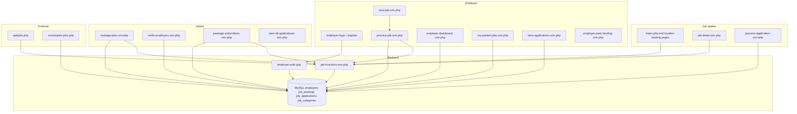
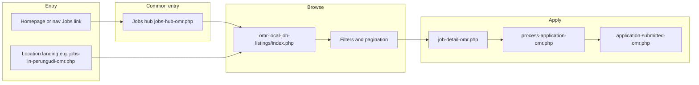
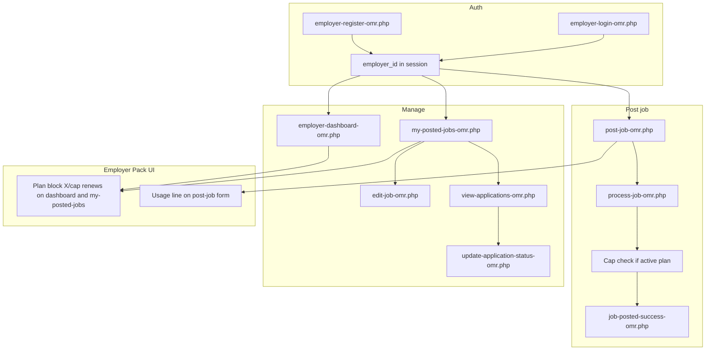
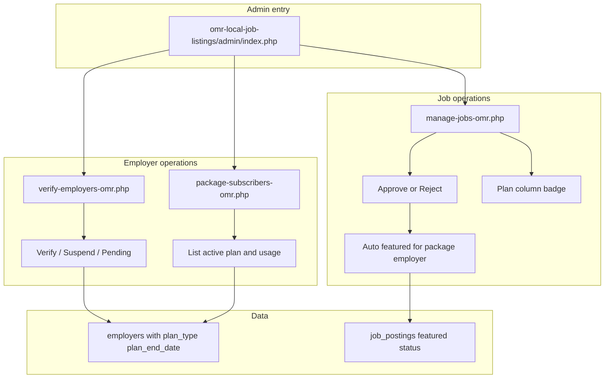
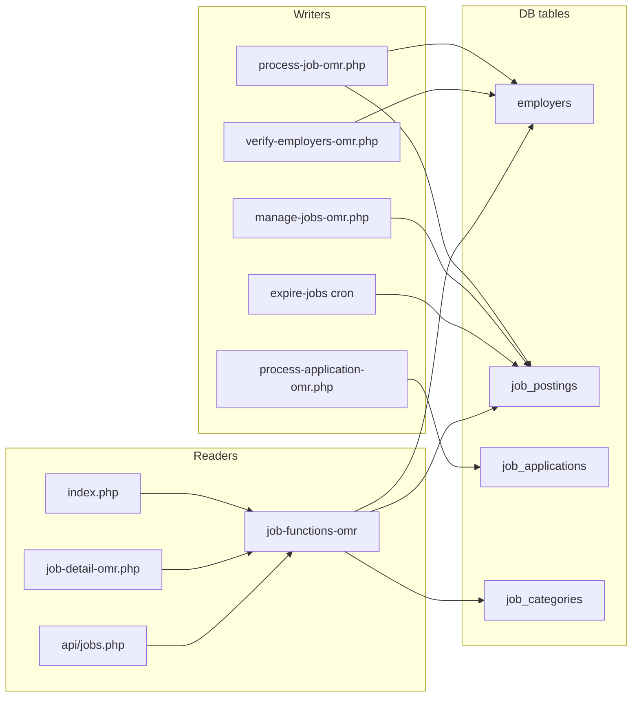

# Job Feature — Full Architecture and Flow Analysis

This document describes the MyOMR job feature: stakeholders, system connections, data layer, and flow diagrams. It also references the Employer Pack and the common Jobs hub entry page.

---

## 1. Stakeholders and systems (summary)

| Stakeholder      | Entry points                                                                                                                                 | Main actions                                                                                                           | Auth / session                                                                                                                                 |
| ---------------- | --------------------------------------------------------------------------------------------------------------------------------------------- | ---------------------------------------------------------------------------------------------------------------------- | ---------------------------------------------------------------------------------------------------------------------------------------------- |
| **Job seeker**   | omr-local-job-listings/index.php, Jobs hub (jobs-hub-omr.php), root landing pages (e.g. jobs-in-perungudi-omr.php), homepage job links        | Browse jobs, view detail, apply (resume upload), save job / job alert                                                  | Optional cookie (`applicant_email`) for "already applied"                                                                                      |
| **Employer**     | employer-login-omr.php, employer-register-omr.php, employer-pack-landing-omr.php, Jobs hub                                                | Post/edit job, view my-posted-jobs, dashboard, view/update applications, edit profile                                  | employer-auth.php: employer_id, employer_email, employer_company, employer_status                                                             |
| **Admin**        | core/admin-auth.php; job admin under omr-local-job-listings/admin/                                                                          | Manage jobs (approve/reject, Plan column, auto-featured), verify employers, package subscribers, view all applications | $_SESSION['admin_logged_in'], admin_csrf                                                                                                       |
| **Cron**         | omr-local-job-listings/cron/expire-jobs.php                                                                                                  | Close jobs past application_deadline; optional email to employer                                                     | CLI only                                                                                                                                       |
| **API consumer** | omr-local-job-listings/api/jobs.php                                                                                                          | GET jobs list (filters, pagination) — same filters as main listing                                                     | None                                                                                                                                           |

**Shared backend:** core/omr-connect.php (single DB); omr-local-job-listings/includes/job-functions-omr.php (getJobListings, getJobCount, getJobById, plan helpers, filters).

---

## 2. Data layer (tables and key pages)

Core tables used by the job feature:

- **employers** — id, company_name, contact_person, email, phone, address, website, status; plus Employer Pack: plan_type, plan_start_date, plan_end_date.
- **job_postings** — employer_id, title, category, job_type, work_segment, location, salary_range, description, requirements, benefits, application_deadline, status (pending/approved/rejected/closed), featured, views, created_at; optional work_segment.
- **job_applications** — job_id, applicant_name, applicant_email, applicant_phone, experience_years, cover_letter, resume_path, status, created_at.
- **job_categories** — slug, name (used in JOINs for display and filters).
- **admin_audit_log** — admin actions (job status, employer status).

Listing and detail use `job_postings` JOIN `employers` and `job_categories`; ordering is `featured DESC, created_at DESC`. Plan logic reads/writes `employers.plan_type` and (for cap) counts approved jobs in current month.

---

## 3. Flow diagrams

### Diagram A — Stakeholders and system connections

### Diagram B — Job seeker journey (with Jobs hub)

Home and main nav "Jobs" link go to the **Jobs hub** first; hub then links to Browse. Direct links and location landings can still go to the listing index.

### Diagram C — Employer journey (including Employer Pack)

### Diagram D — Admin operations and Employer Pack

### Diagram E — Data flow (tables and main readers/writers)

---

## 4. Plans that apply to the job feature

- **Employer Pack (B2B):** Documented in docs/product/EMPLOYER-PACK-PRODUCT.md. Plan columns on `employers`; cap enforced in process-job-omr.php; auto-featured and Plan column in admin/manage-jobs-omr.php; plan/usage block on employer-dashboard-omr.php and my-posted-jobs-omr.php; usage line on post-job-omr.php; admin/package-subscribers-omr.php and employer-pack-landing-omr.php.
- **Jobs hub (common entry):** omr-local-job-listings/jobs-hub-omr.php is the recommended first touch for both job seekers and employers when they click "Jobs" from the homepage or main navigation. From the hub, "Browse jobs" goes to the listing index; "Post a job" / employer path goes to employer login or Employer Pack landing.
- **Root landing pages:** jobs-in-perungudi-omr.php, it-jobs-omr-chennai.php, fresher-jobs-omr-chennai.php, etc. use the same DB and either direct queries or landing-page-template.php; they are entry points for job seekers and link to the main listing or detail.
- **Homepage:** index.php at root fetches recent_jobs from job_postings and links to the Jobs hub; search form can submit to the job listing.
