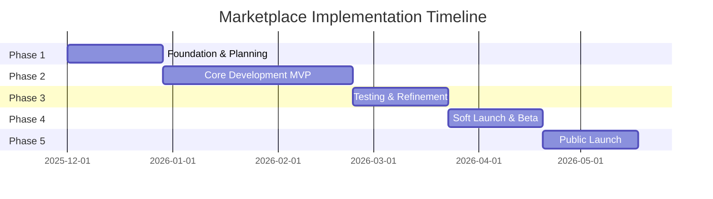
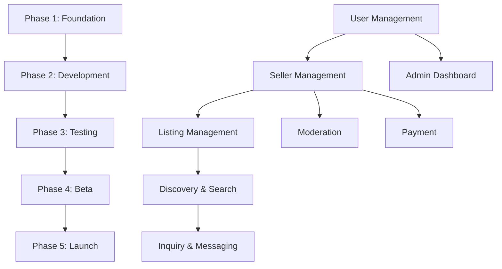

# 🗺️ Marketplace Implementation Roadmap

> **Document Type:** Product Requirements Document (PRD) + Work Breakdown Structure (WBS)  
> **Status:** `Draft v1.1` | **Last Updated:** 18-11-2025  
> **Purpose:** Comprehensive implementation guide combining PRD requirements with detailed work breakdown structure for MyOMR.in marketplace feature  
> **Related Documents:** [Marketplace Project Discussion](../../docs/inbox/MARKETPLACE-PROJECT-DISCUSSION.md)

**Tags:** `omr-marketplace` `implementation-roadmap` `work-breakdown-structure` `prd` `product-requirements`

---

## 📋 Table of Contents

1. [Document Overview](#document-overview)
2. [Executive Summary](#executive-summary)
3. [Product Requirements](#product-requirements)
4. [Work Breakdown Structure (WBS)](#work-breakdown-structure-wbs)
5. [Phase 1: Foundation & Planning](#phase-1-foundation--planning)
6. [Phase 2: Core Development - MVP](#phase-2-core-development---mvp)
7. [Phase 3: Testing & Refinement](#phase-3-testing--refinement)
8. [Phase 4: Soft Launch & Beta](#phase-4-soft-launch--beta)
9. [Phase 5: Public Launch](#phase-5-public-launch)
10. [Post-Launch: Growth & Optimization](#post-launch-growth--optimization)
11. [Resource Allocation](#resource-allocation)
12. [Risk Management](#risk-management)
13. [Success Criteria & Acceptance](#success-criteria--acceptance)
14. [Appendices](#appendices)

---

## 📖 Document Overview

### Purpose

This document serves as the **single source of truth** for implementing the MyOMR Marketplace feature. It combines:

- **Product Requirements Document (PRD)**: Detailed functional and non-functional requirements
- **Work Breakdown Structure (WBS)**: Hierarchical decomposition of work into manageable tasks
- **Implementation Roadmap**: Phased approach with timelines, dependencies, and deliverables

### Document Structure

| Section                  | Purpose                | Audience                            |
| ------------------------ | ---------------------- | ----------------------------------- |
| **Product Requirements** | What needs to be built | Product, Engineering, Design        |
| **WBS**                  | How work is organized  | Project Managers, Engineering Leads |
| **Phases**               | When work happens      | All stakeholders                    |
| **Resource Allocation**  | Who does what          | Project Managers, Team Leads        |
| **Success Criteria**     | How we measure success | All stakeholders                    |

### How to Use This Document

1. **For Product Managers**: Focus on Product Requirements and Success Criteria sections
2. **For Engineers**: Use WBS and Phase sections for task planning and estimation
3. **For Project Managers**: Use entire document for planning, tracking, and reporting
4. **For Stakeholders**: Review Executive Summary and Phase milestones

---

## 🎯 Executive Summary

### Project Overview

**Project Name:** MyOMR Marketplace  
**Project Type:** New Feature Development  
**Platform:** MyOMR.in (PHP/MySQL Web Application)  
**Target Launch:** Q1 2026 (MVP)  
**Estimated Duration:** 24 weeks (6 months)  
**Team Size:** 5-8 people (varies by phase)

### Key Objectives

1. ✅ Build a trusted hyperlocal marketplace for OMR corridor
2. ✅ Enable sellers to list products/services with moderation
3. ✅ Enable buyers to discover and inquire about listings
4. ✅ Implement subscription-based monetization model
5. ✅ Integrate seamlessly with existing MyOMR platform

### Success Metrics

| Metric                        | Target (MVP) | Target (Year 1) |
| ----------------------------- | ------------ | --------------- |
| **Active Sellers**            | 50           | 500             |
| **Total Listings**            | 100          | 2,000           |
| **Registered Buyers**         | 500          | 5,000           |
| **Monthly Recurring Revenue** | ₹10,000      | ₹200,000        |
| **Inquiry Response Rate**     | 75%          | 90%             |

### High-Level Timeline



---

## 📋 Product Requirements

### PRD Structure

This section defines **what** needs to be built, organized by functional areas:

1. [User Management & Authentication](#user-management--authentication)
2. [Seller Management](#seller-management)
3. [Listing Management](#listing-management)
4. [Discovery & Search](#discovery--search)
5. [Inquiry & Messaging](#inquiry--messaging)
6. [Moderation System](#moderation-system)
7. [Admin Dashboard](#admin-dashboard)
8. [Payment & Subscriptions](#payment--subscriptions)
9. [Analytics & Reporting](#analytics--reporting)
10. [Integration Requirements](#integration-requirements)

---

### 1. User Management & Authentication

#### 1.1 User Registration

**Requirement ID:** PRD-001  
**Priority:** P0 (Critical)  
**Status:** Planned

**Description:**
Users must be able to register for the marketplace with email and phone number. Registration flow supports both buyers and sellers.

**Functional Requirements:**

- **FR-001.1**: User registration form with email, phone, password fields
- **FR-001.2**: Email validation and uniqueness check
- **FR-001.3**: Phone number validation (Indian format)
- **FR-001.4**: Password strength requirements (min 8 chars, alphanumeric)
- **FR-001.5**: Email OTP verification before account activation
- **FR-001.6**: Phone OTP verification before account activation
- **FR-001.7**: Role selection during registration (Buyer/Seller)
- **FR-001.8**: Terms of Service and Privacy Policy acceptance

**User Stories:**

- **US-001.1**: As a new user, I want to register with my email and phone so that I can access the marketplace
- **US-001.2**: As a new user, I want to verify my email and phone via OTP so that my account is secure
- **US-001.3**: As a new user, I want to choose my role (buyer/seller) during registration so that I get the right experience

**Acceptance Criteria:**

- ✅ User can complete registration in < 2 minutes
- ✅ OTP delivery time < 30 seconds
- ✅ Registration success rate > 95%
- ✅ Duplicate email/phone detection works correctly
- ✅ Password requirements are clearly communicated

**Non-Functional Requirements:**

- **NFR-001.1**: Registration API response time < 500ms
- **NFR-001.2**: OTP delivery success rate > 98%
- **NFR-001.3**: Support for 10,000+ concurrent registrations
- **NFR-001.4**: Mobile-responsive registration form

---

#### 1.2 User Authentication

**Requirement ID:** PRD-002  
**Priority:** P0 (Critical)  
**Status:** Planned

**Description:**
Registered users must be able to securely log in to the marketplace using email/phone and password, with session management.

**Functional Requirements:**

- **FR-002.1**: Login form with email/phone and password
- **FR-002.2**: "Remember Me" functionality
- **FR-002.3**: Password reset via email OTP
- **FR-002.4**: Session management with timeout (30 minutes inactive)
- **FR-002.5**: Role-based access control (Buyer/Seller/Admin)
- **FR-002.6**: Login attempt rate limiting (5 attempts per 15 minutes)
- **FR-002.7**: Account lockout after failed attempts
- **FR-002.8**: Multi-device session support

**User Stories:**

- **US-002.1**: As a registered user, I want to log in with my credentials so that I can access my account
- **US-002.2**: As a user, I want to reset my password if I forget it so that I can regain access
- **US-002.3**: As a user, I want my session to persist so that I don't have to log in repeatedly

**Acceptance Criteria:**

- ✅ Login success rate > 99%
- ✅ Password reset email delivered within 1 minute
- ✅ Session timeout works correctly
- ✅ Rate limiting prevents brute force attacks
- ✅ Users are redirected to appropriate dashboard based on role

**Non-Functional Requirements:**

- **NFR-002.1**: Login API response time < 300ms
- **NFR-002.2**: Session data stored securely (encrypted)
- **NFR-002.3**: Support for 1,000+ concurrent sessions
- **NFR-002.4**: Password hashing using bcrypt (cost factor 12)

---

### 2. Seller Management

#### 2.1 Seller Onboarding

**Requirement ID:** PRD-003  
**Priority:** P0 (Critical)  
**Status:** Planned

**Description:**
Sellers must complete a comprehensive onboarding process including business profile setup, verification, and policy acceptance.

**Functional Requirements:**

- **FR-003.1**: Multi-step seller onboarding wizard
- **FR-003.2**: Business profile form (name, type, address, GST number optional)
- **FR-003.3**: Business type selection (Individual/Retail/Service/NGO/Other)
- **FR-003.4**: Document upload for verification (GST, Trade License, Aadhaar/PAN)
- **FR-003.5**: Policy acknowledgment (Terms, Marketplace Policies)
- **FR-003.6**: Verification status tracking (Pending/Verified/Rejected)
- **FR-003.7**: Onboarding progress indicator
- **FR-003.8**: Save draft functionality

**User Stories:**

- **US-003.1**: As a new seller, I want to complete my business profile so that buyers can trust me
- **US-003.2**: As a seller, I want to upload verification documents so that I can get verified status
- **US-003.3**: As a seller, I want to save my onboarding progress so that I can complete it later

**Acceptance Criteria:**

- ✅ Onboarding completion rate > 80%
- ✅ Average onboarding time < 10 minutes
- ✅ Document upload supports JPG, PNG, PDF (max 5MB)
- ✅ Verification status updates in real-time
- ✅ Sellers can edit profile after onboarding

**Non-Functional Requirements:**

- **NFR-003.1**: Document upload success rate > 99%
- **NFR-003.2**: File validation and virus scanning
- **NFR-003.3**: Secure document storage (encrypted at rest)

---

#### 2.2 Seller Dashboard

**Requirement ID:** PRD-004  
**Priority:** P0 (Critical)  
**Status:** Planned

**Description:**
Sellers need a comprehensive dashboard to manage listings, inquiries, analytics, and account settings.

**Functional Requirements:**

- **FR-004.1**: Dashboard overview with key metrics (listings, inquiries, views)
- **FR-004.2**: Quick actions (Create Listing, View Inquiries, Manage Account)
- **FR-004.3**: Listing management interface
- **FR-004.4**: Inquiry management and response interface
- **FR-004.5**: Performance analytics (views, inquiries, conversion)
- **FR-004.6**: Subscription plan display and upgrade options
- **FR-004.7**: Account settings and profile management
- **FR-004.8**: Notification center

**User Stories:**

- **US-004.1**: As a seller, I want to see my dashboard overview so that I understand my performance
- **US-004.2**: As a seller, I want to manage my listings from one place so that it's convenient
- **US-004.3**: As a seller, I want to respond to inquiries quickly so that I don't lose customers

**Acceptance Criteria:**

- ✅ Dashboard loads in < 2 seconds
- ✅ All key metrics are accurate and up-to-date
- ✅ Quick actions are easily accessible
- ✅ Mobile-responsive dashboard design
- ✅ Real-time notification updates

**Non-Functional Requirements:**

- **NFR-004.1**: Dashboard API response time < 1 second
- **NFR-004.2**: Support for 500+ concurrent seller sessions
- **NFR-004.3**: Analytics data refreshed every 15 minutes

---

### 3. Listing Management

#### 3.1 Listing Creation

**Requirement ID:** PRD-005  
**Priority:** P0 (Critical)  
**Status:** Planned

**Description:**
Sellers must be able to create detailed product/service listings with images, descriptions, pricing, and delivery information.

**Functional Requirements:**

- **FR-005.1**: Multi-step listing creation form
- **FR-005.2**: Category selection (hierarchical categories)
- **FR-005.3**: Title and description fields (with character limits)
- **FR-005.4**: Image upload (min 1, max 10 images, primary image selection)
- **FR-005.5**: Price input with currency (INR default)
- **FR-005.6**: Condition selection (New/Like-New/Used/Refurbished/Service)
- **FR-005.7**: Quantity input
- **FR-005.8**: Delivery mode selection (Pickup/Delivery/Hybrid)
- **FR-005.9**: Delivery notes and location
- **FR-005.10**: Listing attributes (flexible key-value pairs)
- **FR-005.11**: Save as draft functionality
- **FR-005.12**: Preview before submission

**User Stories:**

- **US-005.1**: As a seller, I want to create a listing with photos and details so that buyers can see what I'm selling
- **US-005.2**: As a seller, I want to save my listing as draft so that I can complete it later
- **US-005.3**: As a seller, I want to preview my listing before publishing so that it looks good

**Acceptance Criteria:**

- ✅ Listing creation success rate > 95%
- ✅ Image upload supports JPG, PNG, WebP (max 5MB per image)
- ✅ Image compression and optimization
- ✅ Form validation prevents invalid submissions
- ✅ Draft listings can be edited and published later

**Non-Functional Requirements:**

- **NFR-005.1**: Image upload success rate > 99%
- **NFR-005.2**: Image processing time < 3 seconds
- **NFR-005.3**: Form auto-save every 30 seconds
- **NFR-005.4**: Support for 100+ concurrent listing creations

---

#### 3.2 Listing Management

**Requirement ID:** PRD-006  
**Priority:** P0 (Critical)  
**Status:** Planned

**Description:**
Sellers must be able to manage their listings (edit, pause, delete, duplicate) and view listing performance.

**Functional Requirements:**

- **FR-006.1**: Listing list view with filters and search
- **FR-006.2**: Edit existing listings
- **FR-006.3**: Pause/Resume listings
- **FR-006.4**: Delete listings (with confirmation)
- **FR-006.5**: Duplicate listing functionality
- **FR-006.6**: Listing status display (Draft/Pending/Live/Paused/Suspended)
- **FR-006.7**: Listing performance metrics (views, inquiries)
- **FR-006.8**: Bulk actions (pause multiple, delete multiple)

**User Stories:**

- **US-006.1**: As a seller, I want to edit my listings so that I can update prices or details
- **US-006.2**: As a seller, I want to pause my listings so that I can temporarily stop receiving inquiries
- **US-006.3**: As a seller, I want to see how my listings are performing so that I can optimize them

**Acceptance Criteria:**

- ✅ Listing management operations complete in < 1 second
- ✅ Changes reflect immediately in public view
- ✅ Bulk operations work correctly
- ✅ Listing history/audit trail maintained

**Non-Functional Requirements:**

- **NFR-006.1**: Listing list loads in < 1 second (up to 100 listings)
- **NFR-006.2**: Edit operation response time < 500ms
- **NFR-006.3**: Support for pagination (50 listings per page)

---

### 4. Discovery & Search

#### 4.1 Public Marketplace Homepage

**Requirement ID:** PRD-007  
**Priority:** P0 (Critical)  
**Status:** Planned

**Description:**
Buyers need an attractive, functional homepage to discover listings with curated sections, categories, and featured listings.

**Functional Requirements:**

- **FR-007.1**: Hero section with search bar
- **FR-007.2**: Curated sections (Trending, New Arrivals, Local Favorites)
- **FR-007.3**: Category grid/browse section
- **FR-007.4**: Featured listings carousel
- **FR-007.5**: Recent listings section
- **FR-007.6**: Call-to-action for sellers ("Start Selling")
- **FR-007.7**: Trust indicators and statistics
- **FR-007.8**: Mobile-responsive design

**User Stories:**

- **US-007.1**: As a buyer, I want to see featured listings on the homepage so that I can discover popular items
- **US-007.2**: As a buyer, I want to browse by category so that I can find what I'm looking for
- **US-007.3**: As a buyer, I want to see new listings so that I can find fresh items

**Acceptance Criteria:**

- ✅ Homepage loads in < 2 seconds
- ✅ All sections display correctly on mobile and desktop
- ✅ Featured listings rotate/update regularly
- ✅ Category links work correctly
- ✅ Search functionality accessible from homepage

**Non-Functional Requirements:**

- **NFR-007.1**: Homepage API response time < 1 second
- **NFR-007.2**: Support for 5,000+ concurrent homepage views
- **NFR-007.3**: SEO-optimized homepage structure

---

#### 4.2 Search & Filtering

**Requirement ID:** PRD-008  
**Priority:** P0 (Critical)  
**Status:** Planned

**Description:**
Buyers must be able to search for listings using keywords and filter results by various criteria.

**Functional Requirements:**

- **FR-008.1**: Search bar with autocomplete suggestions
- **FR-008.2**: Keyword search across title, description, tags
- **FR-008.3**: Filter by category (hierarchical)
- **FR-008.4**: Filter by price range (slider)
- **FR-008.5**: Filter by location (OMR localities)
- **FR-008.6**: Filter by condition (New/Used/etc.)
- **FR-008.7**: Filter by delivery mode
- **FR-008.8**: Sort options (Price, Date, Relevance)
- **FR-008.9**: Search results pagination
- **FR-008.10**: Save search functionality (for logged-in users)

**User Stories:**

- **US-008.1**: As a buyer, I want to search for products so that I can find what I need
- **US-008.2**: As a buyer, I want to filter search results so that I can narrow down options
- **US-008.3**: As a buyer, I want to sort results by price so that I can find the best deals

**Acceptance Criteria:**

- ✅ Search results load in < 1 second
- ✅ Filters work correctly in combination
- ✅ Search handles typos and partial matches
- ✅ Results are relevant and ranked properly
- ✅ Pagination works smoothly

**Non-Functional Requirements:**

- **NFR-008.1**: Search API response time < 500ms
- **NFR-008.2**: Support for complex filter combinations
- **NFR-008.3**: Search index updated in real-time

---

#### 4.3 Listing Detail Page

**Requirement ID:** PRD-009  
**Priority:** P0 (Critical)  
**Status:** Planned

**Description:**
Buyers need detailed listing pages with all product information, images, seller details, and inquiry options.

**Functional Requirements:**

- **FR-009.1**: Image gallery with zoom functionality
- **FR-009.2**: Listing title and description
- **FR-009.3**: Price and condition display
- **FR-009.4**: Seller information and verification badge
- **FR-009.5**: Delivery information and location
- **FR-009.6**: Inquiry/Send Message button
- **FR-009.7**: Share listing functionality
- **FR-009.8**: Save to favorites (for logged-in users)
- **FR-009.9**: Related listings section
- **FR-009.10**: Breadcrumb navigation
- **FR-009.11**: SEO-optimized meta tags

**User Stories:**

- **US-009.1**: As a buyer, I want to see detailed listing information so that I can make informed decisions
- **US-009.2**: As a buyer, I want to contact the seller so that I can ask questions
- **US-009.3**: As a buyer, I want to save listings I like so that I can view them later

**Acceptance Criteria:**

- ✅ Listing detail page loads in < 2 seconds
- ✅ All images display correctly
- ✅ Inquiry button works for logged-in and guest users
- ✅ Share functionality works across platforms
- ✅ Mobile-responsive design

**Non-Functional Requirements:**

- **NFR-009.1**: Detail page API response time < 500ms
- **NFR-009.2**: Image lazy loading for performance
- **NFR-009.3**: Support for 1,000+ concurrent detail page views

---

### 5. Inquiry & Messaging

#### 5.1 Inquiry Creation

**Requirement ID:** PRD-010  
**Priority:** P0 (Critical)  
**Status:** Planned

**Description:**
Buyers must be able to send inquiries to sellers about listings, with message threading and notification system.

**Functional Requirements:**

- **FR-010.1**: Inquiry form with subject and message
- **FR-010.2**: Guest inquiry option (with email/phone)
- **FR-010.3**: Logged-in user inquiry (auto-fill user info)
- **FR-010.4**: Inquiry submission confirmation
- **FR-010.5**: Email notification to seller
- **FR-010.6**: SMS notification to seller (optional)
- **FR-010.7**: Inquiry status tracking
- **FR-010.8**: Contact reveal option (phone/email)

**User Stories:**

- **US-010.1**: As a buyer, I want to send an inquiry to a seller so that I can ask questions
- **US-010.2**: As a buyer, I want to send inquiries without logging in so that it's convenient
- **US-010.3**: As a buyer, I want to track my inquiries so that I know if sellers responded

**Acceptance Criteria:**

- ✅ Inquiry submission success rate > 99%
- ✅ Notifications delivered within 1 minute
- ✅ Inquiry appears in seller dashboard immediately
- ✅ Guest inquiries work correctly
- ✅ Contact reveal works as expected

**Non-Functional Requirements:**

- **NFR-010.1**: Inquiry API response time < 300ms
- **NFR-010.2**: Notification delivery success rate > 98%
- **NFR-010.3**: Support for 500+ concurrent inquiries

---

#### 5.2 Messaging & Conversation

**Requirement ID:** PRD-011  
**Priority:** P0 (Critical)  
**Status:** Planned

**Description:**
Buyers and sellers need a messaging system to communicate about inquiries, with conversation threading and history.

**Functional Requirements:**

- **FR-011.1**: Conversation thread view
- **FR-011.2**: Message composition and sending
- **FR-011.3**: Message history display
- **FR-011.4**: Attachment support (images, documents)
- **FR-011.5**: Read/unread status
- **FR-011.6**: Timestamp display
- **FR-011.7**: Conversation status (Open/Responded/Closed)
- **FR-011.8**: Mark as resolved functionality
- **FR-011.9**: Real-time updates (optional, future)

**User Stories:**

- **US-011.1**: As a buyer, I want to message sellers so that I can negotiate and ask questions
- **US-011.2**: As a seller, I want to respond to inquiries so that I can close sales
- **US-011.3**: As both users, I want to see conversation history so that I have context

**Acceptance Criteria:**

- ✅ Messages send successfully > 99% of the time
- ✅ Conversation history loads correctly
- ✅ Attachments upload and display properly
- ✅ Notifications sent for new messages
- ✅ Mobile-responsive messaging interface

**Non-Functional Requirements:**

- **NFR-011.1**: Message API response time < 300ms
- **NFR-011.2**: Support for 1,000+ concurrent conversations
- **NFR-011.3**: Message storage encrypted at rest

---

### 6. Moderation System

#### 6.1 Listing Moderation

**Requirement ID:** PRD-012  
**Priority:** P0 (Critical)  
**Status:** Planned

**Description:**
All listings must be reviewed and approved by moderators before going live, with automated pre-screening and manual review.

**Functional Requirements:**

- **FR-012.1**: Moderation queue interface
- **FR-012.2**: Automated pre-screening (keywords, images)
- **FR-012.3**: Manual review workflow
- **FR-012.4**: Approve/Reject actions
- **FR-012.5**: Rejection reason selection and notes
- **FR-012.6**: Moderation checklist
- **FR-012.7**: Priority flagging (high-risk categories)
- **FR-012.8**: Moderation history and audit trail
- **FR-012.9**: SLA tracking (24-hour target)

**User Stories:**

- **US-012.1**: As a moderator, I want to review listings so that only quality content goes live
- **US-012.2**: As a moderator, I want to see flagged listings first so that I can prioritize
- **US-012.3**: As a seller, I want to know why my listing was rejected so that I can fix it

**Acceptance Criteria:**

- ✅ 90% of listings reviewed within 24 hours
- ✅ Automated screening catches 80% of policy violations
- ✅ Rejection reasons are clear and actionable
- ✅ Moderation queue is easy to navigate
- ✅ Audit trail is complete and accurate

**Non-Functional Requirements:**

- **NFR-012.1**: Moderation queue loads in < 1 second
- **NFR-012.2**: Support for 10+ concurrent moderators
- **NFR-012.3**: Automated screening completes in < 5 seconds

---

### 7. Admin Dashboard

#### 7.1 Admin Overview

**Requirement ID:** PRD-013  
**Priority:** P0 (Critical)  
**Status:** Planned

**Description:**
Administrators need a comprehensive dashboard to oversee the entire marketplace, manage users, listings, and system settings.

**Functional Requirements:**

- **FR-013.1**: System overview with key metrics
- **FR-013.2**: User management (sellers, buyers, admins)
- **FR-013.3**: Listing management and oversight
- **FR-013.4**: Moderation tools and queue
- **FR-013.5**: Dispute management
- **FR-013.6**: Analytics and reporting
- **FR-013.7**: System settings and configuration
- **FR-013.8**: Policy enforcement tools

**User Stories:**

- **US-013.1**: As an admin, I want to see system overview so that I understand platform health
- **US-013.2**: As an admin, I want to manage users so that I can handle issues
- **US-013.3**: As an admin, I want to view analytics so that I can make data-driven decisions

**Acceptance Criteria:**

- ✅ Dashboard loads in < 2 seconds
- ✅ All metrics are accurate and real-time
- ✅ User management operations work correctly
- ✅ Analytics data is comprehensive
- ✅ Mobile-responsive admin interface

**Non-Functional Requirements:**

- **NFR-013.1**: Admin dashboard API response time < 1 second
- **NFR-013.2**: Support for role-based admin access
- **NFR-013.3**: Audit logging for all admin actions

---

### 8. Payment & Subscriptions

#### 8.1 Subscription Management

**Requirement ID:** PRD-014  
**Priority:** P0 (Critical)  
**Status:** Planned

**Description:**
Sellers must be able to subscribe to paid plans (Featured/Premium) with payment processing and subscription management.

**Functional Requirements:**

- **FR-014.1**: Subscription plan display and comparison
- **FR-014.2**: Plan selection and upgrade/downgrade
- **FR-014.3**: Payment gateway integration (Razorpay/PayU)
- **FR-014.4**: Payment processing and confirmation
- **FR-014.5**: Subscription status tracking
- **FR-014.6**: Auto-renewal management
- **FR-014.7**: Invoice generation
- **FR-014.8**: Payment history

**User Stories:**

- **US-014.1**: As a seller, I want to upgrade my plan so that I can list more products
- **US-014.2**: As a seller, I want to pay securely so that my payment information is safe
- **US-014.3**: As a seller, I want to see my payment history so that I can track expenses

**Acceptance Criteria:**

- ✅ Payment success rate > 98%
- ✅ Subscription activation within 1 minute of payment
- ✅ Payment gateway integration is secure (PCI compliant)
- ✅ Invoice generation works correctly
- ✅ Auto-renewal processes successfully

**Non-Functional Requirements:**

- **NFR-014.1**: Payment API response time < 2 seconds
- **NFR-014.2**: PCI DSS compliance
- **NFR-014.3**: Payment data encrypted in transit and at rest

---

### 9. Analytics & Reporting

#### 9.1 Seller Analytics

**Requirement ID:** PRD-015  
**Priority:** P1 (High)  
**Status:** Planned

**Description:**
Sellers need access to analytics and reporting to understand listing performance, inquiry trends, and optimize their marketplace presence.

**Functional Requirements:**

- **FR-015.1**: Dashboard analytics overview (views, inquiries, conversion rate)
- **FR-015.2**: Listing performance metrics (individual listing analytics)
- **FR-015.3**: Inquiry analytics (response rate, time to respond)
- **FR-015.4**: Traffic sources and referral data
- **FR-015.5**: Time-based analytics (daily, weekly, monthly views)
- **FR-015.6**: Export analytics data (CSV/PDF)
- **FR-015.7**: Comparison metrics (vs. category average)
- **FR-015.8**: Performance trends and insights

**User Stories:**

- **US-015.1**: As a seller, I want to see my listing performance so that I can optimize my listings
- **US-015.2**: As a seller, I want to track my inquiry response rate so that I can improve customer service
- **US-015.3**: As a seller, I want to export my analytics data so that I can do further analysis

**Acceptance Criteria:**

- ✅ Analytics data is accurate and updated in real-time
- ✅ Dashboard loads in < 2 seconds
- ✅ Export functionality works correctly
- ✅ Metrics are easy to understand and actionable

**Non-Functional Requirements:**

- **NFR-015.1**: Analytics API response time < 1 second
- **NFR-015.2**: Support for historical data (12+ months)
- **NFR-015.3**: Data aggregation optimized for performance

---

#### 9.2 Admin Analytics & Reporting

**Requirement ID:** PRD-016  
**Priority:** P0 (Critical)  
**Status:** Planned

**Description:**
Administrators need comprehensive analytics and reporting to monitor platform health, user behavior, revenue, and make data-driven decisions.

**Functional Requirements:**

- **FR-016.1**: Platform overview metrics (users, listings, inquiries, revenue)
- **FR-016.2**: User growth analytics (registrations, active users, retention)
- **FR-016.3**: Listing analytics (total listings, categories, moderation stats)
- **FR-016.4**: Revenue analytics (MRR, ARPU, subscription trends)
- **FR-016.5**: Engagement metrics (page views, search queries, conversion rates)
- **FR-016.6**: Geographic analytics (OMR locality breakdown)
- **FR-016.7**: Category performance analytics
- **FR-016.8**: Custom report generation
- **FR-016.9**: Scheduled report delivery (email)
- **FR-016.10**: Data export capabilities

**User Stories:**

- **US-016.1**: As an admin, I want to see platform health metrics so that I can monitor performance
- **US-016.2**: As an admin, I want to track revenue trends so that I can make business decisions
- **US-016.3**: As an admin, I want to generate custom reports so that I can analyze specific aspects

**Acceptance Criteria:**

- ✅ All metrics are accurate and updated regularly
- ✅ Reports can be generated and exported
- ✅ Dashboard provides actionable insights
- ✅ Historical data is available for trend analysis

**Non-Functional Requirements:**

- **NFR-016.1**: Analytics dashboard loads in < 2 seconds
- **NFR-016.2**: Support for large datasets (10,000+ records)
- **NFR-016.3**: Report generation completes in < 30 seconds

---

### 10. Integration Requirements

#### 10.1 Existing MyOMR Platform Integration

**Requirement ID:** PRD-017  
**Priority:** P0 (Critical)  
**Status:** Planned

**Description:**
The marketplace must integrate seamlessly with existing MyOMR.in platform infrastructure, sharing authentication, navigation, and design systems.

**Functional Requirements:**

- **FR-017.1**: Shared user authentication system
- **FR-017.2**: Integrated navigation menu
- **FR-017.3**: Consistent design system (Bootstrap 5, Poppins font)
- **FR-017.4**: Shared header and footer components
- **FR-017.5**: Cross-platform user profile linking
- **FR-017.6**: Unified search (optional, future)
- **FR-017.7**: Shared notification system
- **FR-017.8**: SEO integration (sitemap, canonical URLs)

**User Stories:**

- **US-017.1**: As a user, I want to use the same login for marketplace and main site so that it's convenient
- **US-017.2**: As a user, I want consistent navigation so that I can easily move between sections

**Acceptance Criteria:**

- ✅ Single sign-on works correctly
- ✅ Design consistency maintained across platform
- ✅ Navigation is intuitive and seamless
- ✅ No duplicate user accounts required

**Non-Functional Requirements:**

- **NFR-017.1**: Integration doesn't impact existing platform performance
- **NFR-017.2**: Shared components load efficiently
- **NFR-017.3**: Backward compatibility maintained

---

#### 10.2 Third-Party Service Integrations

**Requirement ID:** PRD-018  
**Priority:** P0 (Critical)  
**Status:** Planned

**Description:**
The marketplace requires integration with various third-party services for OTP delivery, payment processing, and notifications.

**Functional Requirements:**

- **FR-018.1**: Email service integration (SMTP/API) for OTP and notifications
- **FR-018.2**: SMS service integration (Twilio/TextLocal) for OTP delivery
- **FR-018.3**: Payment gateway integration (Razorpay/PayU)
- **FR-018.4**: Image storage integration (local/CDN)
- **FR-018.5**: Analytics integration (Google Analytics)
- **FR-018.6**: Error tracking integration (optional, future)
- **FR-018.7**: Backup service integration (optional)

**User Stories:**

- **US-018.1**: As a user, I want to receive OTP via email and SMS so that I can verify my account
- **US-018.2**: As a seller, I want to pay securely through integrated payment gateway

**Acceptance Criteria:**

- ✅ All third-party integrations work reliably
- ✅ Error handling for service failures
- ✅ Fallback mechanisms in place
- ✅ API rate limits respected

**Non-Functional Requirements:**

- **NFR-018.1**: Third-party API response time < 2 seconds
- **NFR-018.2**: 99.9% uptime for critical integrations
- **NFR-018.3**: Secure API key management
- **NFR-018.4**: Retry logic for failed requests

---

#### 10.3 Database Integration

**Requirement ID:** PRD-019  
**Priority:** P0 (Critical)  
**Status:** Planned

**Description:**
The marketplace database must integrate with existing MyOMR database infrastructure while maintaining data isolation and integrity.

**Functional Requirements:**

- **FR-019.1**: Shared database connection pool
- **FR-019.2**: Separate marketplace database schema
- **FR-019.3**: User table integration (shared or linked)
- **FR-019.4**: Data migration scripts
- **FR-019.5**: Backup and recovery procedures
- **FR-019.6**: Database performance monitoring

**User Stories:**

- **US-019.1**: As a developer, I want clear database structure so that I can maintain the system easily

**Acceptance Criteria:**

- ✅ Database schema is well-documented
- ✅ No conflicts with existing database structure
- ✅ Migration scripts work correctly
- ✅ Backup procedures tested

**Non-Functional Requirements:**

- **NFR-019.1**: Database queries optimized for performance
- **NFR-019.2**: Support for concurrent connections
- **NFR-019.3**: Regular automated backups

---

## 🔨 Work Breakdown Structure (WBS)

### WBS Overview

The Work Breakdown Structure organizes all work into a hierarchical structure, making it easier to plan, estimate, assign, and track progress.

**WBS Levels:**

- **Level 1**: Phases (5 phases)
- **Level 2**: Work Packages (functional areas)
- **Level 3**: Tasks (specific deliverables)
- **Level 4**: Subtasks (detailed activities)

### WBS Structure

```
Marketplace Implementation
├── Phase 1: Foundation & Planning
│   ├── 1.1 Project Setup
│   ├── 1.2 Requirements Finalization
│   ├── 1.3 Technical Design
│   └── 1.4 Database Design
├── Phase 2: Core Development - MVP
│   ├── 2.1 User Management
│   ├── 2.2 Seller Management
│   ├── 2.3 Listing Management
│   ├── 2.4 Discovery & Search
│   ├── 2.5 Inquiry & Messaging
│   ├── 2.6 Moderation System
│   ├── 2.7 Admin Dashboard
│   ├── 2.8 Payment Integration
│   ├── 2.9 Analytics & Reporting
│   └── 2.10 Integration Requirements
├── Phase 3: Testing & Refinement
│   ├── 3.1 Functional Testing
│   ├── 3.2 Performance Testing
│   ├── 3.3 Security Testing
│   └── 3.4 Bug Fixes
├── Phase 4: Soft Launch & Beta
│   ├── 4.1 Beta Setup
│   ├── 4.2 Beta User Recruitment
│   ├── 4.3 Feedback Collection
│   └── 4.4 Iterative Improvements
└── Phase 5: Public Launch
    ├── 5.1 Launch Preparation
    ├── 5.2 Marketing Campaign
    ├── 5.3 Launch Execution
    └── 5.4 Post-Launch Support
```

---

## 📅 Phase 1: Foundation & Planning

**Duration:** 4 weeks  
**Start Date:** Week 1  
**End Date:** Week 4  
**Team Size:** 3-4 people

### Phase Overview

Establish project foundation, finalize requirements, complete technical design, and prepare for development.

### Phase Objectives

- ✅ Complete all planning and design documentation
- ✅ Set up development environment and tools
- ✅ Finalize database schema and architecture
- ✅ Prepare project management infrastructure
- ✅ Align all stakeholders on requirements

### Phase Deliverables

| Deliverable                | Owner           | Due Date | Status     |
| -------------------------- | --------------- | -------- | ---------- |
| Project Charter            | Project Manager | Week 1   | ⏳ Pending |
| Requirements Document      | Product Manager | Week 2   | ⏳ Pending |
| Technical Architecture Doc | Tech Lead       | Week 3   | ⏳ Pending |
| Database Schema            | Backend Lead    | Week 3   | ⏳ Pending |
| Development Environment    | DevOps          | Week 2   | ⏳ Pending |
| Project Plan               | Project Manager | Week 4   | ⏳ Pending |

---

### 1.1 Project Setup

**Work Package ID:** WBS-1.1  
**Duration:** 1 week  
**Owner:** Project Manager  
**Dependencies:** None

#### Tasks

| Task ID   | Task Name                | Description                                                 | Owner | Est. Hours | Priority |
| --------- | ------------------------ | ----------------------------------------------------------- | ----- | ---------- | -------- |
| **1.1.1** | Project Charter Creation | Create project charter with scope, objectives, stakeholders | PM    | 8h         | P0       |
| **1.1.2** | Team Assembly            | Identify and onboard team members                           | PM    | 16h        | P0       |
| **1.1.3** | Communication Setup      | Set up Slack, email lists, meeting schedules                | PM    | 4h         | P0       |
| **1.1.4** | Project Management Tools | Configure Jira/Asana, Git repository, documentation tools   | PM    | 8h         | P0       |
| **1.1.5** | Kickoff Meeting          | Conduct project kickoff with all stakeholders               | PM    | 4h         | P0       |

**Total Estimated Hours:** 40 hours

---

### 1.2 Requirements Finalization

**Work Package ID:** WBS-1.2  
**Duration:** 1.5 weeks  
**Owner:** Product Manager  
**Dependencies:** 1.1 (Project Setup)

#### Tasks

| Task ID   | Task Name                  | Description                                     | Owner   | Est. Hours | Priority |
| --------- | -------------------------- | ----------------------------------------------- | ------- | ---------- | -------- |
| **1.2.1** | Requirements Review        | Review and finalize all PRD requirements        | Product | 16h        | P0       |
| **1.2.2** | User Story Creation        | Create detailed user stories for all features   | Product | 24h        | P0       |
| **1.2.3** | Acceptance Criteria        | Define acceptance criteria for each requirement | Product | 16h        | P0       |
| **1.2.4** | Stakeholder Sign-off       | Get approval from stakeholders on requirements  | Product | 8h         | P0       |
| **1.2.5** | Requirements Documentation | Document all requirements in structured format  | Product | 8h         | P0       |

**Total Estimated Hours:** 72 hours

---

### 1.3 Technical Design

**Work Package ID:** WBS-1.3  
**Duration:** 2 weeks  
**Owner:** Tech Lead  
**Dependencies:** 1.2 (Requirements Finalization)

#### Tasks

| Task ID   | Task Name                  | Description                                             | Owner         | Est. Hours | Priority |
| --------- | -------------------------- | ------------------------------------------------------- | ------------- | ---------- | -------- |
| **1.3.1** | System Architecture Design | Design overall system architecture and components       | Tech Lead     | 24h        | P0       |
| **1.3.2** | API Design                 | Design RESTful API endpoints and contracts              | Backend Lead  | 16h        | P0       |
| **1.3.3** | Frontend Architecture      | Design frontend structure, components, routing          | Frontend Lead | 16h        | P0       |
| **1.3.4** | Security Architecture      | Design security measures, authentication, authorization | Tech Lead     | 12h        | P0       |
| **1.3.5** | Integration Design         | Design integration with existing MyOMR systems          | Tech Lead     | 8h         | P0       |
| **1.3.6** | Technical Documentation    | Document all technical designs                          | Tech Lead     | 12h        | P0       |
| **1.3.7** | Design Review              | Conduct technical design review with team               | Tech Lead     | 4h         | P0       |

**Total Estimated Hours:** 92 hours

---

### 1.4 Database Design

**Work Package ID:** WBS-1.4  
**Duration:** 1.5 weeks  
**Owner:** Backend Lead  
**Dependencies:** 1.2 (Requirements Finalization)

#### Tasks

| Task ID   | Task Name                | Description                                  | Owner   | Est. Hours | Priority |
| --------- | ------------------------ | -------------------------------------------- | ------- | ---------- | -------- |
| **1.4.1** | ERD Creation             | Create Entity Relationship Diagram           | Backend | 16h        | P0       |
| **1.4.2** | Schema Design            | Design all database tables, columns, indexes | Backend | 24h        | P0       |
| **1.4.3** | Migration Scripts        | Create database migration scripts            | Backend | 12h        | P0       |
| **1.4.4** | Seed Data Design         | Design seed data for categories, test data   | Backend | 8h         | P1       |
| **1.4.5** | Database Documentation   | Document schema, relationships, constraints  | Backend | 8h         | P0       |
| **1.4.6** | Performance Optimization | Design indexes, query optimization strategy  | Backend | 8h         | P0       |
| **1.4.7** | Database Review          | Review database design with team             | Backend | 4h         | P0       |

**Total Estimated Hours:** 80 hours

---

### Phase 1 Summary

| Work Package                  | Duration    | Total Hours   | Team Members                 |
| ----------------------------- | ----------- | ------------- | ---------------------------- |
| 1.1 Project Setup             | 1 week      | 40h           | PM                           |
| 1.2 Requirements Finalization | 1.5 weeks   | 72h           | Product Manager              |
| 1.3 Technical Design          | 2 weeks     | 92h           | Tech Lead, Backend, Frontend |
| 1.4 Database Design           | 1.5 weeks   | 80h           | Backend Lead                 |
| **Total**                     | **4 weeks** | **284 hours** | **3-4 people**               |

---

## 🚀 Phase 2: Core Development - MVP

**Duration:** 8 weeks  
**Start Date:** Week 5  
**End Date:** Week 12  
**Team Size:** 5-8 people

### Phase Overview

Build all core marketplace functionality including user management, seller tools, listing management, discovery, inquiry system, moderation, admin dashboard, and payment integration.

### Phase Objectives

- ✅ Complete all MVP features as per PRD
- ✅ Build seller and buyer dashboards
- ✅ Implement listing creation and management
- ✅ Create discovery and search functionality
- ✅ Build inquiry and messaging system
- ✅ Implement moderation workflow
- ✅ Create admin dashboard
- ✅ Integrate payment gateway

### Phase Deliverables

| Deliverable            | Owner              | Due Date | Status     |
| ---------------------- | ------------------ | -------- | ---------- |
| User Management Module | Backend + Frontend | Week 6   | ⏳ Pending |
| Seller Dashboard       | Frontend + Backend | Week 8   | ⏳ Pending |
| Listing Management     | Backend + Frontend | Week 9   | ⏳ Pending |
| Discovery & Search     | Frontend + Backend | Week 10  | ⏳ Pending |
| Inquiry System         | Backend + Frontend | Week 10  | ⏳ Pending |
| Moderation System      | Backend + Frontend | Week 11  | ⏳ Pending |
| Admin Dashboard        | Frontend + Backend | Week 11  | ⏳ Pending |
| Payment Integration    | Backend            | Week 12  | ⏳ Pending |

---

### 2.1 User Management

**Work Package ID:** WBS-2.1  
**Duration:** 2 weeks  
**Owner:** Backend Lead + Frontend Lead  
**Dependencies:** 1.3 (Technical Design), 1.4 (Database Design)

#### Tasks

| Task ID    | Task Name           | Description                                       | Owner              | Est. Hours | Priority |
| ---------- | ------------------- | ------------------------------------------------- | ------------------ | ---------- | -------- |
| **2.1.1**  | Database Tables     | Create users, user_profiles, user_sessions tables | Backend            | 8h         | P0       |
| **2.1.2**  | Registration API    | Build user registration endpoint with validation  | Backend            | 16h        | P0       |
| **2.1.3**  | OTP Service         | Implement email and SMS OTP service               | Backend            | 16h        | P0       |
| **2.1.4**  | Authentication API  | Build login, logout, session management           | Backend            | 16h        | P0       |
| **2.1.5**  | Password Reset      | Implement password reset flow                     | Backend            | 8h         | P0       |
| **2.1.6**  | Registration UI     | Build registration form and flow                  | Frontend           | 24h        | P0       |
| **2.1.7**  | Login UI            | Build login form and password reset UI            | Frontend           | 16h        | P0       |
| **2.1.8**  | OTP Verification UI | Build OTP verification screens                    | Frontend           | 12h        | P0       |
| **2.1.9**  | Session Management  | Implement client-side session handling            | Frontend           | 8h         | P0       |
| **2.1.10** | Testing             | Unit and integration testing                      | Backend + Frontend | 16h        | P0       |

**Total Estimated Hours:** 140 hours

**Related PRD Requirements:** PRD-001, PRD-002

---

### 2.2 Seller Management

**Work Package ID:** WBS-2.2  
**Duration:** 2.5 weeks  
**Owner:** Backend Lead + Frontend Lead  
**Dependencies:** 2.1 (User Management)

#### Tasks

| Task ID   | Task Name             | Description                                         | Owner              | Est. Hours | Priority |
| --------- | --------------------- | --------------------------------------------------- | ------------------ | ---------- | -------- |
| **2.2.1** | Database Tables       | Create seller_accounts, seller_verifications tables | Backend            | 8h         | P0       |
| **2.2.2** | Seller Onboarding API | Build multi-step onboarding endpoints               | Backend            | 24h        | P0       |
| **2.2.3** | Document Upload       | Implement document upload and storage               | Backend            | 16h        | P0       |
| **2.2.4** | Verification Workflow | Build verification status tracking                  | Backend            | 12h        | P0       |
| **2.2.5** | Seller Dashboard API  | Build dashboard metrics and data endpoints          | Backend            | 16h        | P0       |
| **2.2.6** | Onboarding Wizard UI  | Build multi-step onboarding form                    | Frontend           | 32h        | P0       |
| **2.2.7** | Seller Dashboard UI   | Build dashboard with metrics and quick actions      | Frontend           | 32h        | P0       |
| **2.2.8** | Profile Management UI | Build seller profile edit interface                 | Frontend           | 16h        | P0       |
| **2.2.9** | Testing               | Unit and integration testing                        | Backend + Frontend | 16h        | P0       |

**Total Estimated Hours:** 172 hours

**Related PRD Requirements:** PRD-003, PRD-004

---

### 2.3 Listing Management

**Work Package ID:** WBS-2.3  
**Duration:** 2.5 weeks  
**Owner:** Backend Lead + Frontend Lead  
**Dependencies:** 2.2 (Seller Management)

#### Tasks

| Task ID    | Task Name                 | Description                                                           | Owner              | Est. Hours | Priority |
| ---------- | ------------------------- | --------------------------------------------------------------------- | ------------------ | ---------- | -------- |
| **2.3.1**  | Database Tables           | Create listings, listing_media, listing_attributes, categories tables | Backend            | 16h        | P0       |
| **2.3.2**  | Category Management       | Build category CRUD and hierarchy                                     | Backend            | 12h        | P0       |
| **2.3.3**  | Listing Creation API      | Build listing creation endpoint                                       | Backend            | 24h        | P0       |
| **2.3.4**  | Image Upload & Processing | Implement image upload, resize, optimization                          | Backend            | 20h        | P0       |
| **2.3.5**  | Listing Management API    | Build edit, delete, pause, duplicate endpoints                        | Backend            | 16h        | P0       |
| **2.3.6**  | Listing List API          | Build seller's listing list with filters                              | Backend            | 12h        | P0       |
| **2.3.7**  | Listing Creation UI       | Build multi-step listing creation form                                | Frontend           | 40h        | P0       |
| **2.3.8**  | Listing Management UI     | Build listing list, edit, delete interface                            | Frontend           | 32h        | P0       |
| **2.3.9**  | Image Upload UI           | Build drag-drop image upload interface                                | Frontend           | 16h        | P0       |
| **2.3.10** | Testing                   | Unit and integration testing                                          | Backend + Frontend | 20h        | P0       |

**Total Estimated Hours:** 208 hours

**Related PRD Requirements:** PRD-005, PRD-006

---

### 2.4 Discovery & Search

**Work Package ID:** WBS-2.4  
**Duration:** 2 weeks  
**Owner:** Backend Lead + Frontend Lead  
**Dependencies:** 2.3 (Listing Management)

#### Tasks

| Task ID   | Task Name              | Description                                                   | Owner              | Est. Hours | Priority |
| --------- | ---------------------- | ------------------------------------------------------------- | ------------------ | ---------- | -------- |
| **2.4.1** | Homepage API           | Build homepage data endpoint (featured, trending, categories) | Backend            | 16h        | P0       |
| **2.4.2** | Search API             | Build search endpoint with filters and pagination             | Backend            | 24h        | P0       |
| **2.4.3** | Listing Detail API     | Build listing detail endpoint                                 | Backend            | 12h        | P0       |
| **2.4.4** | Search Index           | Implement search indexing for listings                        | Backend            | 16h        | P0       |
| **2.4.5** | Homepage UI            | Build marketplace homepage with sections                      | Frontend           | 32h        | P0       |
| **2.4.6** | Search & Filter UI     | Build search bar, filters, results page                       | Frontend           | 40h        | P0       |
| **2.4.7** | Listing Detail UI      | Build detailed listing page                                   | Frontend           | 32h        | P0       |
| **2.4.8** | Listing Card Component | Build reusable listing card component                         | Frontend           | 16h        | P0       |
| **2.4.9** | Testing                | Unit and integration testing                                  | Backend + Frontend | 16h        | P0       |

**Total Estimated Hours:** 204 hours

**Related PRD Requirements:** PRD-007, PRD-008, PRD-009

---

### 2.5 Inquiry & Messaging

**Work Package ID:** WBS-2.5  
**Duration:** 2 weeks  
**Owner:** Backend Lead + Frontend Lead  
**Dependencies:** 2.4 (Discovery & Search)

#### Tasks

| Task ID   | Task Name            | Description                                     | Owner              | Est. Hours | Priority |
| --------- | -------------------- | ----------------------------------------------- | ------------------ | ---------- | -------- |
| **2.5.1** | Database Tables      | Create inquiries, inquiry_messages tables       | Backend            | 8h         | P0       |
| **2.5.2** | Inquiry API          | Build inquiry creation and management endpoints | Backend            | 20h        | P0       |
| **2.5.3** | Messaging API        | Build message sending and retrieval endpoints   | Backend            | 16h        | P0       |
| **2.5.4** | Notification Service | Implement email/SMS notifications for inquiries | Backend            | 16h        | P0       |
| **2.5.5** | Inquiry UI (Buyer)   | Build buyer inquiry form and tracking           | Frontend           | 24h        | P0       |
| **2.5.6** | Inquiry UI (Seller)  | Build seller inquiry management interface       | Frontend           | 32h        | P0       |
| **2.5.7** | Messaging UI         | Build conversation thread interface             | Frontend           | 32h        | P0       |
| **2.5.8** | Notification UI      | Build notification center                       | Frontend           | 16h        | P0       |
| **2.5.9** | Testing              | Unit and integration testing                    | Backend + Frontend | 16h        | P0       |

**Total Estimated Hours:** 180 hours

**Related PRD Requirements:** PRD-010, PRD-011

---

### 2.6 Moderation System

**Work Package ID:** WBS-2.6  
**Duration:** 1.5 weeks  
**Owner:** Backend Lead + Frontend Lead  
**Dependencies:** 2.3 (Listing Management)

#### Tasks

| Task ID   | Task Name             | Description                                      | Owner              | Est. Hours | Priority |
| --------- | --------------------- | ------------------------------------------------ | ------------------ | ---------- | -------- |
| **2.6.1** | Database Tables       | Create moderation_logs, policy_flags tables      | Backend            | 8h         | P0       |
| **2.6.2** | Automated Screening   | Implement keyword and image screening            | Backend            | 20h        | P0       |
| **2.6.3** | Moderation Queue API  | Build moderation queue and actions endpoints     | Backend            | 16h        | P0       |
| **2.6.4** | Moderation Workflow   | Build approve/reject workflow with notifications | Backend            | 12h        | P0       |
| **2.6.5** | Moderation Queue UI   | Build moderation dashboard and queue interface   | Frontend           | 32h        | P0       |
| **2.6.6** | Moderation Actions UI | Build approve/reject interface with reasons      | Frontend           | 16h        | P0       |
| **2.6.7** | Testing               | Unit and integration testing                     | Backend + Frontend | 12h        | P0       |

**Total Estimated Hours:** 116 hours

**Related PRD Requirements:** PRD-012

---

### 2.7 Admin Dashboard

**Work Package ID:** WBS-2.7  
**Duration:** 1.5 weeks  
**Owner:** Backend Lead + Frontend Lead  
**Dependencies:** 2.1-2.6 (All Core Modules)

#### Tasks

| Task ID   | Task Name           | Description                             | Owner              | Est. Hours | Priority |
| --------- | ------------------- | --------------------------------------- | ------------------ | ---------- | -------- |
| **2.7.1** | Admin API           | Build admin dashboard data endpoints    | Backend            | 20h        | P0       |
| **2.7.2** | User Management API | Build admin user management endpoints   | Backend            | 12h        | P0       |
| **2.7.3** | Analytics API       | Build analytics and reporting endpoints | Backend            | 16h        | P0       |
| **2.7.4** | Admin Dashboard UI  | Build admin overview dashboard          | Frontend           | 32h        | P0       |
| **2.7.5** | User Management UI  | Build admin user management interface   | Frontend           | 24h        | P0       |
| **2.7.6** | Analytics UI        | Build analytics and reporting interface | Frontend           | 24h        | P0       |
| **2.7.7** | Testing             | Unit and integration testing            | Backend + Frontend | 12h        | P0       |

**Total Estimated Hours:** 140 hours

**Related PRD Requirements:** PRD-013

---

### 2.8 Payment Integration

**Work Package ID:** WBS-2.8  
**Duration:** 1 week  
**Owner:** Backend Lead + Frontend Lead  
**Dependencies:** 2.2 (Seller Management)

#### Tasks

| Task ID   | Task Name                   | Description                                            | Owner              | Est. Hours | Priority |
| --------- | --------------------------- | ------------------------------------------------------ | ------------------ | ---------- | -------- |
| **2.8.1** | Database Tables             | Create plan_subscriptions, payment_transactions tables | Backend            | 8h         | P0       |
| **2.8.2** | Payment Gateway Integration | Integrate Razorpay/PayU payment gateway                | Backend            | 24h        | P0       |
| **2.8.3** | Subscription API            | Build subscription management endpoints                | Backend            | 16h        | P0       |
| **2.8.4** | Payment Webhooks            | Implement payment webhook handlers                     | Backend            | 12h        | P0       |
| **2.8.5** | Invoice Generation          | Build invoice generation system                        | Backend            | 12h        | P0       |
| **2.8.6** | Subscription UI             | Build plan selection and payment UI                    | Frontend           | 24h        | P0       |
| **2.8.7** | Payment History UI          | Build payment history interface                        | Frontend           | 16h        | P0       |
| **2.8.8** | Testing                     | Unit and integration testing                           | Backend + Frontend | 16h        | P0       |

**Total Estimated Hours:** 128 hours

**Related PRD Requirements:** PRD-014

---

### 2.9 Analytics & Reporting

**Work Package ID:** WBS-2.9  
**Duration:** 1.5 weeks  
**Owner:** Backend Lead + Frontend Lead  
**Dependencies:** 2.1-2.7 (Core Modules)

#### Tasks

| Task ID   | Task Name              | Description                                           | Owner              | Est. Hours | Priority |
| --------- | ---------------------- | ----------------------------------------------------- | ------------------ | ---------- | -------- |
| **2.9.1** | Database Tables        | Create analytics_events, analytics_metrics tables     | Backend            | 8h         | P1       |
| **2.9.2** | Analytics Tracking API | Build event tracking and metrics collection endpoints | Backend            | 20h        | P1       |
| **2.9.3** | Seller Analytics API   | Build seller dashboard analytics endpoints            | Backend            | 16h        | P1       |
| **2.9.4** | Admin Analytics API    | Build admin analytics and reporting endpoints         | Backend            | 20h        | P0       |
| **2.9.5** | Data Aggregation       | Implement analytics data aggregation and caching      | Backend            | 16h        | P1       |
| **2.9.6** | Seller Analytics UI    | Build seller analytics dashboard                      | Frontend           | 24h        | P1       |
| **2.9.7** | Admin Analytics UI     | Build admin analytics dashboard with charts           | Frontend           | 32h        | P0       |
| **2.9.8** | Report Generation      | Build report generation and export functionality      | Backend + Frontend | 16h        | P1       |
| **2.9.9** | Testing                | Unit and integration testing                          | Backend + Frontend | 12h        | P1       |

**Total Estimated Hours:** 164 hours

**Related PRD Requirements:** PRD-015, PRD-016

---

### 2.10 Integration Requirements

**Work Package ID:** WBS-2.10  
**Duration:** 2 weeks  
**Owner:** Backend Lead + Frontend Lead  
**Dependencies:** 1.3 (Technical Design), 2.1 (User Management)

#### Tasks

| Task ID     | Task Name                     | Description                                                  | Owner              | Est. Hours | Priority |
| ----------- | ----------------------------- | ------------------------------------------------------------ | ------------------ | ---------- | -------- |
| **2.10.1**  | MyOMR Platform Integration    | Integrate with existing MyOMR authentication and navigation  | Backend + Frontend | 24h        | P0       |
| **2.10.2**  | Shared Components Integration | Integrate shared header, footer, and design system           | Frontend           | 16h        | P0       |
| **2.10.3**  | Database Integration          | Set up database schema and connection with existing MyOMR DB | Backend            | 16h        | P0       |
| **2.10.4**  | Email Service Integration     | Integrate email service for OTP and notifications            | Backend            | 12h        | P0       |
| **2.10.5**  | SMS Service Integration       | Integrate SMS service for OTP delivery                       | Backend            | 16h        | P0       |
| **2.10.6**  | Payment Gateway Integration   | Complete payment gateway integration (Razorpay/PayU)         | Backend            | 24h        | P0       |
| **2.10.7**  | Image Storage Integration     | Set up image storage and CDN integration                     | Backend            | 12h        | P0       |
| **2.10.8**  | Google Analytics Integration  | Integrate Google Analytics tracking                          | Frontend           | 8h         | P1       |
| **2.10.9**  | SEO Integration               | Implement sitemap and canonical URL integration              | Backend + Frontend | 12h        | P0       |
| **2.10.10** | Error Handling                | Implement error handling and fallback mechanisms             | Backend            | 12h        | P0       |
| **2.10.11** | Testing                       | Integration testing for all third-party services             | Backend + Frontend | 16h        | P0       |

**Total Estimated Hours:** 168 hours

**Related PRD Requirements:** PRD-017, PRD-018, PRD-019

---

### Phase 2 Summary

| Work Package                  | Duration    | Total Hours     | Team Members       |
| ----------------------------- | ----------- | --------------- | ------------------ |
| 2.1 User Management           | 2 weeks     | 140h            | Backend + Frontend |
| 2.2 Seller Management         | 2.5 weeks   | 172h            | Backend + Frontend |
| 2.3 Listing Management        | 2.5 weeks   | 208h            | Backend + Frontend |
| 2.4 Discovery & Search        | 2 weeks     | 204h            | Backend + Frontend |
| 2.5 Inquiry & Messaging       | 2 weeks     | 180h            | Backend + Frontend |
| 2.6 Moderation System         | 1.5 weeks   | 116h            | Backend + Frontend |
| 2.7 Admin Dashboard           | 1.5 weeks   | 140h            | Backend + Frontend |
| 2.8 Payment Integration       | 1 week      | 128h            | Backend + Frontend |
| 2.9 Analytics & Reporting     | 1.5 weeks   | 164h            | Backend + Frontend |
| 2.10 Integration Requirements | 2 weeks     | 168h            | Backend + Frontend |
| **Total**                     | **8 weeks** | **1,620 hours** | **5-8 people**     |

**Note:** Some work packages can run in parallel to optimize timeline.

---

## 🧪 Phase 3: Testing & Refinement

**Duration:** 4 weeks  
**Start Date:** Week 13  
**End Date:** Week 16  
**Team Size:** 5-6 people

### Phase Overview

Comprehensive testing of all features, performance optimization, security audit, bug fixes, and refinement based on testing results.

### Phase Objectives

- ✅ Complete functional testing of all features
- ✅ Conduct performance and load testing
- ✅ Perform security audit and penetration testing
- ✅ Fix all critical and high-priority bugs
- ✅ Optimize performance bottlenecks
- ✅ Prepare for beta launch

### Phase Deliverables

| Deliverable              | Owner            | Due Date | Status     |
| ------------------------ | ---------------- | -------- | ---------- |
| Test Plan & Test Cases   | QA Lead          | Week 13  | ⏳ Pending |
| Functional Test Results  | QA Team          | Week 15  | ⏳ Pending |
| Performance Test Report  | DevOps + Backend | Week 15  | ⏳ Pending |
| Security Audit Report    | Security Team    | Week 14  | ⏳ Pending |
| Bug Fixes                | Engineering Team | Week 16  | ⏳ Pending |
| Performance Optimization | Engineering Team | Week 16  | ⏳ Pending |

---

### 3.1 Functional Testing

**Work Package ID:** WBS-3.1  
**Duration:** 2 weeks  
**Owner:** QA Lead  
**Dependencies:** 2.1-2.8 (All Core Modules)

#### Tasks

| Task ID    | Task Name                   | Description                                  | Owner   | Est. Hours | Priority |
| ---------- | --------------------------- | -------------------------------------------- | ------- | ---------- | -------- |
| **3.1.1**  | Test Plan Creation          | Create comprehensive test plan               | QA Lead | 16h        | P0       |
| **3.1.2**  | Test Case Development       | Write detailed test cases for all features   | QA Team | 40h        | P0       |
| **3.1.3**  | Test Environment Setup      | Set up staging environment for testing       | DevOps  | 8h         | P0       |
| **3.1.4**  | User Management Testing     | Test registration, login, password reset     | QA      | 16h        | P0       |
| **3.1.5**  | Seller Management Testing   | Test onboarding, dashboard, profile          | QA      | 20h        | P0       |
| **3.1.6**  | Listing Management Testing  | Test creation, editing, management           | QA      | 24h        | P0       |
| **3.1.7**  | Discovery & Search Testing  | Test homepage, search, filters, detail pages | QA      | 20h        | P0       |
| **3.1.8**  | Inquiry & Messaging Testing | Test inquiry flow, messaging, notifications  | QA      | 20h        | P0       |
| **3.1.9**  | Moderation Testing          | Test moderation queue, workflow, actions     | QA      | 16h        | P0       |
| **3.1.10** | Admin Dashboard Testing     | Test admin features, analytics, management   | QA      | 16h        | P0       |
| **3.1.11** | Payment Testing             | Test subscription, payment, invoices         | QA      | 16h        | P0       |
| **3.1.12** | Cross-browser Testing       | Test on Chrome, Firefox, Safari, Edge        | QA      | 16h        | P0       |
| **3.1.13** | Mobile Testing              | Test on iOS and Android devices              | QA      | 20h        | P0       |
| **3.1.14** | Bug Reporting               | Document all bugs with severity              | QA      | 16h        | P0       |

**Total Estimated Hours:** 264 hours

---

### 3.2 Performance Testing

**Work Package ID:** WBS-3.2  
**Duration:** 1.5 weeks  
**Owner:** DevOps + Backend Lead  
**Dependencies:** 3.1 (Functional Testing)

#### Tasks

| Task ID   | Task Name                    | Description                                  | Owner    | Est. Hours | Priority |
| --------- | ---------------------------- | -------------------------------------------- | -------- | ---------- | -------- |
| **3.2.1** | Load Testing Setup           | Set up load testing tools (JMeter/Locust)    | DevOps   | 8h         | P0       |
| **3.2.2** | API Load Testing             | Test API endpoints under load                | Backend  | 16h        | P0       |
| **3.2.3** | Database Performance Testing | Test database queries and optimization       | Backend  | 12h        | P0       |
| **3.2.4** | Frontend Performance Testing | Test page load times, rendering              | Frontend | 12h        | P0       |
| **3.2.5** | Image Optimization Testing   | Test image upload and processing performance | Backend  | 8h         | P0       |
| **3.2.6** | Search Performance Testing   | Test search query performance                | Backend  | 8h         | P0       |
| **3.2.7** | Performance Report           | Document performance metrics and bottlenecks | DevOps   | 8h         | P0       |

**Total Estimated Hours:** 72 hours

---

### 3.3 Security Testing

**Work Package ID:** WBS-3.3  
**Duration:** 1 week  
**Owner:** Security Team + Backend Lead  
**Dependencies:** 3.1 (Functional Testing)

#### Tasks

| Task ID   | Task Name               | Description                                    | Owner    | Est. Hours | Priority |
| --------- | ----------------------- | ---------------------------------------------- | -------- | ---------- | -------- |
| **3.3.1** | Security Audit Plan     | Create security testing plan                   | Security | 8h         | P0       |
| **3.3.2** | Authentication Security | Test authentication, session management        | Security | 12h        | P0       |
| **3.3.3** | Authorization Testing   | Test role-based access control                 | Security | 12h        | P0       |
| **3.3.4** | SQL Injection Testing   | Test for SQL injection vulnerabilities         | Security | 8h         | P0       |
| **3.3.5** | XSS Testing             | Test for cross-site scripting vulnerabilities  | Security | 8h         | P0       |
| **3.3.6** | CSRF Testing            | Test for CSRF vulnerabilities                  | Security | 8h         | P0       |
| **3.3.7** | Data Encryption Testing | Verify data encryption at rest and in transit  | Security | 8h         | P0       |
| **3.3.8** | Security Report         | Document security findings and recommendations | Security | 8h         | P0       |

**Total Estimated Hours:** 72 hours

---

### 3.4 Bug Fixes & Optimization

**Work Package ID:** WBS-3.4  
**Duration:** 2 weeks  
**Owner:** Engineering Team  
**Dependencies:** 3.1, 3.2, 3.3 (All Testing)

#### Tasks

| Task ID   | Task Name                | Description                      | Owner              | Est. Hours | Priority |
| --------- | ------------------------ | -------------------------------- | ------------------ | ---------- | -------- |
| **3.4.1** | Bug Triage               | Prioritize and assign bugs       | Tech Lead          | 8h         | P0       |
| **3.4.2** | Critical Bug Fixes       | Fix all P0 critical bugs         | Engineering        | 40h        | P0       |
| **3.4.3** | High Priority Bug Fixes  | Fix all P1 high-priority bugs    | Engineering        | 32h        | P0       |
| **3.4.4** | Performance Optimization | Optimize identified bottlenecks  | Backend + Frontend | 32h        | P0       |
| **3.4.5** | Security Fixes           | Fix all security vulnerabilities | Backend            | 24h        | P0       |
| **3.4.6** | Regression Testing       | Re-test after bug fixes          | QA                 | 24h        | P0       |
| **3.4.7** | Code Review              | Review all bug fixes             | Tech Lead          | 16h        | P0       |

**Total Estimated Hours:** 176 hours

---

### Phase 3 Summary

| Work Package                 | Duration    | Total Hours   | Team Members     |
| ---------------------------- | ----------- | ------------- | ---------------- |
| 3.1 Functional Testing       | 2 weeks     | 264h          | QA Team          |
| 3.2 Performance Testing      | 1.5 weeks   | 72h           | DevOps + Backend |
| 3.3 Security Testing         | 1 week      | 72h           | Security Team    |
| 3.4 Bug Fixes & Optimization | 2 weeks     | 176h          | Engineering Team |
| **Total**                    | **4 weeks** | **584 hours** | **5-6 people**   |

---

## 🧪 Phase 4: Soft Launch & Beta

**Duration:** 4 weeks  
**Start Date:** Week 17  
**End Date:** Week 20  
**Team Size:** 4-5 people

### Phase Overview

Limited beta launch with select sellers, gather user feedback, monitor system performance, and make iterative improvements.

### Phase Objectives

- ✅ Recruit 20-30 beta sellers
- ✅ Launch beta version of marketplace
- ✅ Collect user feedback
- ✅ Monitor system performance
- ✅ Make iterative improvements
- ✅ Prepare for public launch

### Phase Deliverables

| Deliverable                   | Owner                  | Due Date | Status     |
| ----------------------------- | ---------------------- | -------- | ---------- |
| Beta Launch                   | Engineering Team       | Week 17  | ⏳ Pending |
| Beta Seller Recruitment       | Marketing + Operations | Week 17  | ⏳ Pending |
| User Feedback Report          | Product Manager        | Week 19  | ⏳ Pending |
| Performance Monitoring Report | DevOps                 | Week 19  | ⏳ Pending |
| Improvement Backlog           | Product Manager        | Week 20  | ⏳ Pending |

---

### 4.1 Beta Setup

**Work Package ID:** WBS-4.1  
**Duration:** 1 week  
**Owner:** DevOps + Engineering  
**Dependencies:** 3.4 (Bug Fixes)

#### Tasks

| Task ID   | Task Name              | Description                             | Owner   | Est. Hours | Priority |
| --------- | ---------------------- | --------------------------------------- | ------- | ---------- | -------- |
| **4.1.1** | Beta Environment Setup | Set up production-like beta environment | DevOps  | 16h        | P0       |
| **4.1.2** | Beta Data Migration    | Migrate test data to beta environment   | Backend | 8h         | P0       |
| **4.1.3** | Monitoring Setup       | Set up monitoring and alerting          | DevOps  | 12h        | P0       |
| **4.1.4** | Beta Launch Checklist  | Create and execute launch checklist     | PM      | 8h         | P0       |
| **4.1.5** | Beta Launch            | Deploy beta version                     | DevOps  | 4h         | P0       |

**Total Estimated Hours:** 48 hours

---

### 4.2 Beta User Recruitment

**Work Package ID:** WBS-4.2  
**Duration:** 1 week  
**Owner:** Marketing + Operations  
**Dependencies:** 4.1 (Beta Setup)

#### Tasks

| Task ID   | Task Name            | Description                            | Owner      | Est. Hours | Priority |
| --------- | -------------------- | -------------------------------------- | ---------- | ---------- | -------- |
| **4.2.1** | Beta Seller Criteria | Define criteria for beta sellers       | Product    | 4h         | P0       |
| **4.2.2** | Seller Outreach      | Reach out to potential beta sellers    | Marketing  | 16h        | P0       |
| **4.2.3** | Beta Onboarding      | Onboard selected beta sellers          | Operations | 16h        | P0       |
| **4.2.4** | Beta Training        | Provide training to beta sellers       | Operations | 12h        | P0       |
| **4.2.5** | Beta Support Setup   | Set up support channels for beta users | Operations | 8h         | P0       |

**Total Estimated Hours:** 56 hours

---

### 4.3 Feedback Collection

**Work Package ID:** WBS-4.3  
**Duration:** 2 weeks  
**Owner:** Product Manager  
**Dependencies:** 4.2 (Beta User Recruitment)

#### Tasks

| Task ID   | Task Name               | Description                          | Owner      | Est. Hours | Priority |
| --------- | ----------------------- | ------------------------------------ | ---------- | ---------- | -------- |
| **4.3.1** | Feedback Mechanism      | Set up feedback collection tools     | Product    | 8h         | P0       |
| **4.3.2** | User Interviews         | Conduct interviews with beta users   | Product    | 16h        | P0       |
| **4.3.3** | Survey Creation         | Create and distribute user surveys   | Product    | 8h         | P0       |
| **4.3.4** | Analytics Monitoring    | Monitor user behavior analytics      | Product    | 12h        | P0       |
| **4.3.5** | Support Ticket Analysis | Analyze support tickets for issues   | Operations | 12h        | P0       |
| **4.3.6** | Feedback Compilation    | Compile and analyze all feedback     | Product    | 16h        | P0       |
| **4.3.7** | Feedback Report         | Create comprehensive feedback report | Product    | 8h         | P0       |

**Total Estimated Hours:** 80 hours

---

### 4.4 Iterative Improvements

**Work Package ID:** WBS-4.4  
**Duration:** 2 weeks  
**Owner:** Engineering Team  
**Dependencies:** 4.3 (Feedback Collection)

#### Tasks

| Task ID   | Task Name                  | Description                               | Owner       | Est. Hours | Priority |
| --------- | -------------------------- | ----------------------------------------- | ----------- | ---------- | -------- |
| **4.4.1** | Improvement Prioritization | Prioritize improvements based on feedback | Product     | 8h         | P0       |
| **4.4.2** | Quick Wins Implementation  | Implement quick-win improvements          | Engineering | 32h        | P0       |
| **4.4.3** | UX Improvements            | Make UX improvements based on feedback    | Frontend    | 24h        | P0       |
| **4.4.4** | Performance Improvements   | Address performance issues                | Backend     | 16h        | P0       |
| **4.4.5** | Bug Fixes                  | Fix bugs discovered during beta           | Engineering | 24h        | P0       |
| **4.4.6** | Testing                    | Test all improvements                     | QA          | 16h        | P0       |

**Total Estimated Hours:** 120 hours

---

### Phase 4 Summary

| Work Package               | Duration    | Total Hours   | Team Members           |
| -------------------------- | ----------- | ------------- | ---------------------- |
| 4.1 Beta Setup             | 1 week      | 48h           | DevOps + Engineering   |
| 4.2 Beta User Recruitment  | 1 week      | 56h           | Marketing + Operations |
| 4.3 Feedback Collection    | 2 weeks     | 80h           | Product + Operations   |
| 4.4 Iterative Improvements | 2 weeks     | 120h          | Engineering Team       |
| **Total**                  | **4 weeks** | **304 hours** | **4-5 people**         |

---

## 🚀 Phase 5: Public Launch

**Duration:** 4 weeks  
**Start Date:** Week 21  
**End Date:** Week 24  
**Team Size:** 6-8 people

### Phase Overview

Public marketplace launch with marketing campaign, seller acquisition drive, and post-launch support.

### Phase Objectives

- ✅ Launch marketplace publicly
- ✅ Execute marketing campaign
- ✅ Recruit initial sellers
- ✅ Monitor launch performance
- ✅ Provide customer support
- ✅ Achieve launch metrics

### Phase Deliverables

| Deliverable           | Owner                  | Due Date   | Status     |
| --------------------- | ---------------------- | ---------- | ---------- |
| Public Launch         | Engineering Team       | Week 21    | ⏳ Pending |
| Marketing Campaign    | Marketing Team         | Week 21-24 | ⏳ Pending |
| Seller Acquisition    | Marketing + Operations | Week 21-24 | ⏳ Pending |
| Launch Metrics Report | Product Manager        | Week 24    | ⏳ Pending |
| Support Documentation | Operations             | Week 21    | ⏳ Pending |

---

### 5.1 Launch Preparation

**Work Package ID:** WBS-5.1  
**Duration:** 1 week  
**Owner:** All Teams  
**Dependencies:** 4.4 (Iterative Improvements)

#### Tasks

| Task ID   | Task Name              | Description                                 | Owner      | Est. Hours | Priority |
| --------- | ---------------------- | ------------------------------------------- | ---------- | ---------- | -------- |
| **5.1.1** | Production Environment | Set up and configure production environment | DevOps     | 16h        | P0       |
| **5.1.2** | Final Testing          | Conduct final pre-launch testing            | QA         | 24h        | P0       |
| **5.1.3** | Launch Checklist       | Create and review launch checklist          | PM         | 8h         | P0       |
| **5.1.4** | Support Documentation  | Create user guides and support docs         | Operations | 16h        | P0       |
| **5.1.5** | Marketing Materials    | Prepare marketing materials and content     | Marketing  | 24h        | P0       |
| **5.1.6** | Launch Plan            | Finalize launch plan and timeline           | PM         | 8h         | P0       |

**Total Estimated Hours:** 96 hours

---

### 5.2 Marketing Campaign

**Work Package ID:** WBS-5.2  
**Duration:** 4 weeks  
**Owner:** Marketing Team  
**Dependencies:** 5.1 (Launch Preparation)

#### Tasks

| Task ID   | Task Name             | Description                                    | Owner     | Est. Hours | Priority |
| --------- | --------------------- | ---------------------------------------------- | --------- | ---------- | -------- |
| **5.2.1** | Campaign Strategy     | Finalize marketing campaign strategy           | Marketing | 16h        | P0       |
| **5.2.2** | Content Creation      | Create marketing content (blog, social, email) | Marketing | 32h        | P0       |
| **5.2.3** | Social Media Campaign | Execute social media marketing                 | Marketing | 24h        | P0       |
| **5.2.4** | Email Campaign        | Send launch announcement emails                | Marketing | 12h        | P0       |
| **5.2.5** | PR & Press Release    | Create and distribute press release            | Marketing | 16h        | P0       |
| **5.2.6** | Community Outreach    | Reach out to OMR community groups              | Marketing | 24h        | P0       |
| **5.2.7** | Campaign Monitoring   | Monitor campaign performance                   | Marketing | 16h        | P0       |

**Total Estimated Hours:** 140 hours

---

### 5.3 Launch Execution

**Work Package ID:** WBS-5.3  
**Duration:** 1 week  
**Owner:** Engineering + DevOps  
**Dependencies:** 5.1 (Launch Preparation)

#### Tasks

| Task ID   | Task Name             | Description                          | Owner       | Est. Hours | Priority |
| --------- | --------------------- | ------------------------------------ | ----------- | ---------- | -------- |
| **5.3.1** | Production Deployment | Deploy marketplace to production     | DevOps      | 8h         | P0       |
| **5.3.2** | Launch Verification   | Verify all systems working correctly | Engineering | 8h         | P0       |
| **5.3.3** | Launch Announcement   | Make public launch announcement      | Marketing   | 4h         | P0       |
| **5.3.4** | Launch Monitoring     | Monitor system during launch         | DevOps      | 24h        | P0       |
| **5.3.5** | Issue Response        | Respond to any launch issues         | Engineering | 16h        | P0       |

**Total Estimated Hours:** 60 hours

---

### 5.4 Post-Launch Support

**Work Package ID:** WBS-5.4  
**Duration:** 3 weeks  
**Owner:** All Teams  
**Dependencies:** 5.3 (Launch Execution)

#### Tasks

| Task ID   | Task Name              | Description                        | Owner       | Est. Hours | Priority |
| --------- | ---------------------- | ---------------------------------- | ----------- | ---------- | -------- |
| **5.4.1** | Customer Support       | Provide customer support           | Operations  | 80h        | P0       |
| **5.4.2** | Seller Onboarding      | Onboard new sellers                | Operations  | 60h        | P0       |
| **5.4.3** | Issue Tracking         | Track and prioritize issues        | PM          | 16h        | P0       |
| **5.4.4** | Hotfixes               | Deploy critical hotfixes           | Engineering | 40h        | P0       |
| **5.4.5** | Performance Monitoring | Monitor system performance         | DevOps      | 24h        | P0       |
| **5.4.6** | Metrics Collection     | Collect and analyze launch metrics | Product     | 16h        | P0       |
| **5.4.7** | Launch Report          | Create comprehensive launch report | PM          | 8h         | P0       |

**Total Estimated Hours:** 244 hours

---

### Phase 5 Summary

| Work Package            | Duration    | Total Hours   | Team Members         |
| ----------------------- | ----------- | ------------- | -------------------- |
| 5.1 Launch Preparation  | 1 week      | 96h           | All Teams            |
| 5.2 Marketing Campaign  | 4 weeks     | 140h          | Marketing Team       |
| 5.3 Launch Execution    | 1 week      | 60h           | Engineering + DevOps |
| 5.4 Post-Launch Support | 3 weeks     | 244h          | All Teams            |
| **Total**               | **4 weeks** | **540 hours** | **6-8 people**       |

---

## 🚀 Post-Launch: Growth & Optimization

**Duration:** Ongoing (Months 4-12)  
**Start Date:** Week 25+  
**Team Size:** 4-6 people

### Phase Overview

Post-launch phase focuses on scaling the platform, adding advanced features, optimizing conversion rates, and expanding the seller base.

### Phase Objectives

- ✅ Scale platform to handle growth
- ✅ Add advanced features based on user feedback
- ✅ Optimize conversion rates
- ✅ Expand seller and buyer base
- ✅ Improve user experience
- ✅ Enhance analytics and reporting

### Key Features to Add

#### Advanced Search & Discovery

- Advanced search filters
- Saved searches with alerts
- Recommendation engine
- Personalized homepage

#### Seller Features

- Seller ratings and reviews
- Advanced analytics
- Bulk listing tools
- Listing templates

#### Buyer Features

- Favorites and wishlists
- Price alerts
- Recently viewed
- Comparison tools

#### Platform Enhancements

- Mobile app (if needed)
- Real-time messaging
- In-platform payments (future)
- Escrow system (future)
- Advanced reporting
- API for third-party integrations

### Success Metrics

| Metric                        | Target (Month 6) | Target (Month 12) |
| ----------------------------- | ---------------- | ----------------- |
| **Active Sellers**            | 200              | 500               |
| **Total Listings**            | 1,000            | 2,000             |
| **Registered Buyers**         | 2,000            | 5,000             |
| **Monthly Recurring Revenue** | ₹100,000         | ₹200,000          |
| **Inquiry Response Rate**     | 85%              | 90%               |
| **User Satisfaction**         | 4.2/5.0          | 4.5/5.0           |

---

### 6.1 Advanced Search & Discovery Features

**Work Package ID:** WBS-6.1  
**Duration:** 3 weeks  
**Owner:** Backend Lead + Frontend Lead  
**Dependencies:** Post-Launch (Month 4+)

#### Tasks

| Task ID   | Task Name             | Description                                        | Owner              | Est. Hours | Priority |
| --------- | --------------------- | -------------------------------------------------- | ------------------ | ---------- | -------- |
| **6.1.1** | Advanced Filters API  | Build advanced search filters and options          | Backend            | 20h        | P1       |
| **6.1.2** | Saved Searches API    | Build saved search functionality with alerts       | Backend            | 16h        | P1       |
| **6.1.3** | Recommendation Engine | Build basic recommendation algorithm               | Backend            | 24h        | P2       |
| **6.1.4** | Personalized Homepage | Build personalized homepage based on user behavior | Backend            | 20h        | P2       |
| **6.1.5** | Advanced Search UI    | Build advanced search interface with filters       | Frontend           | 24h        | P1       |
| **6.1.6** | Saved Searches UI     | Build saved searches management interface          | Frontend           | 16h        | P1       |
| **6.1.7** | Recommendation UI     | Build recommendation section on homepage           | Frontend           | 16h        | P2       |
| **6.1.8** | Testing               | Unit and integration testing                       | Backend + Frontend | 12h        | P1       |

**Total Estimated Hours:** 148 hours

---

### 6.2 Seller Enhancement Features

**Work Package ID:** WBS-6.2  
**Duration:** 4 weeks  
**Owner:** Backend Lead + Frontend Lead  
**Dependencies:** Post-Launch (Month 5+)

#### Tasks

| Task ID   | Task Name                | Description                                    | Owner              | Est. Hours | Priority |
| --------- | ------------------------ | ---------------------------------------------- | ------------------ | ---------- | -------- |
| **6.2.1** | Ratings & Reviews System | Build seller ratings and reviews functionality | Backend            | 24h        | P1       |
| **6.2.2** | Advanced Analytics       | Enhance seller analytics with more metrics     | Backend            | 20h        | P1       |
| **6.2.3** | Bulk Listing Tools       | Build bulk listing creation and management     | Backend            | 24h        | P1       |
| **6.2.4** | Listing Templates        | Build listing template system                  | Backend            | 16h        | P2       |
| **6.2.5** | Ratings & Reviews UI     | Build ratings and reviews display interface    | Frontend           | 20h        | P1       |
| **6.2.6** | Enhanced Analytics UI    | Build enhanced analytics dashboard             | Frontend           | 24h        | P1       |
| **6.2.7** | Bulk Listing UI          | Build bulk listing management interface        | Frontend           | 24h        | P1       |
| **6.2.8** | Template Management UI   | Build listing template management interface    | Frontend           | 16h        | P2       |
| **6.2.9** | Testing                  | Unit and integration testing                   | Backend + Frontend | 16h        | P1       |

**Total Estimated Hours:** 184 hours

---

### 6.3 Buyer Enhancement Features

**Work Package ID:** WBS-6.3  
**Duration:** 2 weeks  
**Owner:** Backend Lead + Frontend Lead  
**Dependencies:** Post-Launch (Month 4+)

#### Tasks

| Task ID   | Task Name          | Description                                | Owner              | Est. Hours | Priority |
| --------- | ------------------ | ------------------------------------------ | ------------------ | ---------- | -------- |
| **6.3.1** | Favorites System   | Build favorites and wishlist functionality | Backend            | 12h        | P1       |
| **6.3.2** | Price Alerts       | Build price alert notification system      | Backend            | 16h        | P1       |
| **6.3.3** | Recently Viewed    | Build recently viewed listings tracking    | Backend            | 8h         | P1       |
| **6.3.4** | Comparison Tools   | Build listing comparison functionality     | Backend            | 20h        | P2       |
| **6.3.5** | Favorites UI       | Build favorites and wishlist interface     | Frontend           | 16h        | P1       |
| **6.3.6** | Price Alerts UI    | Build price alert management interface     | Frontend           | 12h        | P1       |
| **6.3.7** | Recently Viewed UI | Build recently viewed listings section     | Frontend           | 12h        | P1       |
| **6.3.8** | Comparison UI      | Build listing comparison interface         | Frontend           | 20h        | P2       |
| **6.3.9** | Testing            | Unit and integration testing               | Backend + Frontend | 12h        | P1       |

**Total Estimated Hours:** 128 hours

---

### 6.4 Platform Enhancements

**Work Package ID:** WBS-6.4  
**Duration:** 6 weeks  
**Owner:** Backend Lead + Frontend Lead  
**Dependencies:** Post-Launch (Month 6+)

#### Tasks

| Task ID   | Task Name                | Description                                   | Owner              | Est. Hours | Priority |
| --------- | ------------------------ | --------------------------------------------- | ------------------ | ---------- | -------- |
| **6.4.1** | Real-time Messaging      | Implement real-time messaging with WebSockets | Backend            | 32h        | P1       |
| **6.4.2** | Advanced Reporting       | Build advanced reporting and analytics        | Backend            | 24h        | P1       |
| **6.4.3** | Public API               | Build public API for third-party integrations | Backend            | 32h        | P2       |
| **6.4.4** | API Documentation        | Create comprehensive API documentation        | Backend            | 16h        | P2       |
| **6.4.5** | Real-time Messaging UI   | Build real-time messaging interface           | Frontend           | 32h        | P1       |
| **6.4.6** | Advanced Reports UI      | Build advanced reporting interface            | Frontend           | 24h        | P1       |
| **6.4.7** | Performance Optimization | Optimize platform for scale                   | Backend + DevOps   | 40h        | P0       |
| **6.4.8** | Mobile Responsiveness    | Enhance mobile experience                     | Frontend           | 24h        | P1       |
| **6.4.9** | Testing                  | Unit and integration testing                  | Backend + Frontend | 20h        | P1       |

**Total Estimated Hours:** 244 hours

---

### Post-Launch Summary

| Work Package                    | Duration     | Total Hours   | Team Members                |
| ------------------------------- | ------------ | ------------- | --------------------------- |
| 6.1 Advanced Search & Discovery | 3 weeks      | 148h          | Backend + Frontend          |
| 6.2 Seller Enhancement Features | 4 weeks      | 184h          | Backend + Frontend          |
| 6.3 Buyer Enhancement Features  | 2 weeks      | 128h          | Backend + Frontend          |
| 6.4 Platform Enhancements       | 6 weeks      | 244h          | Backend + Frontend + DevOps |
| **Total (Post-Launch)**         | **15 weeks** | **704 hours** | **4-6 people**              |

**Note:** Post-launch features are prioritized based on user feedback and business needs. Timeline may vary.

---

## 👥 Resource Allocation

### Team Structure

| Role                    | Phase 1 | Phase 2  | Phase 3  | Phase 4 | Phase 5   |
| ----------------------- | ------- | -------- | -------- | ------- | --------- |
| **Project Manager**     | 1       | 1        | 1        | 1       | 1         |
| **Product Manager**     | 1       | 1        | 0.5      | 1       | 1         |
| **Tech Lead**           | 1       | 1        | 1        | 0.5     | 0.5       |
| **Backend Developer**   | 1       | 2-3      | 2        | 1-2     | 2         |
| **Frontend Developer**  | 1       | 2-3      | 2        | 1-2     | 2         |
| **QA Engineer**         | 0       | 1        | 2        | 1       | 1         |
| **DevOps Engineer**     | 0.5     | 0.5      | 1        | 0.5     | 1         |
| **Security Specialist** | 0       | 0        | 0.5      | 0       | 0         |
| **Marketing**           | 0       | 0        | 0        | 1       | 2         |
| **Operations**          | 0       | 0        | 0        | 1       | 2         |
| **Total**               | **5-6** | **8-10** | **9-10** | **7-9** | **11-13** |

### Skill Requirements

#### Backend Developer

- PHP (Procedural) expertise
- MySQL database design and optimization
- RESTful API development
- Payment gateway integration
- Image processing
- Security best practices

#### Frontend Developer

- HTML5, CSS3, Bootstrap 5
- Vanilla JavaScript
- Responsive design
- UI/UX implementation
- Form validation
- AJAX and API integration

#### QA Engineer

- Manual testing
- Test case creation
- Bug tracking
- Cross-browser testing
- Mobile testing
- Performance testing basics

#### DevOps Engineer

- Server management (cPanel)
- Database administration
- Deployment automation
- Monitoring and alerting
- Backup and recovery
- Performance optimization

---

## ⚠️ Risk Management

### Risk Register

| Risk ID   | Risk Description                    | Impact   | Probability | Mitigation Strategy                                | Owner         |
| --------- | ----------------------------------- | -------- | ----------- | -------------------------------------------------- | ------------- |
| **R-001** | Timeline delays due to scope creep  | High     | Medium      | Strict scope management, change control process    | PM            |
| **R-002** | Technical complexity underestimated | High     | Medium      | Technical spikes, proof of concepts                | Tech Lead     |
| **R-003** | Key team member unavailability      | High     | Low         | Knowledge sharing, documentation, backup resources | PM            |
| **R-004** | Payment gateway integration issues  | Medium   | Low         | Early integration testing, backup gateway option   | Backend Lead  |
| **R-005** | Performance issues at scale         | High     | Medium      | Load testing, optimization, scalable architecture  | DevOps        |
| **R-006** | Security vulnerabilities            | Critical | Low         | Security audits, penetration testing, code reviews | Security Team |
| **R-007** | Low seller adoption                 | High     | Medium      | Marketing campaign, free tier, seller support      | Marketing     |
| **R-008** | Moderation backlog                  | Medium   | Medium      | Automated screening, scalable moderation team      | Operations    |

---

## ✅ Success Criteria & Acceptance

### MVP Launch Criteria

The marketplace is considered ready for public launch when:

- ✅ All P0 requirements implemented and tested
- ✅ 90%+ test coverage for critical paths
- ✅ Performance targets met (page load < 2s, API < 500ms)
- ✅ Security audit passed with no critical issues
- ✅ Beta testing completed with positive feedback
- ✅ Support documentation complete
- ✅ Monitoring and alerting operational
- ✅ Backup and recovery procedures tested

### Acceptance Criteria by Module

#### User Management

- ✅ Registration success rate > 95%
- ✅ Login success rate > 99%
- ✅ OTP delivery time < 30 seconds
- ✅ Password reset works correctly

#### Seller Management

- ✅ Onboarding completion rate > 80%
- ✅ Document upload success rate > 99%
- ✅ Dashboard loads in < 2 seconds

#### Listing Management

- ✅ Listing creation success rate > 95%
- ✅ Image upload and processing works correctly
- ✅ Listing management operations complete in < 1 second

#### Discovery & Search

- ✅ Homepage loads in < 2 seconds
- ✅ Search results load in < 1 second
- ✅ Filters work correctly in combination

#### Inquiry & Messaging

- ✅ Inquiry submission success rate > 99%
- ✅ Notifications delivered within 1 minute
- ✅ Messaging works correctly

#### Moderation

- ✅ 90% of listings reviewed within 24 hours
- ✅ Automated screening catches 80% of violations
- ✅ Moderation queue is functional

#### Admin Dashboard

- ✅ Dashboard loads in < 2 seconds
- ✅ All metrics are accurate
- ✅ User management operations work

#### Payment Integration

- ✅ Payment success rate > 98%
- ✅ Subscription activation within 1 minute
- ✅ Invoice generation works

---

## 📎 Appendices

### Appendix A: Glossary

| Term    | Definition                        |
| ------- | --------------------------------- |
| **MVP** | Minimum Viable Product            |
| **WBS** | Work Breakdown Structure          |
| **PRD** | Product Requirements Document     |
| **OTP** | One-Time Password                 |
| **KYC** | Know Your Customer                |
| **SLA** | Service Level Agreement           |
| **API** | Application Programming Interface |
| **ERD** | Entity Relationship Diagram       |

### Appendix B: Related Documents

- [Marketplace Project Discussion](../../docs/inbox/MARKETPLACE-PROJECT-DISCUSSION.md)
- [Database Documentation](../../docs/data-backend/DATABASE_INDEX.md)
- [Architecture Documentation](../../docs/ARCHITECTURE.md)

### Appendix C: Change Log

| Version | Date       | Changes                                                                                                                                                                                             | Author       |
| ------- | ---------- | --------------------------------------------------------------------------------------------------------------------------------------------------------------------------------------------------- | ------------ |
| 1.0     | 18-11-2025 | Initial document creation                                                                                                                                                                           | AI Assistant |
| 1.1     | 18-11-2025 | Added missing PRD sections (Analytics & Reporting, Integration Requirements), added WBS tasks for Phase 2 (2.9, 2.10), enhanced Post-Launch section with detailed WBS tasks, updated project totals | AI Assistant |

---

### Appendix D: Project Summary

#### Total Project Effort

| Phase                              | Duration     | Total Hours     | Team Size          |
| ---------------------------------- | ------------ | --------------- | ------------------ |
| Phase 1: Foundation & Planning     | 4 weeks      | 284h            | 3-4 people         |
| Phase 2: Core Development - MVP    | 8 weeks      | 1,620h          | 5-8 people         |
| Phase 3: Testing & Refinement      | 4 weeks      | 584h            | 5-6 people         |
| Phase 4: Soft Launch & Beta        | 4 weeks      | 304h            | 4-5 people         |
| Phase 5: Public Launch             | 4 weeks      | 540h            | 6-8 people         |
| **Total (MVP Launch)**             | **24 weeks** | **3,332 hours** | **5-8 people avg** |
| Post-Launch: Growth & Optimization | 15 weeks     | 704h            | 4-6 people         |
| **Grand Total**                    | **39 weeks** | **4,036 hours** | **5-8 people avg** |

#### Key Milestones

| Milestone                 | Target Date | Status     |
| ------------------------- | ----------- | ---------- |
| Requirements Finalized    | Week 2      | ⏳ Pending |
| Technical Design Complete | Week 4      | ⏳ Pending |
| Core Development Complete | Week 12     | ⏳ Pending |
| Testing Complete          | Week 16     | ⏳ Pending |
| Beta Launch               | Week 17     | ⏳ Pending |
| Public Launch             | Week 21     | ⏳ Pending |

#### Critical Path

The critical path for MVP launch includes:

1. User Management (WBS-2.1) - Foundation for all other modules
2. Seller Management (WBS-2.2) - Required for listing creation
3. Listing Management (WBS-2.3) - Core marketplace functionality
4. Discovery & Search (WBS-2.4) - Required for buyer experience
5. Inquiry & Messaging (WBS-2.5) - Required for transactions
6. Moderation System (WBS-2.6) - Required for quality control

#### Dependencies Map



---

**Document End**

> **Note:** This is a living document. Update as the project progresses and requirements evolve.  
> **Next Steps:** Review with stakeholders, finalize requirements, begin Phase 1 execution.
