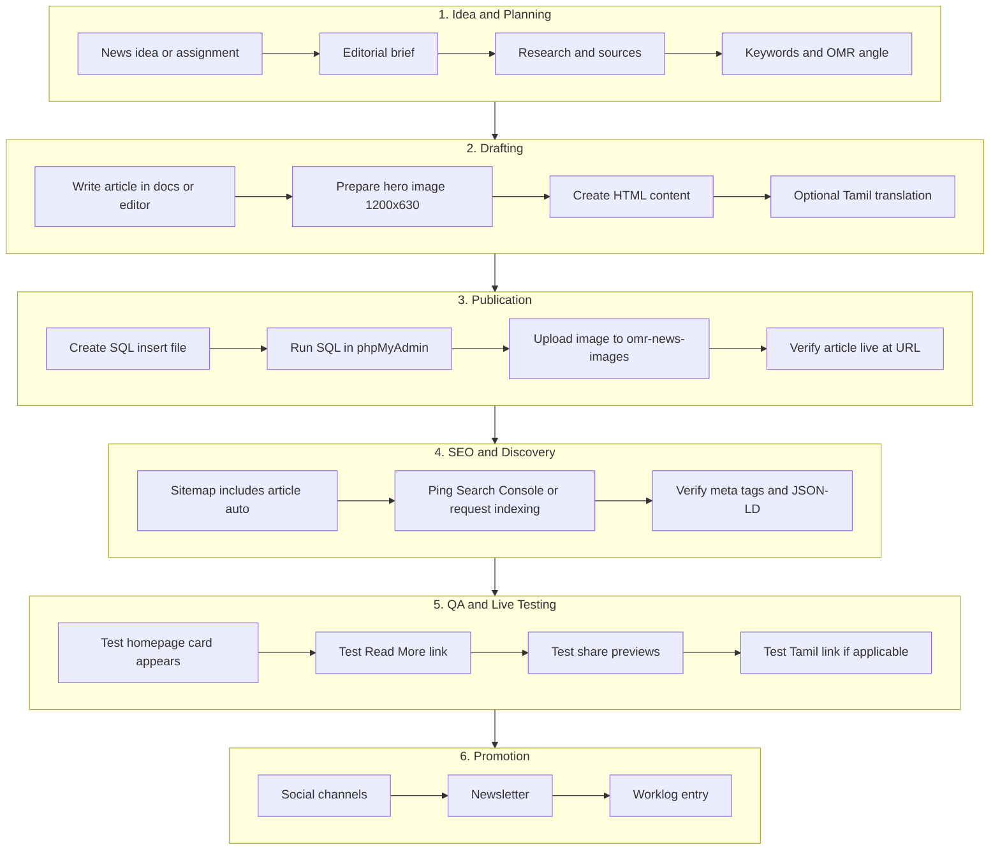
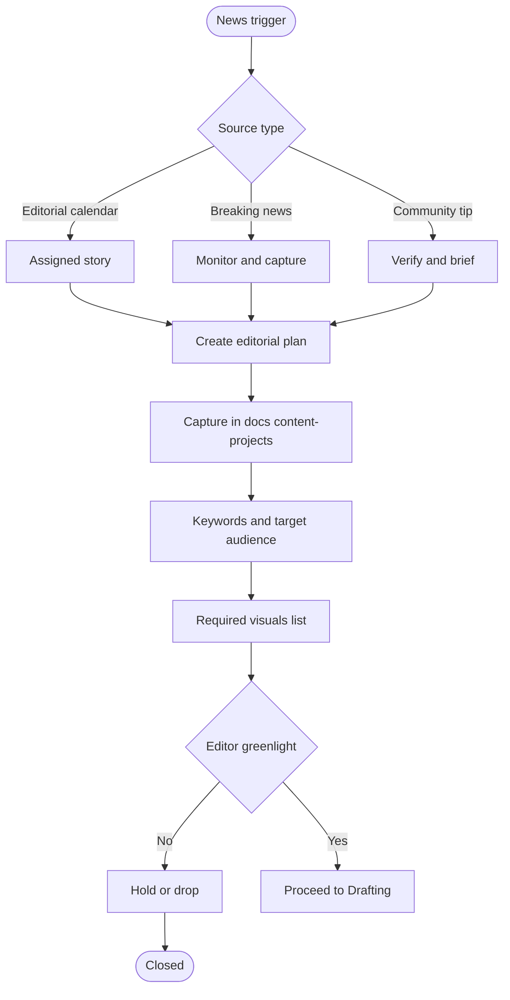
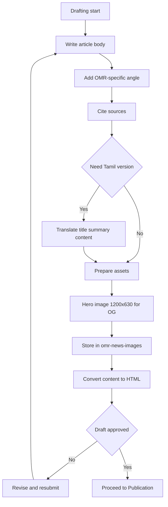
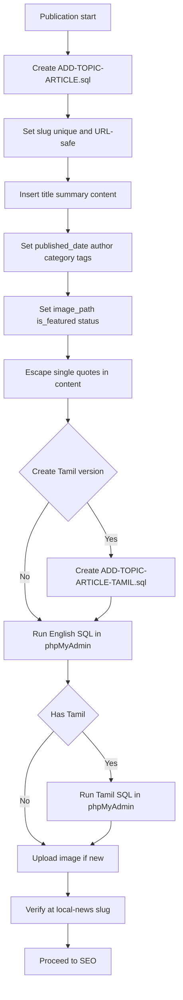
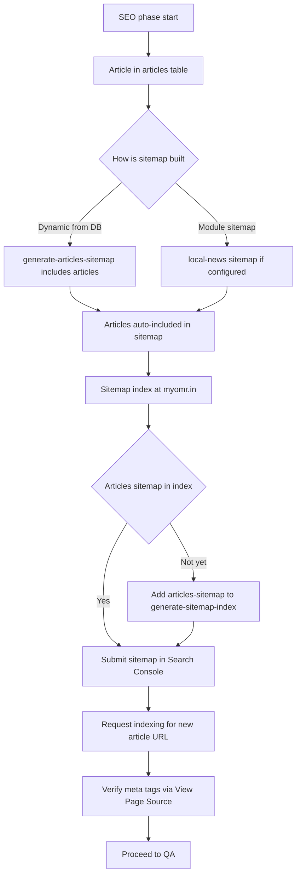
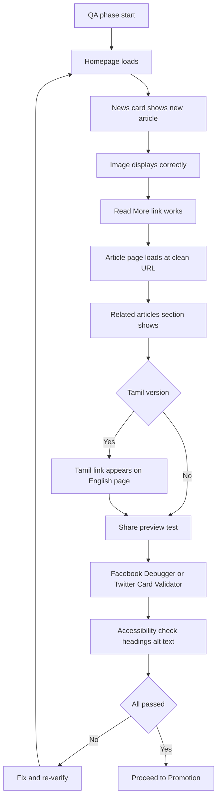
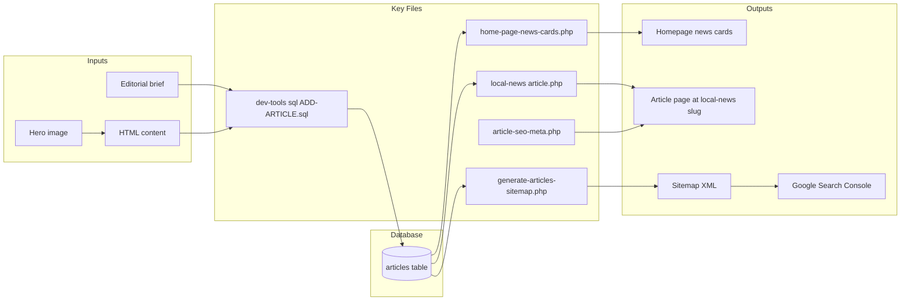
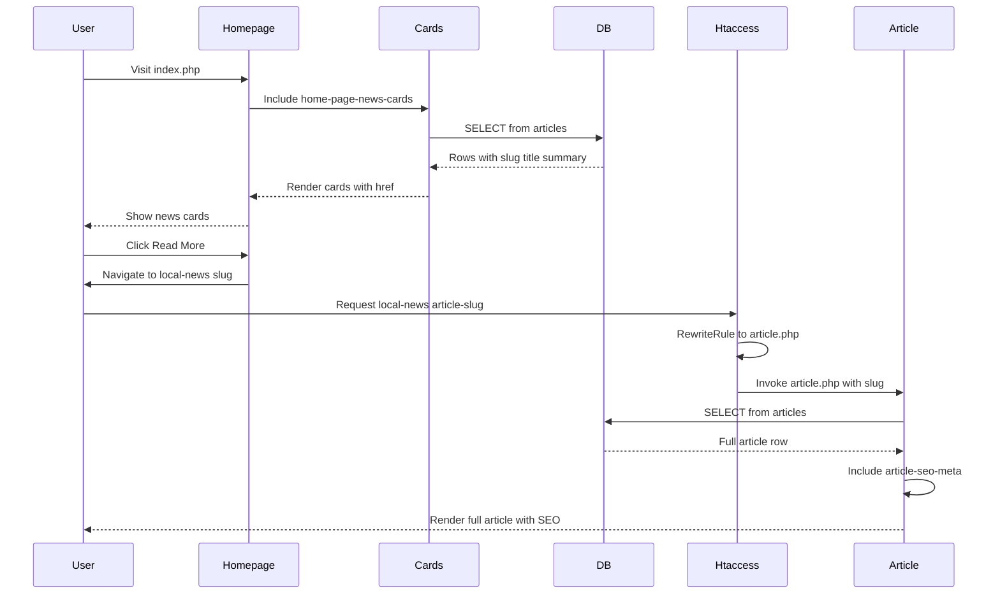
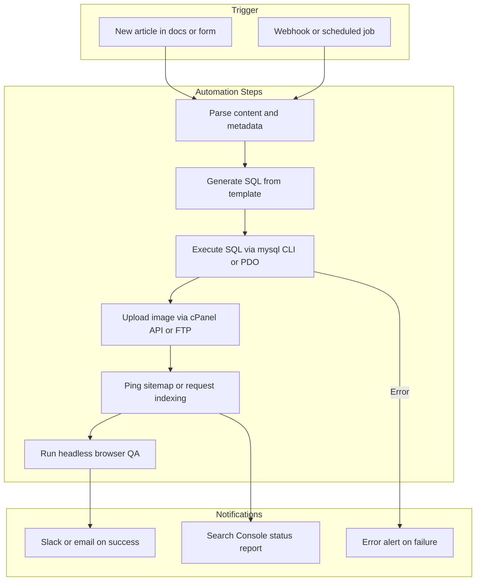

# MyOMR News Workflow — End-to-End Process Map

**Purpose:** Capture the complete news lifecycle from idea to Google Search Console and live testing, for future automation planning.  
**Last updated:** March 2025  
**Owner:** Editorial Team

## 1. High-Level Process Overview



---

## 2. Detailed Phase Flow

### Phase 1: Idea to Draft Approval



### Phase 2: Drafting and Asset Preparation



### Phase 3: SQL Publication Pipeline



### Phase 4: Sitemap and Search Console



### Phase 5: Live Testing Checklist



---

## 3. System Component Map



---

## 4. URL and Routing Flow



---

## 5. Automation Readiness Matrix

| Phase | Step | Current | Automatable? | Blocker |
|-------|------|---------|--------------|---------|
| 1 | Editorial brief | Manual doc | Partial | Editorial judgment |
| 2 | Draft writing | Manual | Partial | AI assist possible |
| 3 | SQL file creation | Manual | **Yes** | Template + content merge |
| 4 | phpMyAdmin run | Manual | **Yes** | CLI mysql or API |
| 5 | Image upload | Manual FTP/cPanel | **Yes** | File API |
| 6 | Sitemap refresh | Auto from DB | N/A | Already dynamic |
| 7 | Search Console ping | Manual | **Yes** | Indexing API |
| 8 | QA testing | Manual | Partial | Playwright/Cypress |

---

## 6. Automation Pipeline Concept (Future)



---

## 7. Sitemap Configuration Gap (As of March 2025)

The main sitemap index (`weblog/generate-sitemap-index.php` or root `generate-sitemap-index.php`) does **not** yet include the articles sitemap. To expose new articles to Google:

1. **Add .htaccess rule** (if missing):
   ```apache
   RewriteRule ^weblog/articles-sitemap\.xml$ weblog/generate-articles-sitemap.php [L]
   ```
2. **Add to sitemap index** in `generate-sitemap-index.php`:
   ```php
   $base . '/weblog/articles-sitemap.xml',
   ```
3. Alternatively, articles may be included in a monolithic sitemap (`@tocheck/sitemap-generator.php`) — verify which generator is used in production.

---

## 8. File Reference Quick List

| Purpose | File Path |
|---------|-----------|
| News cards on homepage | `weblog/home-page-news-cards.php` or `home-page-news-cards.php` |
| Article router | `local-news/article.php` |
| SEO meta generator | `core/article-seo-meta.php` |
| SQL examples | `dev-tools/sql/ADD-*-ARTICLE.sql` |
| Articles sitemap | `weblog/generate-articles-sitemap.php` |
| Sitemap index | `weblog/generate-sitemap-index.php` |
| URL rewrite | `.htaccess` lines 228-232 |
| News images | `local-news/omr-news-images/` |

---

## 9. Mermaid Compatibility Notes

This document uses Mermaid diagram types optimized for MD viewer compatibility:

- `graph` (TB, TD, LR) — legacy keyword, broad viewer support
- `sequenceDiagram` — for request/response flows
- Ampersands replaced with "and" to avoid XML/HTML parsing issues
- Question marks removed from node labels where they caused parse errors

**Avoided:** `erDiagram`, `flowchart` (use `graph`), special chars in labels. See `docs/MERMAID-AND-CHROME-EXTENSION-TROUBLESHOOTING.md` if diagrams still do not render.
