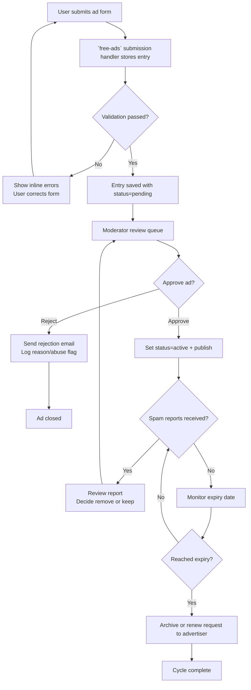

# Free Ads / Classifieds Workflow

- **Last updated:** 12 November 2025  
- **Owner:** Community Ads Team  
- **Applies to:** `/free-ads-chennai/` module (front-end SPA bundle, forms, moderation scripts)  
- **Prerequisites:** Access to ad submission inbox/DB, spam filtering tools, admin removal rights, CDN cache control

## 1. Overview

- **Purpose:** Handle community ad submissions (jobs, rentals, services) while maintaining quality and compliance.
- **Trigger:** New ad submission via site form or scheduled review of expiring ads.
- **Participants:** Community moderator, Support team (for abuse reports), QA reviewer.

## 2. Flow Diagram

## 3. Step-by-Step

1. **Submission intake**
   - Ads submitted via `/free-ads-chennai/` form (React/JS-based).
   - Client-side checks (required fields, category) before hitting backend script.
   - Backend assigns `status='pending'`, records timestamp and contact info.

2. **Moderation queue**
   - Access moderation tool (check docs or admin route in module).
   - Review content for policy compliance (no prohibited items, clear contact details).
   - Approve or reject; send templated email to advertiser with status.

3. **Publication**
   - Approved ads appear on category pages within `free-ads-chennai/`.
   - Ensure CDN caches purged if static JSON generated.
   - Check that share buttons/links reflect ad slug.

4. **Monitoring & moderation**
   - Watch for abuse reports (email notifications or admin dashboard).
   - Remove or edit ad if flagged; record reason in moderation log.
   - Auto-expire ads after configured period (e.g., 30 days); send renewal email if policy allows.

5. **Archive & analytics**
   - Archive expired ads to maintain performance.
   - Track metrics: number of new ads, approved vs rejected, spam ratio.
   - Update `docs/worklogs/` with significant moderation batches.

## 4. Checklists

**Before approval**
- [ ] Contact info verified.
- [ ] Category matches content.
- [ ] No prohibited items / policy violations.
- [ ] Images (if allowed) meet size requirements.

**After publication**
- [ ] Ad visible in correct category list and search.
- [ ] CTA buttons (call/email/WhatsApp) work.
- [ ] Cache/CDN refreshed if necessary.

**Periodic tasks**
- [ ] Expired ads closed or renewed weekly.
- [ ] Spam/abuse queue cleared.
- [ ] Sitemap or RSS regenerated if feature uses them.

## 5. Edge Cases & Recovery

- **High spam volume:** Enable captcha or rate limiting; block IPs in backend.
- **Duplicate posts:** Merge or delete duplicates; communicate with advertiser.
- **Legal removal requests:** Document request, remove ad, and confirm action via email.
- **Backend outage:** Temporarily disable form and show maintenance message.

## 6. References

- Module files: `/free-ads-chennai/` (JS/CSS bundle, API handlers).
- Admin/moderation scripts (check module README or `dev-tools` for utilities).
- Policy docs: `@tocheck/WORKFLOW-AUDIT-SUMMARY.md`, `@tocheck/ARTICLE-SEO-WORKFLOW.md` for reference patterns.
- Documentation: `docs/worklogs/` (ad moderation entries), `LEARNINGS.md` (future updates).

