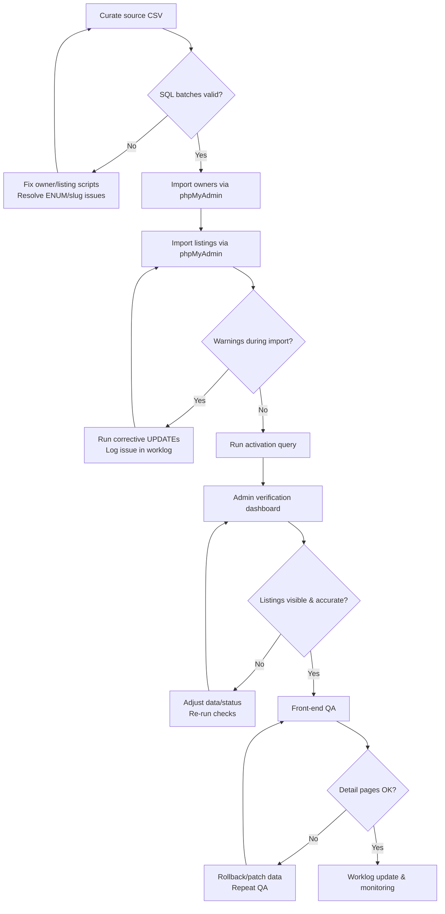

# Hostels & PGs Content Pipeline

- **Last updated:** 12 November 2025  
- **Owner:** Content Operations + Admin Team  
- **Applies to:** `hostels_pgs` database, `/omr-hostels-pgs/` module, admin verification flows  
- **Prerequisites:** phpMyAdmin access, staging checklist, SQL batches in `dev-tools/sql/`, admin credentials (`/omr-hostels-pgs/admin/`)

## 1. Overview

- **Purpose:** Keep the Hostels & PGs directory current with high-quality listings and consistent metadata.  
- **Trigger:** New batch of properties arrives from research/CSV intake or data refresh is scheduled.  
- **Participants:** Content curator (prepares SQL), Database operator (runs imports), Admin moderator (verifies listings), QA reviewer (checks front-end).

## 2. Flow Diagram (Optional)

## 3. Step-by-Step

1. **Curate source data**
   - Start with CSV or research sheet.
   - Generate owners + listings SQL using templates under `dev-tools/sql/` (e.g., `hostel-owner-batch0X-manual.sql`, `hostel-listings-batch0X-manual.sql`).
   - Ensure `verification_status` values respect ENUM constraints (`pending`/`verified`).
   - Fill facilities via `JSON_ARRAY(...)`, set featured image URLs if available.

2. **Review SQL locally**
   - Validate syntax (`CREATE-HOSTELS-PGS-DATABASE.sql` for reference).
   - Run through MySQL client locally if possible to catch typos (`ENUM` mismatches, date formats).

3. **Import into phpMyAdmin**
   - Order matters: **owners** first, then **listings**.
   - Run owner batch; confirm inserted emails resolve to new `property_owners.id`.
   - Run listings batch; watch for warnings (e.g., `Data truncated` if verification status wrong).
   - Execute activation statement appended to script (`UPDATE hostels_pgs SET status='active' WHERE slug IN (…)`).

4. **Post-import corrective scripts (if needed)**
   - Use dedicated fixes like `dev-tools/sql/fix-batch02-verification-status.sql` when enumerations warn.
   - Log any cleanup commands in worklog for traceability.

5. **Admin-side verification**
   - Log into `/omr-hostels-pgs/admin/manage-properties.php`.
   - Use filters + search to spot new records.
   - Toggle status, mark featured, or adjust verification using bulk actions or existing endpoints (`approve-property.php`, `verify-property.php`, `bulk-update-properties.php`).

6. **Front-end QA**
   - Visit `/omr-hostels-pgs/` to confirm new listings appear with correct locality filters.
   - Open `/omr-hostels-pgs/property-detail.php?id=<new-id>` for each sample listing:
     - Check overview text, facilities, map, canonical URL, structured data (`generatePropertySchema()`).
     - Validate contact info renders correctly.
   - Clear caches/CDN if CDN-enabled.

7. **Documentation & monitoring**
   - Update `docs/worklogs/worklog-dd-mm-yyyy.md` with batch details.
   - Note any schema/helpers changes in `LEARNINGS.md`.
   - Monitor admin dashboard counters and analytics events (view, inquiry).

## 4. Checklists

**Pre-import**
- [ ] CSV cleaned and deduplicated.
- [ ] SQL batches validated (owners + listings + activation).
- [ ] Images/links verified.

**During import**
- [ ] Owners inserted without warnings.
- [ ] Listings inserted; no ENUM truncation warnings.
- [ ] Activation query executed.

**Post-import**
- [ ] Admin filters confirm listings present.
- [ ] Sample detail pages reviewed.
- [ ] Worklog updated; issues recorded.
- [ ] Sitemap (`/omr-hostels-pgs/generate-sitemap.php`) regenerated if large batch.

## 5. Edge Cases & Recovery

- **ENUM mismatch:** If `verification_status` set to `active`, MySQL warns and defaults to first enum entry. Run corrective `UPDATE` to set `verification_status='verified'`.
- **Owner missing:** Listings referencing unknown owner email fail; double-check owner batch.
- **Slug collision:** Unique constraint on `slug`—append locality suffix or incremental counter before re-import.
- **Admin status stale:** If bulk activate fails, use new `bulk-update-properties.php` to set status en masse.

## 6. References

- SQL templates: `dev-tools/sql/hostel-owner-batch0X-manual.sql`, `dev-tools/sql/hostel-listings-batch0X-manual.sql`
- Schema reference: `CREATE-HOSTELS-PGS-DATABASE.sql`
- Admin tools: `/omr-hostels-pgs/admin/manage-properties.php`, `/omr-hostels-pgs/admin/bulk-update-properties.php`
- Front-end pages: `/omr-hostels-pgs/index.php`, `/omr-hostels-pgs/property-detail.php`
- Documentation: `docs/content-projects/HOSTELS-PGS-IMPLEMENTATION-SUMMARY.md`, `docs/worklogs/worklog-12-11-2025.md`

