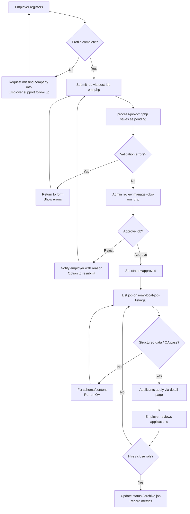

# Job Portal Workflow

- **Owner:** Jobs Team (Content Ops + Admin)  
- **Applies to:** `/omr-local-job-listings/` module, employers subsystem, admin dashboard  
- **Prerequisites:** Employer login credentials (for QA), admin access, database connectivity (`job_postings`, `employers`, `job_applications` tables)

## 1. Overview

- **Purpose:** Ensure job postings move smoothly from employer submission through moderation to public listing, while keeping schema/SEO compliant.
- **Trigger:** A new employer signs up or an existing employer submits a job post; periodic content refresh; moderation queue review.
- **Participants:** Employer, Employer Support (verifies company), Admin moderator, QA reviewer.

## 2. Flow Diagram (Optional)

## 3. Step-by-Step

1. **Employer onboarding**
   - Employer visits `/omr-local-job-listings/employer-register-omr.php`.
   - `process-job-omr.php` creates employer record; email verification (if configured) or manual approval.
   - Employer logs in via `/employer-login-omr.php` (sessions handled by `includes/employer-auth.php`).

2. **Job submission**
   - Employer fills `/post-job-omr.php` form (fields: title, category, location, job_type, salary, description).
   - Submission hits `process-job-omr.php` which:
     - Validates required fields, sanitizes input, sets `status='pending'`.
     - Normalises salary + `valid_through` (helper functions in `includes/job-functions-omr.php` / `seo-helper.php`).
   - On success, redirect to `job-posted-success-omr.php`.

3. **Admin moderation**
   - Admin visits `/omr-local-job-listings/admin/manage-jobs-omr.php`.
   - Filters pending vs approved jobs, checks employer credibility (`verify-employers-omr.php`).
   - Approves job (`status='approved'`) or rejects with notes; optionally marks featured.
   - Generates sitemap via `/omr-local-job-listings/generate-sitemap.php` after batch approvals.

4. **Public listing & SEO**
   - Approved jobs surface on `/omr-local-job-listings/index.php` (uses direct query fallback strategy).
   - Job detail pages (`job-detail-omr.php`) render structured data via `generateJobPostingSchema()`.
   - Listing cards include hidden microdata to stay in sync with detail schema.

5. **Application handling**
   - Applicants submit via `/omr-local-job-listings/job-detail-omr.php` → `process-application-omr.php`.
   - Employer receives notification, reviews applications at `/view-applications-omr.php`.
   - Status updates handled by `/update-application-status-omr.php`.

6. **Analytics & maintenance**
   - Monitor dashboards (`HUMAN-TESTING-CHECKLIST.md`, analytics JS).
   - Update `docs/worklogs` when running bulk fixes (`FIX-CATEGORIES.sql`, `READY-FOR-DEPLOYMENT.md` instructions).

## 4. Checklists

**Employer onboarding**
- [ ] Company profile complete (address, contact, logo).
- [ ] Employer verified in admin panel (`verify-employers-omr.php`).

**Job approval**
- [ ] Job content reviewed for clarity & keywords.
- [ ] Location + category match standard lists (`getJobCategories()`).
- [ ] Salary & `valid_through` set; warnings resolved.
- [ ] Structured data test passes (Google Rich Results).

**Post-approval**
- [ ] Job visible on `/omr-local-job-listings/`.
- [ ] Job detail page loads without errors.
- [ ] Sitemap regenerated and submitted if significant batch.
- [ ] Worklog updated with approvals/rejections.

## 5. Edge Cases & Recovery

- **Silent failures in prepared statements:** Module uses direct queries to avoid binding issues; if fallback triggers log entry, capture details in `HUMAN-TESTING-CHECKLIST.md`.
- **Employer mismatch:** `employer_id` in session may differ from DB; system auto-refreshes via email lookup, but QA should confirm via `employer-auth.php`.
- **Filter returning zero:** Ensure filters only apply when values present (`array_filter` in index).
- **Schema warnings:** If Search Console flags missing fields, update helper functions (`seo-helper.php`) to enrich JSON-LD.

## 6. References

- Employer flows: `post-job-omr.php`, `process-job-omr.php`, `employer-register-omr.php`, `employer-auth.php`
- Admin tools: `/admin/manage-jobs-omr.php`, `/admin/verify-employers-omr.php`, `/admin/index.php`
- Front-end listings: `index.php`, `job-detail-omr.php`
- Structured data helpers: `includes/seo-helper.php`, `includes/job-functions-omr.php`
- QA docs: `HUMAN-TESTING-CHECKLIST.md`, `READY-FOR-DEPLOYMENT.md`, `LEARNINGS.md` (JobPosting entry 10 Nov 2025)

